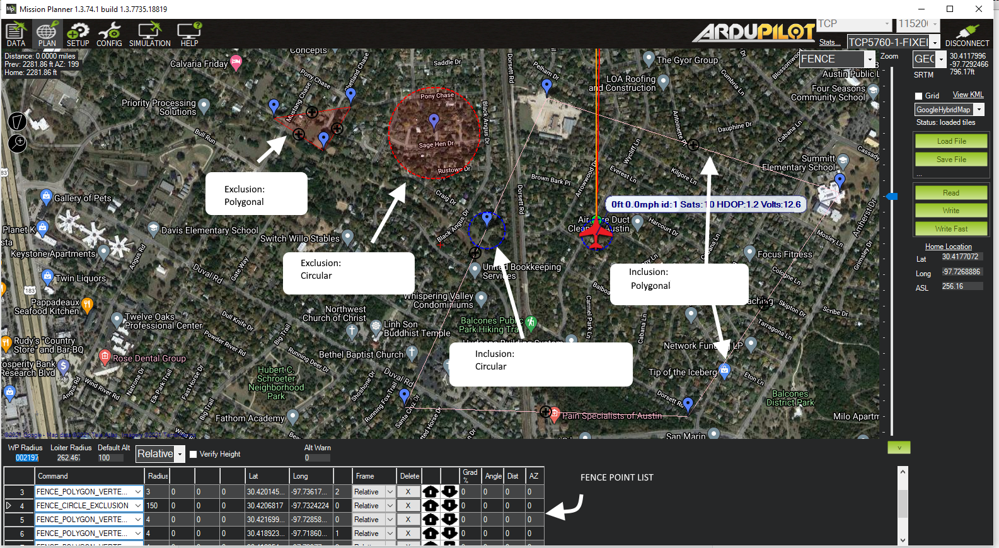

.. _common-polygon_fence:

==============================
Inclusion and Exclusion Fences
==============================

Overview
========

ArduPilot includes support for polygon fences with up to 70 points and for pure circular fences with specified radii. Unlike the home-based cylindrical fence :ref:`cylindrical fence <common-ac2_simple_geofence>`, the circular inclusion/exclusion fence can be placed anywhere. Either the polygonal or circular fences may be selected to be inclusion or exclusion type, and may be mixed. The purpose of these fences are to attempt to stop your vehicle from flying into (exclusion), or out of (inclusion), the fences by initiating a failsafe action like RTL (See :ref:`FENCE_ACTION<FENCE_ACTION>`) or, if flying in Loiter mode for Copter and :ref:`common-object-avoidance-landing-page` is setup, the vehicle will normally stop before breaching the fence and in some cases, plan paths around the boundaries.

This feature is an extension of the simpler home-based :ref:`cylindrical fence <common-ac2_simple_geofence>` and can be combined with it.

You can have multiple circular or polygon inclusion or exclusion fences, all active at the same time. The example PLAN screen from Mission Planner, below, shows examples of each. Note that they can overlap, with one another. So in the example below the Plane could fly within the union of the large polygonal fence AND within the circular overlapping fence without breaching. The example below is not realistic, since with the large inclusion fence, the outside exclusion fences would never be reached and are superfluous, but it shows all the different kinds of fences that can be created.

See :ref:`common-geofencing-landing-page` for fence setup parameters common to all fences.

These fences are created and treated in a similar way to mission command lists and rally point lists and loaded into the autopilot. Each item in the list specifies a point in the polygonal boundary or a circular item, whether its inclusion or exclusion type, and radius if circular. Most GCS provide a graphical drawing facility to add in the design of the fence boundaries and inclusion/exclusion type.

Multiple fences can be specified of differing types and shapes in the list.

..  youtube:: U3Z8bO3KbyM
    :width: 100%

Warnings:
=========

-  The minimum recommended fence radius is 30m
-  The fence requires the GPS to be functioning well so do not disable
   the :ref:`GPS arming check <common-prearm-safety-checks>` nor the :ref:`EKF failsafe <ekf-inav-failsafe>` while the fence is enabled. 
   Conversely, if you disable either of these checks, disable the Fence.
-  For the best results, ensure RTL is working on your vehicle.
-  With the Fence enabled in Copter and Rover, the pre-arm checks will require you have GPS
   lock before arming the vehicle.
-  In Copter, if EKF failsafe occurs and the Fence is enabled and you lose
   GPS lock while flying the fence will be disabled.
-  In Copter, if EKF failsafe occurs and the Fence is enabled and in an autonomous mode, the vehicle will switch to LAND (HOLD for Rover) because we no
   longer know the vehicle position and we want to ensure the vehicle
   never travels far outside the fence. If this is not desired,
   the pilot can retake control by moving the flight mode switch to a manual mode.
-  The Copter and Rover backup fences are created 20m out from the previous breached
   fence not 20m out from the vehicle's position.  This means if you
   choose to override the fence you may have less than 20m to regain
   vehicle control before the fence switches the vehicle to the :ref:`FENCE_ACTION<FENCE_ACTION>`
   again.  If you really want to override the fence, you should be ready
   to switch the flight mode twice or alternatively set-up the
   enable/disable fence switch.
   
.. note:: You can define many inclusion and exclusion fences. However,multiple inclusions fences, including the :ref:`cylindrical fences <common-ac2_simple_geofence>` must overlap, since the vehicle can operate only within the complete overlap area of all of the inclusion fences. Exclusion fences may be placed within or outside of inclusion fences.

.. note:: In order to upload or download these fences from Mission Planner the connected link must be using MAVLink2 protocol. Normally, since the USB connection is used, this protocol is default. However, radio linked connections may use MAVLink1 by default and would need to be changed to MAVLink2 in order to upload and download across them.

.. tip:: You can have both the :ref:`cylindrical fences <common-ac2_simple_geofence>` and inclusion/exclusion fences and choose to use just the HOME centered "tin-can" for a flight by selecting only the "Circle" or "Altitude and Circle" for :ref:`FENCE_TYPE<FENCE_TYPE>`. You can chose to enable the :ref:`cylindrical fences <common-ac2_simple_geofence>`, these inclusion/exclusion fences, and/or altitude limit, in any combination, with this parameter.

Combining with the Cylindrical Fence
====================================

A polygon fence can be used in combination with the :ref:`cylindrical fences <common-ac2_simple_geofence>` and the failsafe behaviour (i.e. stop at the fence or RTL) will trigger at whichever barrier the vehicle reaches first (i.e. the green line shown below)

.. image:: ../../../images/copter_polygon_circular_fence..png
    :target: ../_images/copter_polygon_circular_fence..png

Please see the :ref:`Cylindrical Fence <common-ac2_simple_geofence>` page for additional warnings and instructions including how to enable/disable the fence with the RC channel auxiliary switches.

