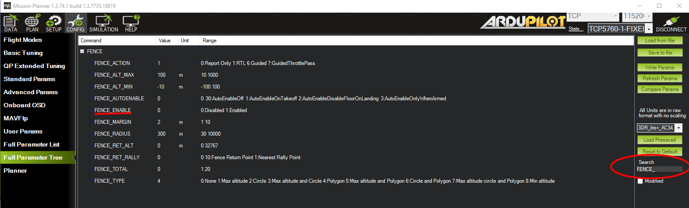

.. _common-polygon_fence:

==============================
Inclusion and Exclusion Fences
==============================

Overview
========

ArduPilot includes support for polygon fences with up to 70 points and for pure circular fences with specified radii. Unlike the home-based cylindrical fence :ref:`cylindrical fence <common-ac2_simple_geofence>`, the circular inclusion/exclusion fence can be placed anywhere. Either the polygonal or circular fences may be selected to be inclusion or exclusion type, and may be mixed. The purpose of these fences are to attempt to stop your vehicle from flying into (exclusion), or out of (inclusion), the fences by initiating a failsafe action like RTL or, if flying in Loiter mode for Copter and :ref:`common-object-avoidance-landing-page` is setup, the vehicle will normally stop before breaching the fence and in some cases, plan paths around the boundaries.

This feature is an extension of the simpler home-based :ref:`cylindrical fence <common-ac2_simple_geofence>` and can be combined with it.

You can have multiple circular or polygon inclusion or exclusion fences, all active at the same time. The example PLAN screen from Mission Planner, below, shows examples of each. Note that they can overlap, with one another. So in the example below the Plane could fly within the union of the large polygonal fence AND within the circular overlapping fence without breaching. The example below is not realistic, since with the large inclusion fence, the outside exclusion fences would never be reached and are superfluous, but it shows all the different kinds of fences that can be created.

[site wiki="copter"]
Like the :ref:`cylindrical fence <common-ac2_simple_geofence>`, Copter will stop increasing altitude at :ref:`FENCE_ALT_MAX<FENCE_ALT_MAX>` in Loiter, PosHold, and AltHold modes. In other modes, it will execute the :ref:`FENCE_ACTION<FENCE_ACTION>` if the altitude limit is exceeded and active. 
[/site]
[site wiki="plane"]
Like the :ref:`cylindrical fence <common-ac2_simple_geofence>`, Plane will execute the :ref:`FENCE_ACTION<FENCE_ACTION>` if the boundary or altitude limits are breached.
[/site]

These fences are created and treated in a similar way to mission command lists and rally point lists and loaded into the autopilot. Each item in the list specifies a point in the polygonal boundary or a circular item, whether its inclusion or exclusion type, and radius if circular.
[site wiki="plane"]
For Plane a fence breach return point can also be specified in the list.
[/site]

Multiple fences can be specified of differing types and shapes in the list.

..  youtube:: U3Z8bO3KbyM
    :width: 100%

Enabling Fences in Mission Planner
==================================

To enable Fences, go to the Mission Planner full parameter list (CONFIG->Full Parameter Tree), search for items with ``FENCE_``:

Plane Parameter List (Copter/Rover have fewer)

-  Set :ref:`FENCE_ACTION<FENCE_ACTION>` = to whatever you wish for a breach action. These will vary depending on vehicle type.
-  Set :ref:`FENCE_OPTIONS<FENCE_OPTIONS>` to "1" to prevent mode changes after a fence breach until the vehicle returns within the fence boundary (Plane only, Copter/Rover do not allow mode changes while in breach)
-  Set :ref:`FENCE_ALT_MAX<FENCE_ALT_MAX>` = to the altitude limit you want (in meters). This is unavailable in Rover.
-  Set :ref:`FENCE_ENABLE<FENCE_ENABLE>` =1 to enable FENCEs.
-  Set :ref:`FENCE_MARGIN<FENCE_MARGIN>` = to the distance from the fence horizontal boundary the vehicle must maintain in order to prevent a breach.
-  Set :ref:`FENCE_RADIUS<FENCE_RADIUS>` to the maximum distance from HOME you want (in meters). This should normally be at least 50m. This value must be larger than :ref:`FENCE_MARGIN<FENCE_MARGIN>` and greater than 30m.
-  :ref:`FENCE_TOTAL<FENCE_TOTAL>` should not be changed manually and indicates the number of inclusion/exclusion fence points stored. (See :ref:`common-polygon_fence`)
-  Set :ref:`FENCE_TYPE<FENCE_TYPE>` = is a bitmap set to enable the various fence types: MIN or MAX altitude, simple CIRCLE tin can around HOME, or POLYGON fences. The POLYGON fences must also have been loaded via a fence list from a ground control station in order to be active.

.. note:: Polygon fence type includes the circular fences specified in the Inclusion/Exclusion fence list. The simple home centered CIRCLE fence is a separate fence. Rover ignores altitudes, if set.

Defaults for :ref:`FENCE_TYPE<FENCE_TYPE>` are:

- Rover: CIRCLE and POLYGON
- Copter: ALT MAX, CIRCLE, and POLYGON
- Plane: POLYGON

If Plane, you can also:

-  Set the :ref:`FENCE_ALT_MIN<FENCE_ALT_MIN>` as a breach boundary.
-  Set :ref:`FENCE_AUTOENABLE<FENCE_AUTOENABLE>` = to allow automatic temporary (until reboot)forcing of :ref:`FENCE_ENABLE<FENCE_ENABLE>` =1 under certain vehicle conditions, such as upon arming or takeoff. A value of 0 disables this feature.
-  :ref:`FENCE_RET_RALLY<FENCE_RET_RALLY>` allows returning to the nearest RALLY point (See: :ref:`common-rally-points`), if loaded, instead of HOME.

..  youtube:: yhNrtTERnJk
    :width: 100%

Copter GeoFence Tab
-------------------

Copter and Traditional Heli, when connected to Mission Planner, present a CONFIG tab called GeoFence which provides another way to access these parameters in those vehicles.

.. image:: ../../../images/Fence_MPSetup.png
    :target: ../_images/Fence_MPSetup.png

Enabling the fence with an RC Channel Auxiliary Switch
======================================================

It is not necessary to set-up a switch to enable or disable the fence
but if you wish to control the fence with a switch follow these
steps:

for firmware versions before 4.0:

-  Go to the Mission Planner's Config/Tuning > Extended Tuning screen (or other GCS's parameter setup screen) and set  either "Ch7 Opt" OR "Ch8 Opt" to Fence. These parameters can also be directly set from the Config/Tuning > Full Parameter List screen
   
.. image:: ../../../images/Fence_MPCh78.png
    :target: ../_images/Fence_MPCh78.png
   
Alternatively, for firmware versions 4.0 or later, an RCx_OPTION can be set via the Config/Tuning > Full Parameter List screen:

-  Use an RCx_OPTION set to Fence
-  setting the switch high (i.e. PWM > 1800) will enable the fence, low
   (under 1800) will disable the fence.

Warnings:
=========

-  The minimum recommended fence radius is 30m
-  The fence requires the GPS to be functioning well so do not disable
   the :ref:`GPS arming check <common-prearm-safety-checks>` nor the :ref:`EKF failsafe <ekf-inav-failsafe>` while the fence is enabled. 
   Conversely, if you disable either of these checks, disable the Fence.
-  For the best results, ensure RTL is working on your vehicle.
-  With the Fence enabled in Copter and Rover, the pre-arm checks will require you have GPS
   lock before arming the vehicle.
-  In Copter, if EKF failsafe occurs and the Fence is enabled and you lose
   GPS lock while flying the fence will be disabled.
-  In Copter, if EKF failsafe occurs and the Fence is enabled and in an autonomous mode, the vehicle will switch to LAND (HOLD for Rover) because we no
   longer know the vehicle position and we want to ensure the vehicle
   never travels far outside the fence. If this is not desired,
   the pilot can retake control by moving the flight mode switch to a manual mode.
-  The Copter and Rover backup fences are created 20m out from the previous breached
   fence not 20m out from the vehicle's position.  This means if you
   choose to override the fence you may have less than 20m to regain
   vehicle control before the fence switches the vehicle to the :ref:`FENCE_ACTION<FENCE_ACTION>`
   again.  If you really want to override the fence, you should be ready
   to switch the flight mode twice or alternatively set-up the
   enable/disable fence switch.
   
.. note:: You can define many inclusion and exclusion fences. However,multiple inclusions fences, including the :ref:`cylindrical fences <common-ac2_simple_geofence>` must overlap, since the vehicle can operate only within the complete overlap area of all of the inclusion fences. Exclusion fences may be placed within or outside of inclusion fences.

.. note:: In order to upload or download these fences from Mission Planner the connected link must be using MAVLink2 protocol. Normally, since the USB connection is used, this protocol is default. However, radio linked connections may use MAVLink1 by default and would need to be changed to MAVLink2 in order to upload and download across them.

.. tip:: You can have both the :ref:`cylindrical fences <common-ac2_simple_geofence>` and inclusion/exclusion fences and choose to use just the HOME centered "tin-can" for a flight by selecting only the "Circle" or "Altitude and Circle" for :ref:`FENCE_TYPE<FENCE_TYPE>`. You can chose to enable the :ref:`cylindrical fences <common-ac2_simple_geofence>`, these inclusion/exclusion fences, and/or altitude limit, in any combination, with this parameter.

Combining with the Cylindrical Fence
====================================

A polygon fence can be used in combination with the :ref:`cylindrical fences <common-ac2_simple_geofence>` and the failsafe behaviour (i.e. stop at the fence or RTL) will trigger at whichever barrier the vehicle reaches first (i.e. the green line shown below)

.. image:: ../../../images/copter_polygon_circular_fence..png
    :target: ../_images/copter_polygon_circular_fence..png

Please see the :ref:`Cylindrical Fence <common-ac2_simple_geofence>` page for additional warnings and instructions including how to enable/disable the fence with the RC channel auxiliary switches.

