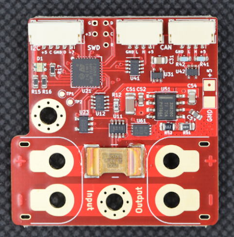

.. _common-pomegranate-systems-pm:

=============================================
Pomegranate Systems CAN/DroneCAN Power Module
=============================================

Intelligent power monitor, accurate fuel gauge, and efficient 5V/2A power supply with a CANbus interface.

-    High-resolution current and voltage monitoring with state of charge integration.
-    Power monitoring for battery, 5V, and 3V rails.
-    Supports 2-6S batteries (6-26V) and currents of up to 100A, when actively cooled.
-    CANbus interface using DroneCAN v0 protocol (PX4 / ArduPilot Compatible).
-    Efficient 5V switching regulator provides up to 2A of low noise current.
-    Daytime visible state of charge LED
-    Electronic CANbus termination simplifies wiring.
-    Multiple modules on the same bus can monitor multiple power sources.
-    Board-mounted battery connectors and M2.5 mounting holes provide a robust battery entry point.
-    Open Source Firmware

Configuration and Setup
=======================

.. youtube:: 5bUyms6UPao

Where to Buy
============

`Pomegranate Systems <https://store.p-systems.io/products/power-module>`__