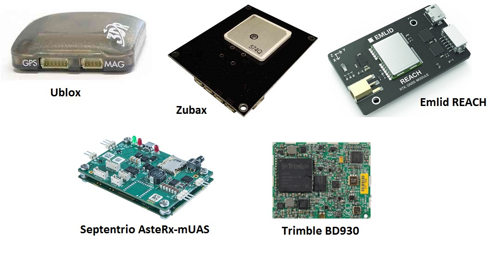

.. _common-positioning-landing-page:

==========================
GPS/Compass (landing page)
==========================

Copter/Plane/Rover support integration with GPS, Compass and other
positioning technologies:

.. toctree::
    :maxdepth: 1
    
    Beitain BN-220 GPS / BN-880 GPS + Compass Module <common-beitian-gps>
    CUAV C-RTK 9P RTK Receiver <common-cuav-c-rtk-9p-gps>
    CUAV Neo v2 Pro UAVCAN GPS <common-cuav-neo-v2-pro>
    Emlid Reach RTK Receiver <common-reach-rtk-receiver>
    Hex Here+ RTK Receiver <common-here-plus-gps>
    JDrones GPS Options <http://store.jdrones.com/GPS_s/193.htm>
    MRo M8N Gps+Compass Module <https://store.mrobotics.io/mRo-GPS-u-Blox-Neo-M8N-HMC5983-Compass-p/gps002-mr.htm>
    Swift Navigation's Piksi Multi RTK GPS Receiver <common-piksi-multi-rtk-receiver>
    Septentrio AsteRx-mUAS RTK GPS <common-gps-septentrio>
    Trimble BD930 RTK GPS <common-gps-trimble>
    Zubax GNSS 2: GNSS + Compass + Barometer <common-zubax-gnss-positioning-module-gps-compass-and-barometer>
    GPS Blending (aka Dual GPS) <common-gps-blending>
    GPS – How it Works <common-gps-how-it-works>
