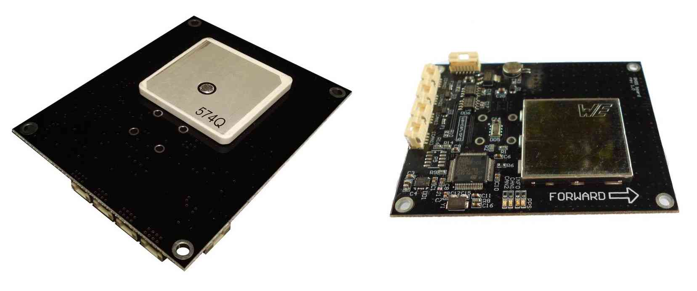
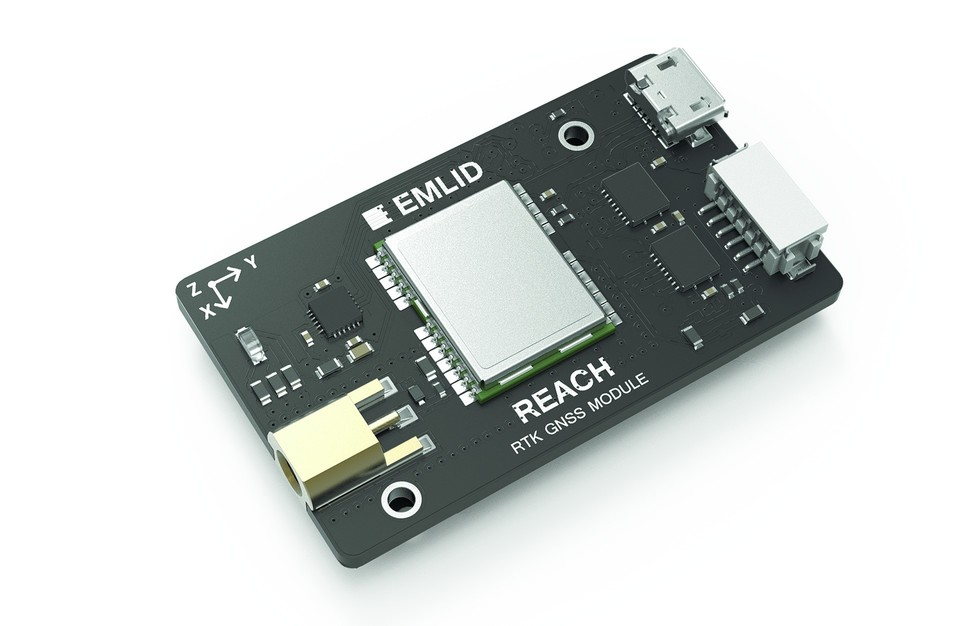

.. _common-positioning-landing-page:

==========================
GPS/Compass (landing page)
==========================

Copter/Plane/Rover support integration with GPS, Compass and other
positioning technologies:

.. figure:: ../../../images/GPS_TopAndSide.jpg
   :target: ../_images/GPS_TopAndSide.jpg

   3DR UBlox GPS + Compass Module

   Zubax GNSS: GPS, Compass andBarometer

   Reach RTK Receiver

.. toctree::
    :maxdepth: 1

    3DR UBlox GPS + Compass <common-installing-3dr-ublox-gps-compass-module>
    Zubax GNSS: GPS, Compass, Barometer <common-zubax-gnss-positioning-module-gps-compass-and-barometer>
    Emlid Reach RTK Receiver <common-reach-rtk-receiver>
    GPS – How it Works <common-gps-how-it-works>

