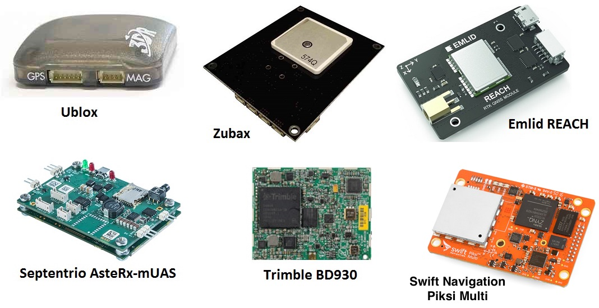

.. _common-positioning-landing-page:

==========================
GPS/Compass (landing page)
==========================

Copter/Plane/Rover support integration with GPS, Compass and other
positioning technologies:

.. toctree::
    :maxdepth: 1
    
    Avionics Anonymous GNSS + Compass<common-avanon-gnss-mag>
    Avionics Anonymous Compass<common-avanon-mag>
    Beitain BN-220 GPS / BN-880 GPS + Compass Module <common-beitian-gps>
    CUAV C-RTK 9P RTK Receiver <common-cuav-c-rtk-9p-gps>
    CUAV Neo v2 Pro UAVCAN GPS <common-cuav-neo-v2-pro>
    Emlid Reach RTK Receiver <common-reach-rtk-receiver>
    Hex Here+ RTK Receiver <common-here-plus-gps>
    Hex Here 2 UAVCAN GPS/Gyro/IMU/Baro <http://www.proficnc.com/all-products/152-gps-module.html>
    Holybro Micro M8N GPS Module <https://shop.holybro.com/micro-m8n-gps_p1009.html> 
    Holybro Nano Ublox M8 5883 GPS Module <https://shop.holybro.com/nano-ublox-m8-5883-gps-module_p1236.html> 
    Holybro Pixhawk 4 GPS Module <https://shop.holybro.com/pixhawk-4-gps-module_p1094.html>
    Holybro RTK M8P Family <common-holybro-rtk-m8p>
    Holybro RTK F9P Family <common-holybro-rtk-f9p>
    Matek M8Q-CAN/UAVCAN GPS+Compass+Baro+Airspeed I2C port <common-matek-m8q>
    mRo GPS, GPS+Compass,RTK, and UAVCAN modules <https://store.mrobotics.io/category-s/109.htm>
    mRo Locaton One UAVCAN GPS/Compass <common-mrobotics-location-one-gps>
    Swift Navigation's Piksi Multi RTK GPS Receiver <common-piksi-multi-rtk-receiver>
    Septentrio AsteRx-mUAS RTK GPS <common-gps-septentrio>
    Trimble BD930 RTK GPS <common-gps-trimble>
    Zubax GNSS 2: GNSS + Compass + Barometer <common-zubax-gnss-positioning-module-gps-compass-and-barometer>

Advanced Uses
=============

.. toctree::
    :maxdepth: 1

    GPS Blending (aka Dual GPS) <common-gps-blending>
    GPS for Yaw (aka Moving Baseline) <common-gps-for-yaw>
    GPS – How it Works <common-gps-how-it-works>
    U-Blox F9P Firmware Update Procedure <common-gps-ublox-firmware-update>
