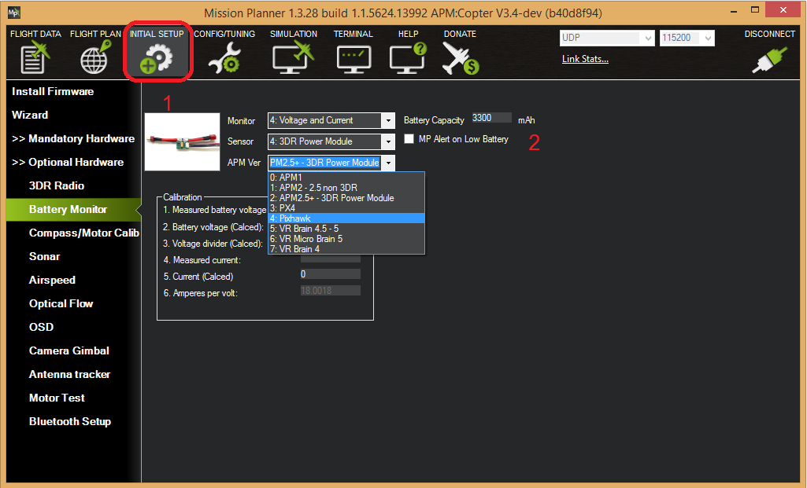
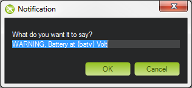
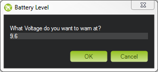
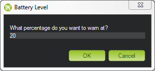

.. _common-power-module-configuration-in-mission-planner:

=====================================================
Power Monitor/Module Configuration in Mission Planner
=====================================================

A power monitor can be used to measure the battery voltage and current for use in the battery failsafe and a power module can also provide a stable power supply to the autopilot.

ArduPilot is :ref:`compatible with a number of power modules/monitors <common-powermodule-landingpage>`.

.. note:: Boards with integrated power monitors have their parameters setup by default.

Mission Planner Setup
=====================

Battery measurement is primarily set up in the *Mission Planner*'s
**INITIAL SETUP \| Optional Hardware \| Battery Monitor** screen. Note that currently Mission Planner only supports the first two Battery Monitors in the system (a total of 10 are available in firmware versions 4.0 and later). More would need to be configured directly by directly setting their parameters in the **CONFIG/TUNNING\|Full Parameter List** screen.

   MissionPlanner: Battery Monitor Configuration

Enable voltage and current sensing
----------------------------------

Enter the properties your monitor can measure, the type of monitor, the
type of autopilot, and the battery capacity:

-  **Monitor:** *Voltage and Current* or *Battery Volts*
-  **Sensor:** Supported power module, or "Other"
-  **APM ver:** Autopilot (e.g. Pixhawk )
-  **Battery Capacity:** Battery capacity in mAh

The **Sensor** selection list offers a number of Power Modules
(including popular models from 3DR and AttoPilot) which you can select
to automatically configure your module. If your PM is not on the list
then you can select **Other**, enter its recommended values, or 
:ref:`perform a manual calibration <common-power-module-configuration-in-mission-planner_calibration>` as described below.

.. _common-power-module-configuration-in-mission-planner_calibration:

Calibration
-----------

The bottom section of the the *Battery Monitor* screen allows you to
calibrate the voltage/current measurement in order to verify that the
measured voltage of the battery is correct. You can also set the
**Sensor** selection list to **Other** and use the calibration process
to configure an "unknown" power monitor/module.

To calibrate the voltage reading:

#. Check the voltage of your LiPo battery with a hand-held volt meter or
   a `power analyzer <https://hobbyking.com/en_us/turnigy-130a-watt-meter-and-power-analyzer.html?___store=en_us>`__
#. Connect your Pixhawk-series to your computer and plug in the LiPo battery
#. Check the voltage through the *Mission Planner*'s **INITIAL SETUP \|
   Optional Hardware \| Battery Monitor** screen or on the Flight Data
   screen's HUD or *Status* tab.

   .. image:: ../../../images/MPCheckVoltage.jpg
       :target: ../_images/MPCheckVoltage.jpg

If you find the voltage is not correct (i.e. if off from the hand-held
volt meter's reading by more than perhaps 0.2V) you can calibrate it by doing the following:

#. On *Mission Planner*'s **INITIAL SETUP \| Optional Hardware \|
   Battery Monitor** screen set the "Sensor" to "Other".
#. Enter the voltage according to the hand-held volt meter in the
   "Measured Battery Voltage" field
#. Press tab or click out of the field and the "Voltage Divider
   (Calced)" value will update and the "Battery voltage (Calced)" should
   now equal the measured voltage

   .. image:: ../../../images/CalibrateVoltage.png
       :target: ../_images/CalibrateVoltage.png

Using the power analyser you can also measure the current and compare to
results displayed in the Mission Planner.

.. note::

   Most current sensors are not very accurate at low currents (less
   than 3 Amps). Typically you should perform current calibration at around
   10A. The exception is PMs that use hall-effect sensors, like :ref:`those from Mauch <common-mauch-power-modules>`.

This video shows the voltage and current calibration process using a
Turnigy Power Analyser.

..  youtube:: tEA0Or-1n18
    :width: 100%

Enable Low Battery Alert
------------------------

You can set *Mission Planner* to alert you verbally when your battery is
low (using a computerized voice).

Simply check the **MP Alert on Low Battery** checkbox and enter the
warning you wish to hear, the voltage level and finally the percentage
of remaining current.

Connecting power monitor to alternative pins
============================================

The power monitor is generally plugged into the default port on the
autopilot (ie. Pixhawk). If you wish to change where the power
monitor is plugged into the controller, the pins used can be modified
using the ``BATT_VOLT_PIN`` and ``BATT_CURR_PIN`` parameters.

The list of available analog input pins that can be used are listed on
the Hardware Options page for the :ref:`Pixhawk <common-pixhawk-overview_pixhawk_analog_input_pins>`  board or its board description linked from the :ref:`common-autopilots` page

