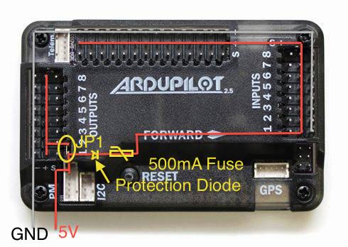

.. _common-powering-the-apm2:

==========================
Archived:Powering the APM2
==========================

.. warning::

    **ARCHIVED**
    
    The APM2.x is end of life for use with ArduPilot. 
    This article is made available for existing users.

This article demonstrates the options for powering the APM2.x board
along with information about the requirements for connecting the power
rail.

Overview
========

Like any computer, the APM needs a power supply with a steady clean
voltage and sufficient current.

3DR provides an :ref:`3DR Power Module <common-3dr-power-module>` that
supplies 2.25A at 5.37V. The module is designed to convert power from
the main flight battery (18 Volt maximum).  That module will supply
sufficient power for your APM, and low power radios including your RC
receiver (without servos). Your RC receiver can be powered from any APM
Input (+5V and ground). This is normally done by connecting a 2 or 3
wire cable between an APM Input and one of the output channels on the RC
radio.

If you are using any servos such as are required with a traditional
helicopter or a camera gimbal, you will need to provide an additional
dedicated power supply for the servos. The APM is intended to
**control** servos, not power them.

The following sections describe the APM power circuit (you will need to
understand this in order to design a power supply for your APM, or
provide additional power), and your options for powering the APM and
connected components.

APM power circuit
=================

There are two "sides" to the positive circuit in the board. Each side
has positive-rails available for inputing power or distributing it to
peripheral devices. The center row of pins in the three groups of pins
(Outputs, Inputs, Analog) labeled "+" are referred to as a
"positive-rail". This means that the base of all the + pins are
connected so they represent a single electrical path. The positive-rails
of the Input and Analog group are connected together. So we have two
separate positive circuits, one in the Outputs and the other made up of
the Input/Analog.

All of the components on the board take power from various points on
these rails, so it is necessary for both "sides" to be receiving +5V
(within the specs below) for the board to function.

These positive-rails can be joined together by placing JP1 in its
position on the board. This connects all the positive-rails ands
provides power to both sides of the board, so that low-level power can
be distributed to peripheral sensors and devices: 3DR Radios, sonar, RC
Rx, etc. via the power-rails.

When using the power module, the circuit path is as follows:

From the power module connection the negative wire is connected to a
negative-rail shared by the entire board regardless of JP1.

Positive voltage comes in to a T-junction. to the left is a path through
the JP1 to the positive-rail of the Outputs. To the right it flows
through an over-voltage, over-current, reverse-polarity protection(500mA
fuse and 6V Zener diode). A side effect of passing through the Zener
diode is a .37V loss, therefore input voltage should be bumped up by
.37V to account for this. From here the positive voltage runs to the
positive-rails of the Inputs and Analog. Inputs should not be used to
power anything except your RC receiver.

Higher current loads such as servos should be powered from the
power-rails (positive-negative) of the Output side. You must use an
adequate voltage-regulator to provide power directly to the Output
power-rails, all servo power leads will attach to these same rails (the
signal wires can connect on the Analog "S" pins in the case of a camera
gimbal). Since JP1 is removed in this scenario, the other "side" of the
board will need power provided to its power-rails directly.

Alternative ways to power your board
====================================

If you are using the 3DR Power Module please find instructions
here: \ :ref:`Using the 3DR Power Module <common-3dr-power-module>`

.. warning::

   Under no circumstances should you ever attempt to draw servo
   power from the analog input connector.

.. warning::

   You may "control" servos from A9, A10 and A11 from the A0 - A11
   I/O connector, but you must run servo power separately.

   -  The A0 - A11 I/O connector cannot supply sufficient power for servos.
   -  A9, A10 and A11 of the I/O connector come pre-wired to correct
      digital out for use as servo control lines.
   -  For servo use, it is imperative that they have not been reassigned to
      analog use with the pads on the back of the APM board.

Non-technical description of the power supply requirements
==========================================================

The description below simply supplements and provides an alternate view
of the information above.

#. The APM 2.5/2.6 board has two separate power circuits which make it
   very easy to power by a variety of methods.

   #. A fused power circuit provides primary board and general I/O
      power: (It cannot provide power for servos).
   #. The Other power circuit is for the OUTPUT connector power rail:
      (it can provide power for servos).

#. The jumper JP 1 determines whether the two power circuits are
   connected or separate.

   #. If JP1 is removed, the power rail on the OUTPUT connector "Floats"
      and may be used to distribute power.
   #. Although if JP1 is removed the OUTPUT connector cannot be used to
      supply power to the APM board.

#. It is possible to power the APM board from the Power Module connector
   or the OUTPUT or INPUT connectors.
#. Normally the APM 2.5/2.6 "Power Module" is used to provide primary
   APM 2.5 board and general I/O power.
#. Alternatively primary board power can be supplied by a BEC either
   from one of the ESCs or from an external BEC.
#. If servos are used, supplementary power is required.

   #. Generally one power supply is provided for the board and one or
      more additional power supplies for the servos.
   #. But if a sufficiently large external BEC is used it can supply
      power for both via the OUTPUT connector.

#. Only the OUTPUT connector can provide power for servos as the other
   circuit is fused.

   #. The address connector is sometimes used provide servo signals, but
      the servos power must come from elsewhere.

#. How you are powering your APM board and or servos determines whether
   JP1 is  installed or not.

   #. (Whether the two power circuits are separated or connected).
   #. All possible configurations are detailed Below.

#. The type of use will determine which options are available.

   #. Copter can power the APM from a power module or a UBEC or a BEC
      from one of the ESCs and can power servos from a UBEC or from the
      other ESC's BECs.
   #. Plane can power the APM from the power module,  the BEC from the
      flight motors ESC or a  separate UBEC and can power servos from a
      separate UBEC or the flight motors BEC if it is large enough.
   #. Rover  can power the APM from the power module,  the BEC from the
      drive motor's ESC or a  separate UBEC and can power the steering
      servo from a separate UBEC or the drive motors BEC if it is large
      enough.

Power supply rails connected requirements (JP1 Installed)
=========================================================

.. warning::

   Do not exceed Abs MAX input voltages when connecting the power
   supply or you will damage your board.

.. warning::

   Connecting USB when you have input voltages at the high end of
   the range (near Abs Max) can damage the board. Disconnect battery before
   connecting USB or test input voltages so they are within the specified
   range.

+---------------------------------+----------------+-----------+-----------------+
| Power Options                   | Nominal        | Abs MAX   | JP1 status      |
+---------------------------------+----------------+-----------+-----------------+
| Power on Output PWM connector   | 5.37V +-0.5    | 6V        | JP1 connected   |
+---------------------------------+----------------+-----------+-----------------+
| Power on Input PWM connector    | 5.00V +-0.25   | 5.5V      | JP1 connected   |
+---------------------------------+----------------+-----------+-----------------+

No Power Module and no servos and power provided by BEC from ESC
----------------------------------------------------------------

-  If you do not have a power module and you are not using servos.
-  Ensure JP1 is installed and provide the necessary power via the BEC
   from one of your ESC's.
-  Connect one ESC's BEC power and ground wires to one pair of the APM
   OUTPUT connectors power and ground pins.
-  Clip the BEC power leads on the remaining 3 wire connectors.
-  Ensure that the ESC's signal wires are connected to the appropriate
   APM OUTPUT connector signal pins.
-  You must ensure that your ESC's BEC has a sufficient power capability
   (at least 2 amps).

   -  Most 20 amp or higher ESCs have 2 amp BECs.

No Power Module but using servos and a high power External BEC
--------------------------------------------------------------

-  If you do not have a power module and are using servos you can use a
   high power external BEC.
-  Ensure JP1 is installed and provide the necessary power via a high
   power external BEC (5 to 10 amps or more).
-  The BEC power **must** be provided to one pair of the APM
   OUTPUT connector pins.

.. warning::

   Clip all power leads on the ESC's BECs (they would conflict
      with the external BEC).

-  Your servos will determine the size of the BEC required.
-  You should allow at least 2 or 3 amps extra to power the APM,
   receiver and to prevent (brown outs).
-  All of the positive power for driving each servo must come from the
   OUTPUT connector.

   -  This is true even if the servo(s) signal wires are connected to
      the ADDRESS connector.

-  This option requires you to take responsibility for providing
   sufficient power to prevent brownout.

No Power Module but using servos and multiple BECs from ESC's (A BEC for each servo)
------------------------------------------------------------------------------------

-  If you do not have a power module and are using servos you can use
   multiple BECs from your ESC's.
-  Ensure JP1 is installed and plug one of your ESC's signal cables with
   power leads into the OUTPUT connector.
-  Remove the power and ground leads from the remaining ESCs signal
   cable connectors.
-  Plug the signal wire connector from each ESC onto the appropriate pin
   on the OUTPUT connector.

   -  You can heat shrink these or plug them into a multi-wire connector
      appropriate for your copter.

-  Connect one pair of each of the remaining BEC power and ground lines
   to the power and ground of each individual servo.
-  Clip or heat shrink any remaining excess BEC power and ground leads.
-  The BEC power from one ESC \ **must** be provided to one pair of the
   APM output connector pins.
-  Plug only the signal input wire from your servos into the appropriate
   OUTPUT or ADDRESS connector pin.
-  Your ESC's BECs should be at least 2 amps.
-  The ESC's BEC grounds are in common with battery and internal signal
   ground so grounding the servos this way is OK.

Power supply rails not connected requirements (JP1 Not Installed)
=================================================================

.. warning::

   Do not exceed Abs MAX input voltages when connecting the power
   supply or you will damage your board.

.. warning::

   Connecting USB when you have input voltages at the high end of
   the range (near Abs Max) can damage the board. Disconnect battery before
   connecting USB or test input voltages so they are within the specified
   range.

+---------------------------------+----------------+-----------+--------------+
| Power Options                   | Nominal        | Abs MAX   | JP1 status   |
+---------------------------------+----------------+-----------+--------------+
| Power on Output PWM connector   | 5.00V +-0.5    | 6V        | JP1 open     |
+---------------------------------+----------------+-----------+--------------+
| Power on Input PWM connector    | 5.00V +-0.25   | 5.5V      | JP1 open     |
+---------------------------------+----------------+-----------+--------------+

Power Module and no servos
--------------------------

-  If you have a power module and you are not using servos.
-  Ensure JP1 is not installed.
-  Provide the necessary power via the power module connected to the
   APM's power module connector.
-  When connecting your ESCs to the OUTPUT connector clip the BEC power
   leads on each ESC's 3 wire connector.

   -  Or connect only the ESC's signal wires to the OUTPUT connector.

Power Module and using servos with external BEC power
-----------------------------------------------------

-  If you have a power module and an external BEC and you are using
   servos.
-  Ensure JP1 is Not installed
-  Provide APM board and receiver power via the power module connected
   to the power module connector.
-  Connect an external BEC with sufficient power for your servos to one
   pair of the OUTPUT connector power pins.
-  When connecting your ESCs to the OUTPUT connector clip the BEC power
   leads on each ESC's 3 wire connector.

   -  Or connect only the ESC signal wires to the OUTPUT connector.

Power Module and using servos with BEC power from one ESC
---------------------------------------------------------

-  If you have a power module and you are using servos Remove JP1.
-  Provide APM and receiver power via the power module connected to the
   APM's power module connector.
-  The BEC of a single ESC must provide sufficient power for all your
   servos.
-  When connecting your ESCs to the OUTPUT connector clip the BEC power
   leads on all but one of the ESC's connectors.
-  Or connect only the ESC signal wires to the OUTPUT connector for all
   except one ESC.

   -  And on that ESC connect all 3 wires to the OUTPUT connector.

No Power Module and using Servos with BEC power from two ESCs
-------------------------------------------------------------

-  If you do not have a power module and you are using servos remove
   JP1.
-  Provide APM and receiver power via 1 pair of ESC-BEC power wires
   connected to the APM INPUT connector power pins.
-  Also connect another of the ESCs power wire pair to the
   OUTPUT connector.
-  The BEC of a single ESC must provide sufficient power for all your
   servos.
-  Clip the signal power leads on your remaining ESC's.
-  Connect all ESC signal wires to the appropriate OUTPUT connector
   pins.

APM Power Wiring Example
========================

.. warning::

   Do not exceed Abs MAX input voltages when connecting power
   supply or you will damage your board.

.. warning::

   Connecting USB when you have input voltages at the high end of
   the range (near Abs Max) can damage the board. Disconnect battery before
   connecting USB or test input voltages so they are within the specified
   range.

On the bench, you'll probably be powering the board via your USB cable
while you set it up and test it. But in your aircraft, you'll need to
power it with your on board power system, which is usually your LiPo
battery going through an ESC or the Power Module. In the case of a
multicopter, this can come through your Power Distribution Board (PDB),
which will break out the 5V output from the one of the electronic speed
controls (ESCs) or the Power module which is wored directly to the
battery.

In the picture below, the red and black wires are the 5b    m hV power
cable coming from a PDB. You can plug them into any two pins along the
5V and Ground (middle and outer) rows of pins on APM 2.5's Output side.
The other cable, which in this case is a four-wire cable with orange and
white wires for a quadcopter, is the signal cable to the PDB, which are
the wires that APM 2.5 will use to command each of the ESCs.

The picture below is of APM 2; but the concept is applicable to APM 2.5.

.. image:: ../../../images/pdbpower.jpg
    :target: ../_images/pdbpower.jpg

It's also possible to power APM 2.5 from two separate sources, one
powering the RC system on the input side, and the other powering the
output side (servos or ESCs). This is determined by a jumper on the JP1
pins (see below). If the jumper is on, which is the factory default, the
board is powered from the OUTPUT rail or the USB. If the jumper is off,
the board is powered from the INPUT rail, but the OUTPUT rail will need
its own power source. This configuration is used if you want to have two
separate power sources in your aircraft, one powering the servos and the
other powering the electronics. The ideal input voltage is 5.37v +/-0.0v
and may not be provided by a typical ESC.

.. warning::

   Do not exceed Abs MAX input voltages when connecting power
   supply or you will damage your board.

In some cases it may be a good idea to set the input voltage slightly
above the median (but below the maximum) to account for possible voltage
drops during momentary high current events.

The APM2.5 by itself draws relatively little current (200ma range) and a
power source capable of providing 300 - 500ma will provide plenty of
margin. However, if servos or other power consuming devices are being
driven by the same power source you must consider the power requirements
for those devices as well and provide plenty of margin to prevent
disastrous "brown-outs". For instance, a single digital servo can easily
draw 1-5 amps depending on its size and performance. (Note: ESCs do not
consume power from the APM) If you experience spurious resets or other
odd behavior it is most likely due to noisy or insufficient power to the
APM. As with all logic boards, electrical noise from the motors, servos,
or other high current devices on the power source can cause
unpredictable behavior.

It is recommend that a \ `power filter <http://www.dpcav.com/xcart/Power-Supply-Filter-L-C-Type.html>`__ be
used in such conditions.

Too short or long power wires, bad or old connectors, or insufficient
current capability of the APM power source can result in a "brown-out"
situation resulting in unpredictable operation. This is particularly
true in traditional helicopters where the collective servos can draw
3-20 amps in short bursts. The power source must be able to accommodate
this without voltage droop or voltage spikes. A quality switching type
BEC (e.g one of
`these <http://www.castlecreations.com/products-search?qs=bec>`__ or one of
`these <http://www.western-robotics.com/WRL-HBECM2>`__) can be a
solution depending on overall current requirements. Many of these type
of regulators are programmable so remember to program them with in the
safe operating range of the APM2. Linear voltage regulators are not
recommended as they are inefficient and prone to overheating and heat
induced failures. APM2 should never be connected directly to a battery
of any type.

Power source problems are common and can be insidious and frustrating.
Be meticulous. Any autopilot or autopilot is useless and
potentially dangerous without good clean power source.

The picture below is of APM 2; but the concept is applicable to APM
2.5/2.6.

.. image:: ../../../images/APM2_JP1.jpg
    :target: ../_images/APM2_JP1.jpg
