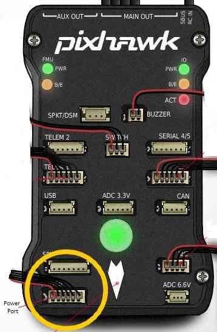
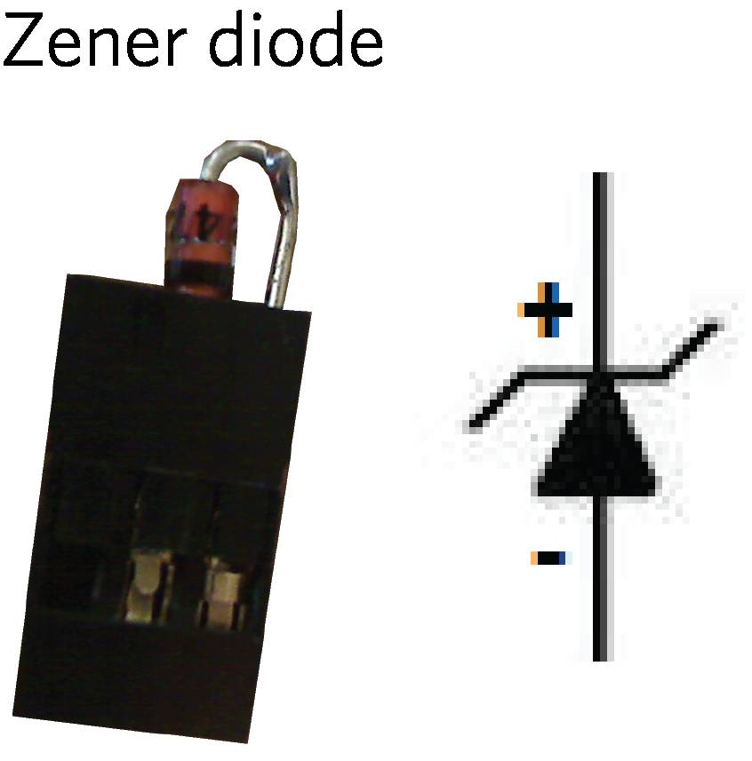
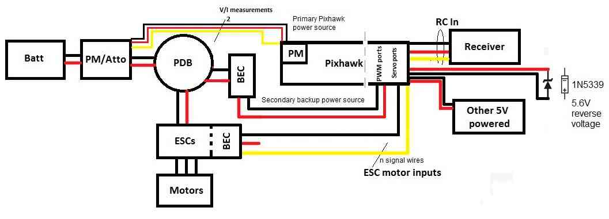
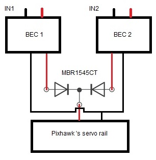

.. _common-powering-the-pixhawk:

====================
Powering the Pixhawk
====================

This article explains how to power the
:ref:`Pixhawk <common-pixhawk-overview>`.

Overview
========

For most users powering the Pixhawk is as simple as connecting a 6-pin
DF13 cable from one of the :ref:`supported power modules <common-powermodule-landingpage>` into the Pixhawk's "Power"
port as shown below.

   Pixhawk Power Port

The module will provide a steady ~5V to Pixhawk and allow the Pixhawk to
measure the current and/or voltage of the main battery. Depending on the
power module you may also have connections to provide backup power and
power to supply the servo rail.

The type of power module also determines what size batteries can be used
(most multicopters draw less than 20amps when hovering and rarely
consume more than 90amps at full throttle).

.. warning::

   Pixhawk does **not** *supply* power to the servo rail. Powering
   the servo rails is normally done by an ESC or alternatively a separate
   source such as a BEC (as shown in the 
   :ref:`wiring overview below <common-powering-the-pixhawk_pixhawk_poweresc_wiring_overview>`).

.. tip::

   Some power modules explicitly provide support for powering the
   servo rail, backup power and support for larger batteries. Using this
   sort of module means that you don't need to think about most of the
   wiring issues discussed in the rest of this article.
   
.. warning::

   Pixhawk supplies power for an RC receiver if that receiver is connected via a 3-conductor servo cable to the RC connector on the Pixhawk. If that receiver is also connected to the SBus port on the
   Pixhawk to communicate an analog RSSI signal via a 3-conductor cable, there is an opportunity to inadvertently power the servo bus from the primary PixHawk power input thru the radio.

Some radios (e.g., FRSky) will pass power received on their RC output cable out on their analog RSSI port. And the PixHawk servo-rail power bus includes the SBus +5v pin.

Removing the center conductor from the RSSI monitoring cable will avoid powering the Pixhawk servo bus from the wrong (or from multiple) voltage sources thru the RC radio receiver.

Powering/backup off the servo rail
==================================

Pixhawk can be powered off the servo rail instead of from a power
module. This is achieved by connecting a 5V BEC (with or without a
servo) to a power (+) pin and a ground (-) pin of the "MAIN OUT" or "AUX
OUT" pins. You **must** also add a Zener diode (part number 1N5339) to
condition the power across the rail and restrict it to less than 5.7V.

.. image:: ../../../images/servo-power-wiring.jpg
    :target: ../_images/servo-power-wiring.jpg

This method can also be used as backup power for Pixhawk when using a
power module. If the voltage provided by the power module falls too low
(4V?), Pixhawk will take power from the output rail. See the *voltage
ratings* section below for more information on powering Pixhawk.

.. warning::

   The servo rail can supply servos requiring up to 10.5V (but not also power the Pixhawk). Voltages above 5V cannot be used to power the Pixhawk via the servo rail. In this case the Zener diode **must not be used**. 

.. _common-powering-the-pixhawk_pixhawk_poweresc_wiring_overview:

Pixhawk Power/ESC Wiring Overview
=================================

The block diagram below synthesizes an overview of Pixhawk's power and
ESC wiring. In this diagram, a 3DR power module (or equivalent device)
powers Pixhawk through its power port (primary source). One power source
is enough but obviously not redundant if the power module fails to power
this primary source. Therefore the diagram adds a second backup power
source via a 5V BEC that wires to Pixhawk's output servo rail. If the
primary source fails, Pixhawk will automatically switch to this second
power source.

   Pixhawk Power/ESC Wiring Overview

*Diagram acronyms:*

-  *PDB = Power Distribution Board.*
-  *PM = pixhawk power port.*
-  *PM/Atto = optional power module from 3DR or Attopilot alternative
   for higher than 4S battery voltages.*

.. note::

   Looking for a detailed explanation of power wiring with Pixhawk?
   `Click here for more information about connecting ESCs and servos to Pixhawk. <http://pixhawk.org/users/actuators/pwm_escs_and_servos>`__\ 

General wiring recommendations
==============================

-  Always connect a ground reference wire with your ESC's signal wires
   on the Pixhawk servo rail (output ports 1-8). Indeed an ESC's signal
   wire should never be left floating without its ground reference
   (THERE IS NO SETUP WHICH WOULDN'T REQUIRE SIGNAL GROUND TO BE
   CONNECTED).
-  It is dangerous to power the Pixhawk **only** from the servo rail,
   especially with digital servos. Servos may cause voltage spikes (as
   shown on illustration below that shows the servo rail voltage on an
   oscilloscope when a single digital servo attached to a Pixhawk is
   moved rapidly ). The key thing is that the digital servo causes the
   voltage on the rail to rise above the critical 5.7V level. Above that
   level the Pixhawk power management will cut power to the FMU and the
   Pixhawk will reboot.
   **If that happens when flying you will lose your aircraft.**

   .. image:: ../../../images/servo-V-spike.jpg
       :target: ../_images/servo-V-spike.jpg

   It is up to the user to provide a clean source of power for the cases
   when it is powered off the servo rail. Servos by themselves are not
   quiet enough.

-  Do not connect a BEC power source to the RC IN port (black ground,
   red power and white signal wires from the receiver's PPM output are
   connected to these RC pins)
-  Adding an external Zener is a recommendation specifically for systems
   that are using 5V servos and have the servo rail configured for back
   up power. Connect the recommended Zener diode with its polarity as
   indicated on the diagram. Use as short wires as possible or even
   better, use a standard 3 position JR servo connector with the diode
   legs directly inserted (and soldered) in the servo female pins. To
   complement the diode, it is also useful to add a capacitor in parallel
   to the diode. The capacitor will smooth out eventual voltage ripples.
   As advised for the diode, the capacitor should be connected with as
   short wires as possible. Do not oversize the capacitor.

Advanced power supply configuration
===================================

This section explains how to set up triple redundant power sources
(power module as primary, with two backup BECs).

In this scheme, a simple MBR1545CT integrated circuit is used. This
circuit takes two BECs on its inputs, and outputs only off the BEC with
the highest voltage (i.e. if BEC1 outputs 5.25V and BEC2 outputs 5.45V,
MBR1545CT will pass BEC2 and blocks BEC1). Here is a tie bus circuit
wiring diagram and example realisation with the MBR1545CT integrated
circuit and a 6 pin JST connector:

.. image:: ../../../images/MBR1545CT.jpg
    :target: ../_images/MBR1545CT.jpg

Voltage ratings
===============

Pixhawk can be triple-redundant on the power supply if three power
sources are supplied. The three rails are: Power module input, servo
rail input, USB input.

**Normal Operation Maximum Ratings**

Under these conditions all power sources will be used in this order to
power the system.

Power module input (4.1V to 5.7V) [refers to the voltage coming into
Pixhawk from the power module]

Servo rail input (4.1V to 5.7V)

USB power input (4.1V to 5.7V)

**Absolute Maximum Ratings**

Under these conditions the system will not draw any power (will not be
operational), but will remain intact.

Power module input (0V to 20V) [refers to the voltage coming into
Pixhawk from the power module]

Servo rail input (0V to 20V)

USB power input (0V to 6V)

