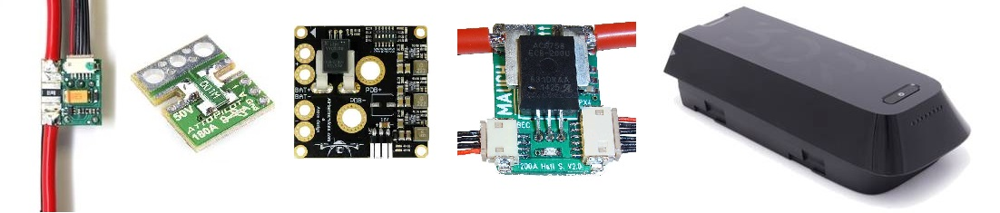
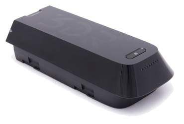

.. _common-powermodule-landingpage:

====================================
Battery Monitors (aka Power Modules)
====================================

If possible it is best to power your flight controller controller with a :ref:`power module <common-3dr-power-module>` to reduce the chances of a brownout.  
The links below have information about these modules and other alternatives.

.. toctree::
    :maxdepth: 1

    Common Power Module <common-3dr-power-module>
    AirbotPower Power Module <common-airbotpower-power-module>
    AttoPilot Current Sensor <common-using-a-current-sensor>
    Mauch Power Modules <common-mauch-power-modules>
    Power Module Configuration <common-power-module-configuration-in-mission-planner>
    Smart Batteries <common-smart-battery>

.. image:: ../../../images/mauch_power_module.jpg
    :target: ../_images/mauch_power_module.jpg

.. image:: ../../../images/AirbotPower_PowerModule_Back.jpg
    :target: ../_images/AirbotPower_PowerModule_Back.jpg

[site wiki="copter"]

    
    Solo (only) smart battery.
[/site]

