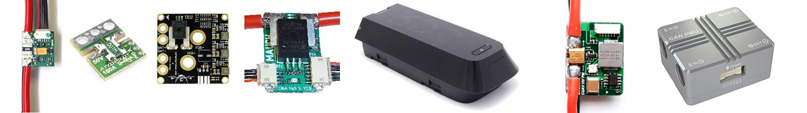

.. _common-powermodule-landingpage:

=============================================
Battery Monitors (aka Power Monitors/Modules)
=============================================

Power Monitors/Modules provide these benefits:

- Most provide a stable power supply to the autopilot, in addition to monitoring, and therefore reduces the chance of a brown-out
- Allows real-time monitoring of the battery’s voltage and current and triggering a low battery failsafe
- Allows compensating for the interference on the compass from the motors using the COMPASS_MOT_x and COMPASS_PMOT_x parameters, see :ref:`common-compass-setup-advanced`.

The links below have information about the most commonly used power monitors/modules

Up to 16 batteries/power monitors can be monitored. Each monitor has its own group of configuration parameters, designated by ``BATTx_`` with x denoting each monitor in the system (first monitor "x" is null character, ie ``BATT_`` prefix). In addition, a ``BATT_MONITOR`` "type" = SUM is available, that consolidates  battery monitors into a single report using the :ref:`BATT_SUM_MASK<BATT_SUM_MASK>`.

.. note:: some kinds of monitors can provide bi-directional battery current information. These are useful when generators or MPPT chargers are being utilized in the system to monitor the net charge state of the battery.

.. toctree::
    :maxdepth: 1

    Power Monitor Configuration <common-power-module-configuration-in-mission-planner>

Power Monitors Connecting to AutoPilot Power Monitor Port
=========================================================

.. toctree::
    :maxdepth: 1

    AirbotPower Power Module <common-airbotpower-power-module>
    Common Power Module <common-3dr-power-module>
    CUAV HV PM<common-hv-pm>
    Holybro Analog Power Modules (PM02,PM06,PM07) <https://holybro.com/collections/power-modules-pdbs/Analog>
    Holybro Digital I2C Power Modules (PM02D,PM03D,PM06D) <https://holybro.com/collections/power-modules-pdbs/Digital>
    Mauch Power Monitor <common-mauch-power-modules>
    SmartAP Power Distribution Board<common-smartap-pdb>
    Synthetic Current Sensor/Analog Voltage Monitor <common-synthetic-current-monitor>

CAN/DroneCAN Power Monitors and Batteries
=========================================

.. toctree::
    :maxdepth: 1

    Aerotate DroneCAN Smart Battery<common-aerotate-dronecan-battery>
    CUAV CAN/DroneCAN PMU<common-can-pmu>
    Holybro PM08-CAN Power Modules <https://holybro.com/collections/power-modules-pdbs/products/dronecan-pm08-power-module-14s-200a>
    Matek CAN-L4-BM DroneCan PMU <http://www.mateksys.com/?portfolio=can-l4-bm>
    Packet Digital MPPT Solar Controller <common-packetdigital-mppt>
    Pomegranate Systems<common-pomegranate-systems-pm>
    Tattu DroneCan Battery<common-tattu-dronecan-battery>

DroneCAN Battery Tag
====================

A DroneCAN based Battery Tag which monitors battery age and user cycles can be easily created by reflashing the `Matek DroneCAN RC adapter board <https://www.mateksys.com/?portfolio=can-l4-rc>`__ using the `Battery Tag AP_Periph firmware <https://firmware.ardupilot.org/AP_Periph/latest/MatekL431-BatteryTag/>`__ . Firmware updating process is explained :ref:`HERE <dronecan-firmware-flashing>`.

VimDrones also has Battery Tag firmware for use with their DroneCan devices based on the L431, `HERE <https://firmware.ardupilot.org/AP_Periph/latest/VM-L431-BatteryTag/>`__.

Battery Tag data can be accessed easily via either examining the tag's DroneCAN parameters using the :ref:`GCS DroneCAN Interface <dronecan-uavcan-slcan>` or :ref:`DroneCAN GUI <common-uavcan-gui>`.

A `Scripting applet <https://github.com/ArduPilot/ardupilot/blob/master/libraries/AP_Scripting/applets/BatteryTag.lua>`__ can also be used.

I2C Power Monitor
=================

.. toctree::
    :maxdepth: 1

    ARK PAB Power Modules <common-ark-power-modules>
    Holybro Digital I2C Power Modules (PM02D,PM03D,PM06D) <https://holybro.com/collections/power-modules-pdbs/Digital>
    Rotoye BatMon Smart Battery <common-smart-battery-rotoye.rst>

Power Monitoring Via Telemetry Equipped AM32/BLHeli32/S ESCs
============================================================

- See :ref:`this section<esc-telemetry-based-battery-monitor>` of the :ref:`blheli32-esc-telemetry` page

EFI Fuel Monitoring
===================

EFI Fuel Monitoring, See :ref:`common-efi` section on using :ref:`BATT_MONITOR<BATT_MONITOR>` = 27 (EFI).

Liquid Fuel Monitors
====================

.. toctree::
    :maxdepth: 1

    Fuel Monitors <common-fuel-sensors>

Substituting  a Battery Monitor's Data into an ESC's telemetry stream
=====================================================================

- See :ref:`BATT_ESC_INDEX<BATT_ESC_INDEX>` (for first Battery Monitor. ``BATTx_ESC_INDEX`` for others.)

.. note:: this feature is usually only available as a build option using the `Custom Firmware Build Server <https://custom.ardupilot.org>`__

