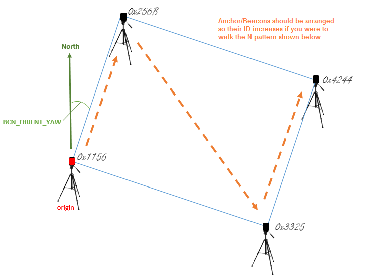

.. _common-pozyx:

============================
Pozyx for Non-GPS Navigation
============================

[copywiki destination="copter,rover"]

This article explains how a `Pozyx <https://www.pozyx.io/>`__ system based on the `DWM1000 <http://www.decawave.com/products/dwm1000-module>`__ can be used as a short-range substitute for a GPS allowing position control modes like Loiter, PosHold, RTL, Auto indoors.

.. note::

   This is an experimental feature released in Copter-3.5.  Better results may be possible by using Copter-3.6 and enabling the :ref:`EKF3 <common-apm-navigation-extended-kalman-filter-overview>`.

..  youtube:: ozr8tGO9CFs
    :width: 100%

Required Hardware
=================

* 4 `Pozyx anchors <https://www.pozyx.io/store/detail/5>`__ and 1 `Pozyx tag <https://www.pozyx.io/store/detail/4>`__.  Note the `Ready to Localize <https://www.pozyx.io/store/detail/2>`__ or `Developer Kits <https://www.pozyx.io/store/detail/3>`__ are more economical than buying individual tags and anchors.
* one `Arduino Uno R2 or R3 <https://www.arduino.cc/en/Main/ArduinoBoardUno>`__
* 4 `portable chargers <https://www.amazon.com/s/ref=nb_sb_noss_2?url=search-alias%3Daps&field-keywords=portable+charger&rh=i%3Aaps%2Ck%3Aportable+charger>`__ with type A USB ports to power the anchors (optional)
* 4 `tripods <https://www.amazon.com/s/ref=nb_sb_noss_1?url=search-alias%3Daps&field-keywords=tripod&rh=i%3Aaps%2Ck%3Atripod>`__ to mount the anchors (optional)

Placing the anchors
===================

The anchors should be placed in a rectangular shape.  The anchor with the lowest ID (IDs are printed in hexidecimal on each device) will act as the "origin" and should be placed at the lower-left corner of the rectangle.  Each of the remaining three anchors should be placed in a corner so that the anchor IDs increase as you travel an "N" pattern within the rectangle.  The configuration is slightly simpler if the line from the origin anchor to the 2nd anchor is due North but it is not required as the :ref:`BCN_ORIENT_YAW <BCN_ORIENT_YAW>` parameter can be used to account this difference.

Preparing the tag
=================

- connect one of the Pixhawk's telemetry connections to the UNO.  Telem1 is shown above but Telem2 or Serial4/5 will work equally well.
- Pixhawk's GND should be connecdted to one of the UNO's GND pins.
- Pixhawk's TX should be connected to the UNO's pin 10.
- Pixhawk's RX should be connected to the UNO's pin 11.
- Pixhawk's VCC may be connected to the UNO's 5V connector to provide power to the Uno/Pozyx from the Pixhawk.

The Arduino IDE should be used to load `IndoorLoiter sketch <https://github.com/ArduPilot/ardupilot/blob/master/Tools/Pozyx/IndoorLoiter/IndoorLoiter.ino>`__ onto the Uno after first changing the anchor tags `found here <https://github.com/ArduPilot/ardupilot/blob/master/Tools/Pozyx/IndoorLoiter/IndoorLoiter.ino#L12>`__ to match the IDs of the tags in your setup.

At this point you may wish to test the tag's ability to communicate with the tags by:

- powering on all the anchors.
- connect the UNO's Type B USB to your PC.
- connect with the Arduino IDE's serial monitor (set to baud 115200) and check no "Beacon Configuration failed" messages appear.  If they do, check that the IDs have been set correctly in the IndoorLoiter2.ino sketch (above).

Mount the Pozyx tag on the top of the Arduino Uno and then mount on the vehicle.

Configuration through the Ground Station 
========================================

Ensure that Copter-3.5 (or higher) is loaded onto the flight controller and connect with a Ground Station (i.e. Mission Planner).

- set :ref:`BCN_TYPE <BCN_TYPE>` to 1 (means using Pozyx system)
- set :ref:`BCN_LATITUDE <BCN_LATITUDE>`, :ref:`BCN_LONGITUDE <BCN_LONGITUDE>` and :ref:`BCN_ALT <BCN_ALT>` to match your actual location.  Getting these values exactly correct is not particularly important although getting it close is required in order for the compass's declination to be correctly looked up from the small database held within ArduPilot.
- set :ref:`BCN_ORIENT_YAW <BCN_ORIENT_YAW>` to the heading from the origin anchor to the 2nd anchor.  One way to capture this value is to stand at the origin holding the vehicle so that it's nose points towards the second beacon.  Read the vehicle's heading from the HUD and enter this value into :ref:`BCN_ORIENT_YAW <BCN_ORIENT_YAW>`
- set :ref:`GPS_TYPE <GPS_TYPE>` to 0 to disable the GPS
- set :ref:`ARMING_CHECK <ARMING_CHECK>` to -9 to disable the GPS arming check
- set :ref:`SERIAL1_BAUD <SERIAL1_BAUD>` to 115 to set telemetry1's baud rate to 115200 (if using Telem2 set :ref:`SERIAL2_BAUD <SERIAL2_BAUD>` instead)
- set :ref:`SERIAL1_PROTOCOL <SERIAL1_PROTOCOL>` to 13 to enable reading the IndoorLoiter2 protocol (If using Telem2 set :ref:`SERIAL2_PROTOCOL <SERIAL2_PROTOCOL>` instead)
- set :ref:`BRD_SER1_RTSCTS <BRD_SER1_RTSCTS>` to 0 to ensure telem1 does not use flow control (If using Telem2 set :ref:`BRD_SER2_RTSCTS <BRD_SER2_RTSCTS>` instead, not required if using Serial4/5)

Ground Testing
==============

- Connect the Flight Controller to a ground station.  You may need to connect the Lipo battery as well because some computers are unable to provide enough power through their USB port for the combined Pixhawk+Pozyx+Uno.
- Press the UNO's white or red reset button which can be found next to the USB port (see image above)
- After about 1 minute the vehicle's position should jump to the lattitude, longitude you input during the configuration step (above).  If it does not, connect a USB cable to the UNO's USB port and open the Arduino IDE's serial monitor and look for errors.
- Check that the vehicle's position is relatively stable (i.e. moving around less than one meter)
- Walk the vehicle around between the anchors and ensure that it's position on the map updates correctly

Flight testing
==============

Setup the transmitter with Stabilize, AltHold and Loiter flight modes.
Take off in AltHold mode and maintain a stable hover.
Switch to Loiter but be ready to switch back to AltHold or Stabilize if the vehicle's position or altitude becomes unstable.

DataFlash logging
=================

The distance to the beacons can be found in the dataflash log's BCN message's D0, D1, D2, D3 fields.

User videos
===========

..  youtube:: mVLj2kUZXe0
    :width: 100%
