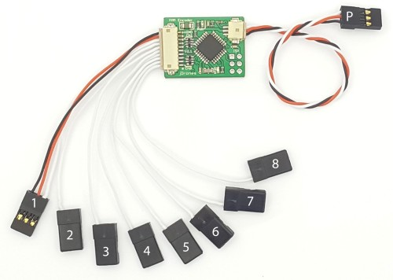
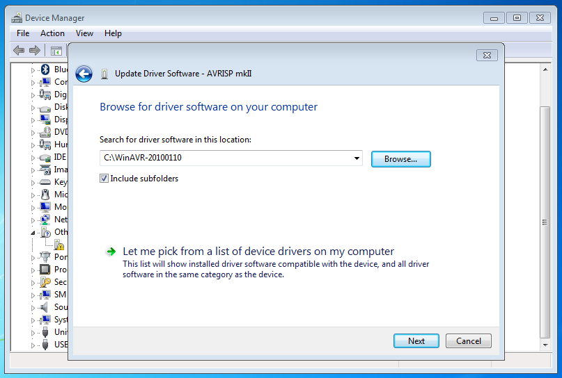
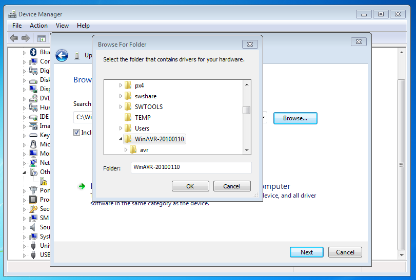

.. _common-ppm-encoder-8-channel-standalone-encoder:

===============================================
PPM Encoder AT328P 8 Channel Standalone Encoder
===============================================

This article describes the standalone PPM Encoder that can be purchased
from `jDrones <http://store.jdrones.com/pixhawk_px4_paparazzi_ppm_encoder_v2_p/eleppmenc20.htm>`__. 
It is provided for use in the (very unlikely) event that the encoder needs 
to be reprogrammed.

Overview
========

The ATMEGA 328P 8 channel STANDALONE PPM encoder allows to encode up to
8 PWM (pulse width modulated) signals into one PPM (pulse position
modulation) signal. This allows you to use any R/C receiver and a
microcontroller that supports PPM (e.g. the
`PX4FMU <http://pixhawk.org/modules/px4fmu>`__). The design is
based on the Atmega328P using and an external 16Mhz resonator.   The 3DR
PPM Encoder (v2) now uses the ArduPPM firmware, replacing the previously
used Paparazzi PPM Encoder firmware. The new ArduPPM firmware has been
designed from scratch to enhance performance and robustness, and to
better accommodate our product needs now and in the future. Firmware for
Plane (and Rover) can be `downloaded here <https://download.ardupilot.org/downloads/wiki/advanced_user_tools/ArduPPM_v2.3.16_ATMega328p_for_ArduPlane.hex_.zip>`__.
Firmware for Copter can be `downloaded here <https://download.ardupilot.org/downloads/wiki/advanced_user_tools/ArduPPM_v2.3.16_ATMega328p_for_ArduCopter.hex_.zip>`__.
(The source code, while not necessary if using the compiled code, \ `can be found here <https://github.com/ArduPilot/ardupilot/blob/master/Tools/ArduPPM/Libraries/PPM_Encoder.h>`__.)

Setup Manual
============

The `Manual <https://download.ardupilot.org/downloads/wiki/advanced_user_tools/PPM-Encoder-3DR-Manual-v2.3.16.pdf>`__
shows how to solder and wire the PPM Encoder and explains the different
failsafe modes.

Version 3
=========

The third version of the PPM Encoder features a smaller form factor and
DF13 connector ports. To set up, connect the three-wire cable to the
autopilot and the 10-wire cable to a PWM receiver. For more
instructions, `view the manual here <https://download.ardupilot.org/downloads/wiki/advanced_user_tools/PPM-Encoder-V3-Manual.pdf>`__.

	
- Numbers 1-8, connects to your RC-Receiver
- Cable marked with P, connects to Pixhawk PPM/RC Input 	

Re-Programming the Atmega328p PPM encoder
=========================================

**Note**: !The PPM Encoder comes with the PPM encoder firmware
pre-programmed, and most users will never need or want to modify it.  
However, some users may want to get into the code to change the way the
PPM Encoder interprets RC signals or may want to update to the latest
version. Some rare users did report receiver compatility problems with
the old version (before ArduPPM). For most cases, ArduPPM did solve
them.   ArduPPM is the official name for the newer generation firmwares.
It has been designed from scratch with reliability as a top priority.
The official release of the encoder firmware is in the Downloads section
as ArduPPM_Vx.x.xx_ATMega328p.hex. The official source code is in the
`Git repository here <https://github.com/ArduPilot/ardupilot/tree/master/Tools/ArduPPM>`__.
The standalone PPM Encoder needs the ATMega328p version.   To flash,
connect the PPM Encoder to an AVR programmer such as the AVRISP mkII:

.. image:: ../../../images/reprogramming_the_standalone_ppm_encoder1.jpg
    :target: ../_images/reprogramming_the_standalone_ppm_encoder1.jpg

When flashing, make sure the PPM Encoder is powered using any of the 5V
and Ground pins.

Re-Programming instructions for Windows
---------------------------------------

Download and install the
latest \ `WinAVR <https://sourceforge.net/projects/winavr/>`__. Plug in
the AVRISP mkII and Install the drivers for AVRISP mkII as follows: Open
the device manager and select the AVRISP mkII, choose "Update Driver
Software..."

.. image:: ../../../images/windows_install_avrispmkii_driver_11.png
    :target: ../_images/windows_install_avrispmkii_driver_11.png

Choose "Browse my Computer for driver software"

.. image:: ../../../images/windows_install_avrispmkii_driver_21.png
    :target: ../_images/windows_install_avrispmkii_driver_21.png

Browse to the folder where WinAVR is installed (e.g.
C:\\WinAVR-20100110\\)   |windows_install_avrispmkii_driver_3|

Choose "Install this driver software anyway"

.. image:: ../../../images/windows_install_avrispmkii_driver_51.jpg
    :target: ../_images/windows_install_avrispmkii_driver_51.jpg

This should finish successful:

.. image:: ../../../images/windows_install_avrispmkii_driver_61.jpg
    :target: ../_images/windows_install_avrispmkii_driver_61.jpg

Now start the command line: Press "Start" and type cmd and enter.

.. image:: ../../../images/windows_start_cmd1.png
    :target: ../_images/windows_start_cmd1.png

Change Directory using cd to the folder where your Hex file is located:
e.g. cd Downloads\\ if it is in Downloads   Then type the command:
avrdude -P usb -c avrispmkii -p atmega328p -U
flash:w:ArduPPM_Vx.x.x_PPM_Encoder.hex (substitute x.x.x with the
your version number)

.. image:: ../../../images/windows_cmd_avrdude_11.png
    :target: ../_images/windows_cmd_avrdude_11.png

If it all went well, the following output should appear:   

.. image:: ../../../images/windows_cmd_avrdude_21.png
    :target: ../_images/windows_cmd_avrdude_21.png

Re-Programming instructions for Mac OS X
----------------------------------------

Todo: add content on how to flash the hex file here

Re-Programming instructions for Linux
-------------------------------------

Install avrdude:   For Ubuntu:

::

    sudo apt-get install avrdude

Program instructions for the AVRISP mkII:

::

    avrdude -p atmega328p -P usb -c avrispmkii -U flash:w:ArduPPM_Vx.x.x_ATMega328p.hex

This should output:

::

    avrdude: AVR device initialized and ready to accept instructions

    Reading | ################################################## | 100% 0.00s

    avrdude: Device signature = 0x1e950f
    avrdude: NOTE: FLASH memory has been specified, an erase cycle will be performed
             To disable this feature, specify the -D option.
    avrdude: erasing chip
    avrdude: reading input file "ArduPPM_V2.3.0_ATMega328p.hex"
    avrdude: input file ArduPPM_V2.3.0_ATMega328p.hex auto detected as Intel Hex
    avrdude: writing flash (1952 bytes):

    Writing | ################################################## | 100% 0.61s

    avrdude: 1952 bytes of flash written
    avrdude: verifying flash memory against ArduPPM_V2.3.0_ATMega328p.hex:
    avrdude: load data flash data from input file ArduPPM_V2.3.0_ATMega328p.hex:
    avrdude: input file ArduPPM_V2.3.0_ATMega328p.hex auto detected as Intel Hex
    avrdude: input file ArduPPM_V2.3.0_ATMega328p.hex contains 1952 bytes
    avrdude: reading on-chip flash data:

    Reading | ################################################## | 100% 0.56s

    avrdude: verifying ...
    avrdude: 1952 bytes of flash verified

    avrdude: safemode: Fuses OK

    avrdude done.  Thank you.

If you get permission errors, try using sudo.

Re-Compiling Options
====================

By default negative pulse PPM is encoded. In order to change to positive
pulse PPM, the line 158 in Tools/ArduPPM/Libraries/PPM_Encoder.h needs
to be uncommented from:

::

    // #define _POSITIVE_PPM_FRAME_ // Switch to positive pulse PPM

to

::

    #define _POSITIVE_PPM_FRAME_    // Switch to positive pulse PPM

Re-Compiling using Linux
------------------------

These instructions are tested using Ubuntu:

::

    sudo apt-get install build-essential git-core gcc-avr avrdude
    git clone http://code.google.com/p/ardupilot-mega
    cd ardupilot-mega/Tools/ArduPPM/

edit ATMega328p/Encoder-PPM.c or Libraries/PPM_Encoder.h now

::

    cd ATMega328p/
    make clean
    make

and you should have your custom hex-file to program using:

::

    avrdude -p atmega328p -P usb -c avrispmkii -U flash:w:Encoder-PPM.hex

