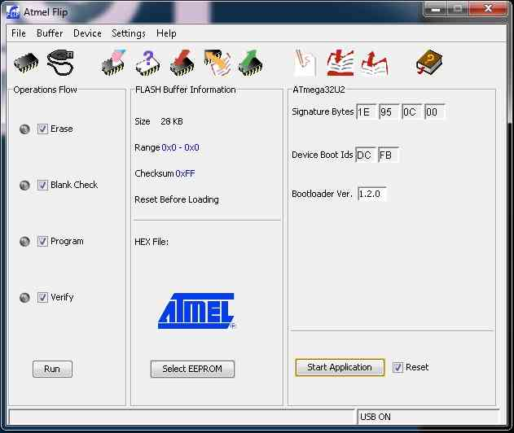

.. _common-ppm-encoder-apm2x-atmega32u2:

================================================================
Archived:PPM Encoder APM 2.x Atmega 32U2 (8 Channel PPM Encoder)
================================================================

.. warning::

    **ARCHIVED**
    
    The APM2.x is end of life for use with ArduPilot. 
    This article is made available for existing users.

This article describes the PPM Encoder that is embedded in APM2.5/6
boards. It is provided for use in the (very unlikely) event that the
encoder needs to be reprogrammed.

How to flash the Atmega32U2 (PPM encoder) through USB
=====================================================

If you every find yourself in a situation where your PPM encoder has
become corrupted for some reason, or you want to upload a new version,
you can. The PPM encoder (ATMega32-U2) has an special bootloader that
allows you to flash it without needing a special SPI programmer. The
32U2 firmware controls the USB connection to the 2560 and is also used
to convert radio PCM signals to a PPM signal for the 2560.  APM 2.5
modules shipped before March 4th 2013  have an older version of the
firmware. Here is a discussion on the
newer \ `firmware <https://www.diydrones.com/profiles/blogs/new-arduppm-firmware-version-2-3-16-in-the-downloads-section>`__.

What you need
=============

-  Windows XP/Vista/7
-  USB cable
-  Download and install Flip,
   click \ `**here**. <http://www.atmel.com/tools/FLIP.aspx>`__ - The firmware (HEX file) you want to load can be `downloaded here <https://download.ardupilot.org/downloads/wiki/advanced_user_tools/ArduPPM_v2.3.16_ATMega32U2.hex_.zip>`__.
-  *(The source code, while not necessary if using the compiled code,
   `**can be found
   here** <https://github.com/ArduPilot/ardupilot/blob/master/Tools/ArduPPM/Libraries/PPM_Encoder.h>`__.)*

Putting the Atmega32U2 into programming (DFU) mode
==================================================

For the APM 2.5 board
^^^^^^^^^^^^^^^^^^^^^

-  First, unscrew the top of your APM 2.5 case, so you can get to the
   pins.
-  After installing flip, connect your APM 2.5 to your computer with
   your USB cable.
-  When turned on, insert a jumper cap into the JP2 port to short it, as
   indicated in the picture below.

   -  This is the same small jumper that came with your APM 2.5 board.
   -  If you're currently using it on the JP1 pins, temporarily move it
      to JP2. When you're done with the procedures on this page, you can
      move it back to JP1.

.. image:: ../../../images/DFUone1.jpg
    :target: ../_images/DFUone1.jpg

-  Use a pair of needle-nosed pliers or a little piece of wire to short
   circuit the GND and RST pins of the Atmega32U2 in order to reset it.
-  You can find those pins broken out in the chip's ICSP header on the
   edge of the board:

.. image:: ../../../images/DFUtwo1.jpg
    :target: ../_images/DFUtwo1.jpg

-  After resetting you will hear the USB disconnect/connect sound in
   your Windows computer.
-  Your board should be in DFU mode now and ready to be programmed.

For the APM 2 board
^^^^^^^^^^^^^^^^^^^

-  After installing flip, connect your APM 2 to your computer with your
   USB cable.
-  When turned on, insert a jumper cap into the JP2 port to short it, as
   indicated in the picture below.

   -  This is the same small jumper that came with your APM 2 board.
   -  If you're currently using it on the JP1 pins, temporarily move it
      to JP2. When you're done with the procedures on this page, you can
      move it back to JP1.

.. image:: ../../../images/PPMencoder_APM2_jumper.jpg
    :target: ../_images/PPMencoder_APM2_jumper.jpg

-  Use a little piece of wire to short circuit the GND and RST pins of
   the Atmega32U2 in order to reset it.
-  You can find those pins broken out in the chip's ICSP header on the
   edge of the board:

   |PPMencoder_APM2_jumper_2|
-  After resetting you will hear the USB disconnect/connect sound in
   your Windows computer.
-  Your board should be in DFU mode now and ready to be programmed.

Using FLIP to upload the firmware
=================================

-  Open Flip by double clicking the flip icon:

   |image4|
-  When opened you will see a window like this:

   |image5|
-  Press on the icon indicated with a red arrow or just go to the menu
   “Device->Select” or just press Ctrl+S.
-  Then select Atmega32U2 and click OK. If this doesn't work, see 3a
   below. |image6|
-  *4a) If you get an alert box that says "AtLibUsbDfu.dll not found",
   you'll need to load an updated driver for your board in DFU mode.*

   -  *Go to the Windows Device Manager (in the Control Panel/Hardware
      and Sound) and you should see the Atmega chip highlighted with an
      exclamation point, signifying an error.*
   -  *Right-click on it, and choose "Update Driver Software".*
   -  *Then choose "Browse my computer for driver software" and navigate
      to the "C:\\Program Files (x86)\\Atmel\\Flip 3.4.7\\usb" folder
      (if you're using a different version of Flip, the folder name will
      reflect that version).*
   -  *Then press Next and it should install the correct driver. Restart
      FLIP and do steps 1-3 again; they should work this time.* 4)
   -  Click on the icon indicated with an arrow or just go the menu
      “Settings->Communications->USB” or just press Ctrl+U and click
      “Open”.

.. image:: ../../../images/flip_step4.jpg
    :target: ../_images/flip_step4.jpg

-  If everything is correct you will see the Signature bytes, etc, like
   in the next pic:

-  *Before you upload new firmware you can view the current firmware in
   the buffer. Some PPM firmware versions will have the version embedded
   in the code.  Click [Device] [Read] to download the current memory
   into the buffer and then [Buffer] [Edit] to view. (See Flip manual
   for details.)  The version may be near the end of the code before all
   the FF entries.  Here is a sample of the end of the code segment for
   one version of the PPM firmware.*

   ::

       01470 98 08 20 03 E8 03 20 03 98 08 20 03 06 09 20 03 .. ... ... ... .
       01480 98 08 20 03 98 08 20 03 98 08 20 03 08 52 41 72 .. ... ... ..RAr
       01490 64 75 50 50 4D 76 32 2E 33 2E 31 36 00 30 20 00 duPPMv2.3.16.0    <--  this is the version number.
       014A0 FF FF FF FF FF FF FF FF FF FF FF FF FF FF FF FF ................        <-- this is the area without code
       014B0 FF FF FF FF FF FF FF FF FF FF FF FF FF FF FF FF ................

-  Now lets load the HEX by clicking on the icon indicated with a red
   arrow or go to the menu “File->Load HEX” or just press Ctrl+L.
-  Choose the HEX file you just downloaded and click OK.

-  Now make sure you select all the options on “Operations Flow” box as
   indicated in the picture with a red arrow.

-  Now just press the “Run” button indicated with a red arrow and the
   system will upload the new firmware.
-  If you are lucky and have done everything correct you will see a
   green dot in every option as indicated:

-  Now remove the jumper and cycle the power of the APM 2.5 board.

-  Your board is ready to go!

.. |image4| image:: ../../../images/flip_icon.jpg
    :target: ../_images/flip_icon.jpg

.. |PPMencoder_APM2_jumper_2| image:: ../../../images/PPMencoder_APM2_jumper_2.jpg
    :target: ../_images/PPMencoder_APM2_jumper_2.jpg

.. |image5| image:: ../../../images/flip_main.jpg
    :target: ../_images/flip_main.jpg

