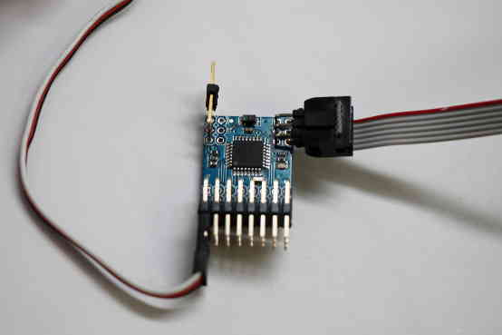

.. _common-ppm-encoder:

===========
PPM Encoder
===========

The PPM encoder allows to encode up to 8 PWM (pulse width modulated)
signals into one PPM (pulse position modulation) signal.

.. figure:: ../../../images/jDrones_PPM_Encoder_V21_Above_with_numbers_500px.jpg
   :target: ../_images/jDrones_PPM_Encoder_V21_Above_with_numbers_500px.jpg

   Newest jDrones PPM-Sum encoder, `here <http://store.jdrones.com/pixhawk_px4_paparazzi_ppm_encoder_v2_p/eleppmenc20.htm>`__

The jD-PPM Encoder (v2.1) uses the ArduPPM firmware, replacing the
previously used Paparazzi PPM Encoder firmware. The new ArduPPM firmware
has been designed from scratch to enhance performance and robustness,
and to better accommodate our product needs now and in the future.

Failsafe output values:
=======================

-  New interrupt system that handles certain Futaba receivers better
   (simultaneous changes on groups of R/C channels in fast intervals)
   (this was already present in v2.3.13)
-  Adapted behaviour in case of channel loss: If one channel is lost, it
   will be set according to the following table. The other channels will
   continue working.

   +-------------+------------+---------------------------+
   | Channel 1   | Roll       | Set to center (1500 μs)   |
   +-------------+------------+---------------------------+
   | Channel 2   | Pitch      | Set to center (1500 μs)   |
   +-------------+------------+---------------------------+
   | Channel 3   | Throttle   | Set to low (900 μs)       |
   +-------------+------------+---------------------------+
   | Channel 4   | Yaw        | Set to center (1500 μs)   |
   +-------------+------------+---------------------------+
   | Channel 5   | ...        | Remain at last value      |
   +-------------+------------+---------------------------+
   | Channel 6   | ...        | Remain at last value      |
   +-------------+------------+---------------------------+
   | Channel 7   | ...        | Remain at last value      |
   +-------------+------------+---------------------------+
   | Channel 8   | ...        | Remain at last value      |
   +-------------+------------+---------------------------+

   In Copter and Plane a fail-safe action can be triggered by the
   throttle low signal.

   This should be carefully configured as explained in the wiki for 
   :ref:`APM Copter <copter:radio-failsafe>` and
   :ref:`APM Plane <plane:apms-failsafe-function>`

   Also note that this has nothing to do with losing the radio
   connection between the transmitter and the receiver. The receiver's
   behaviour when it gets out of range depends on the
   transmitter/receiver hardware and setup. So make sure to go through
   all the scenarios before flying

.. image:: ../../../images/FailsafeDiagram.jpg
    :target: ../_images/FailsafeDiagram.jpg

Setup Manual
============

The `PPM Encoder Manual <https://download.ardupilot.org/downloads/wiki/pdf_guides/PPM-Encoder-V3-Manual.pdf>`__
shows how to solder and wire the PPM Encoder and explains the different
failsafe modes.

Re-Programming the Atmega328p PPM encoder
=========================================

.. note::

   The PPM Encoder comes with the PPM encoder firmware
   pre-programmed, and most users will never need or want to modify
   it.

However, some users may want to get into the code to change the way the
PPM Encoder interprets RC signals or may want to update to the latest
version. Some rare users did report receiver compatility problems with
the old version (before ArduPPM). For most cases, ArduPPM did solve
them.

ArduPPM is the official name for the newer generation firmwares. It has
been designed from scratch with reliability as a top priority. The
official release of the encoder firmware is in the Downloads section as
ArduPPM_Vx.x.xx_ATMega328p.hex. The official source code is in the Git
repository:
https://github.com/ArduPilot/ardupilot/tree/master/Tools/ArduPPM. The
standalone PPM Encoder needs the ATMega328p version.

Compiled binaries can be downloaded from our download site:

- `ArduCopter PPM Encoder v2.3.16 Standalone <https://ardupilot.org/plane/docs/common-downloads_advanced_user_tools.html#arduppm-v2-3-16-atmega328p-firmware-for-apm1-x-copter-and-standalone-ppm-encoder>`__

- `ArduPlane PPM Encoder v2.3.16 Standalone <https://ardupilot.org/plane/docs/common-downloads_advanced_user_tools.html#arduppm-v2-3-16-atmega328p-firmware-for-apm1-x-plane-and-standalone-ppm-encoder>`__

To flash, connect the PPM Encoder to an AVR programmer such as the
AVRISP mkII:

When flashing, make sure the PPM Encoder is powered using any of the 5V
and Ground pins.

Fuse setting for internal MCU
=============================
All ATMEGA 328P based PPM Encoders have strict fuse settings.

Following fuse settings should be used when programming with AVR Studio:

- LOW: 0xFF
- High: 0xDA
- Ext: 0x07

Re-Programming instructions for Windows
=======================================

Download and install the latest
`WinAVR <https://sourceforge.net/projects/winavr/>`__.

Plug in the AVRISP mkII and Install the drivers for AVRISP mkII as
follows:

Open the device manager and select the AVRISP mkII, choose "Update
Driver Software..."

Choose "Browse my Computer for driver software"

Browse to the folder where WinAVR is installed (e.g. C:WinAVR-20100110)

Browse to the folder where WinAVR is installed (e.g.
C:\\WinAVR-20100110\\)   

.. image:: ../../../images/windows_install_avrispmkii_driver_31.png
    :target: ../_images/windows_install_avrispmkii_driver_31.png

.. image:: ../../../images/windows_install_avrispmkii_driver_41.png
    :target: ../_images/windows_install_avrispmkii_driver_41.png

Choose "Install this driver software anyway"

This should finish successful:

Now start the command line: Press "Start" and type cmd and enter.

Change Directory using cd to the folder where your Hex file is located:
e.g. cd Downloads if it is in Downloads

Then type the command: avrdude -P usb -c avrispmkii -p atmega328p -U
flash:w:ArduPPM_Vx.x.x_PPM_Encoder.hex (substitute x.x.x with the
your version number)

.. image:: ../../../images/windows_cmd_avrdude_11.png
    :target: ../_images/windows_cmd_avrdude_11.png

If it all went well, the following output should appear:

Re-Programming instructions for Mac OS X
========================================

Todo: add content on how to flash the hex file here.

Re-Programming instructions for Linux
=====================================

Install avrdude:

For Ubuntu:

::

    sudo apt-get install avrdude

Program instructions for the AVRISP mkII:

::

    avrdude -p atmega328p -P usb -c avrispmkii -U flash:w:ArduPPM_Vx.x.x_ATMega328p.hex

This should output:

::

    avrdude: AVR device initialized and ready to accept instructions

    Reading | ################################################## | 100% 0.00s

    avrdude: Device signature = 0x1e950f avrdude: NOTE: FLASH memory has been specified, an erase cycle will be performed          To disable this feature, specify the -D option. avrdude: erasing chip avrdude: reading input file "ArduPPM_V2.3.0_ATMega328p.hex" avrdude: input file ArduPPM_V2.3.0_ATMega328p.hex auto detected as Intel Hex avrdude: writing flash (1952 bytes):

    Writing | ################################################## | 100% 0.61s

    avrdude: 1952 bytes of flash written avrdude: verifying flash memory against ArduPPM_V2.3.0_ATMega328p.hex: avrdude: load data flash data from input file ArduPPM_V2.3.0_ATMega328p.hex: avrdude: input file ArduPPM_V2.3.0_ATMega328p.hex auto detected as Intel Hex avrdude: input file ArduPPM_V2.3.0_ATMega328p.hex contains 1952 bytes avrdude: reading on-chip flash data:

    Reading | ################################################## | 100% 0.56s

    avrdude: verifying ... avrdude: 1952 bytes of flash verified

    avrdude: safemode: Fuses OK

    avrdude done.  Thank you.

If you get permission errors, try using sudo.

Re-Compiling Options
====================

By default negative pulse PPM is encoded. In order to change to positive
pulse PPM, the line 158 in Tools/ArduPPM/Libraries/PPM_Encoder.h needs
to be uncommented from:

::

    // #define _POSITIVE_PPM_FRAME_ // Switch to positive pulse PPM

to

::

    #define _POSITIVE_PPM_FRAME_    // Switch to positive pulse PPM

Re-Compiling using Linux
------------------------

These instructions are tested using Ubuntu:

::

    sudo apt-get install build-essential git-core gcc-avr avrdude
    git clone http://code.google.com/p/ardupilot-mega
    cd ardupilot-mega/Tools/ArduPPM/

edit ATMega328p/Encoder-PPM.c or Libraries/PPM_Encoder.h now

::

    cd ATMega328p/
    make clean
    make

and you should have your custom hex-file to program using:

::

    avrdude -p atmega328p -P usb -c avrispmkii -U flash:w:Encoder-PPM.hex
    
    

Related information
===================

.. toctree::
    :maxdepth: 1

    PPM Encoder Programming Guide <common-ppm-encoder-8-channel-standalone-encoder>

