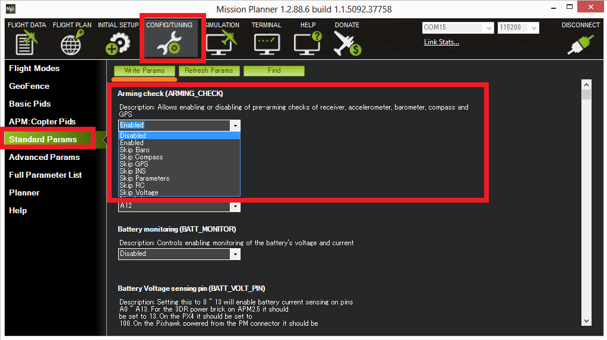

.. _common-prearm-safety-checks:

=====================
Pre-Arm Safety Checks
=====================

ArduPilot includes a suite of Pre-arm Safety Checks which will prevent the
vehicle from arming its propulsion system if any of a fairly large number of issues are
discovered before movement including missed calibration, configuration
or bad sensor data. These checks help prevent crashes or fly-aways but
they can also be disabled if necessary.

..  youtube:: gZ3H2eLmStI
    :width: 100%

Recognising which Pre-Arm Check has failed using the GCS
========================================================

The pilot will notice a pre-arm check failure because he/she will be
unable to arm the vehicle and the notification LED, if available, will be flashing yellow.  To
determine exactly which check has failed:

#. Connect the Autopilot to the ground station using a USB cable
   or :ref:`Telemetry <common-telemetry-landingpage>`.
#. Ensure the GCS is connected to the vehicle (i.e. on Mission
   Planner and push the "Connect" button on the upper right).
#. Turn on your radio transmitter and attempt to arm the vehicle
   (regular procedure is using throttle down, yaw right or via an RCx_OPTION switch)
#. The first cause of the Pre-Arm Check failure will be displayed in red
   on the HUD window

Failure messages
================

Failsafes:
----------

Any failsafe (RC, Battery, GCS,etc.) will display a message and prevent arming.

RC failures:
-------------------------------------------------

**RC not calibrated** : the :ref:`radio calibration <common-radio-control-calibration>` has not been
performed.  :ref:`RC3_MIN<RC3_MIN>` and :ref:`RC3_MAX<RC3_MAX>` must have been changed from their
default values (1100 and 1900), and for channels 1 to 4, MIN value must be 1300 or less, and MAX value 1700 or more.

Barometer failures:
-------------------

**Baro not healthy** : the barometer sensor is reporting that it is
unhealthy which is normally a sign of a hardware failure.

**Alt disparity** : the barometer altitude disagrees with the inertial
navigation (i.e. Baro + Accelerometer) altitude estimate by more than 2
meters.  This message is normally short-lived and can occur when the
autopilot is first plugged in or if it receives a hard jolt
(i.e. dropped suddenly).  If it does not clear the :ref:`accelerometers may need to be calibrated <common-accelerometer-calibration>` or there may
be a barometer hardware issue.

Compass failures:
-----------------

**Compass not healthy** : the compass sensor is reporting that it is
unhealthy which is a sign of a hardware failure.

**Compass not calibrated** : the :ref:`compass(es) has not been calibrated <common-compass-calibration-in-mission-planner>`.  the
``COMPASS_OFS_X, _Y, _Z`` parameters are zero or the number or type of
compasses connected has been changed since the last compass calibration
was performed.

**Compass offsets too high** : the primary compass's offsets length
(i.e. sqrt(x^2+y^2+z^2)) are larger than 500.  This can be caused by
metal objects being placed too close to the compass.  If only an
internal compass is being used (not recommended), it may simply be the
metal in the board that is causing the large offsets and this may not
actually be a problem in which case you may wish to disable the compass
check.

**Check mag field** : the sensed magnetic field in the area is 35%
higher or  lower than the expected value.  The expected length is 530 so
it's > 874 or < 185.  Magnetic field strength varies around the world
but these wide limits mean it's more likely the :ref:`compass calibration <common-compass-calibration-in-mission-planner>` has not
calculated good offsets and should be repeated.

**Compasses inconsistent** : the internal and external compasses are
pointing in different directions (off by >45 degrees).  This is normally
caused by the external compasses orientation (i.e. :ref:`COMPASS_ORIENT<COMPASS_ORIENT>`
parameter) being set incorrectly.

GPS related failures:
---------------------

**GPS Glitch** : the :ref:`GPS is glitching <gps-failsafe-glitch-protection>` and the vehicle
is in a flight mode that requires GPS (i.e. Loiter, PosHold, etc) and/or
the :ref:`cylindrical fence <common-ac2_simple_geofence>` is enabled.

**Need 3D Fix** : the GPS does not have a 3D fix and the vehicle is in a
flight mode that requires the GPS and/or the :ref:`cylindrical fence <common-ac2_simple_geofence>` is enabled.

**Bad Velocity** : the vehicle's velocity (according to inertial
navigation system) is above 50cm/s.  Issues that could lead to this
include the vehicle actually moving or being dropped, bad accelerometer
calibration, GPS updating at below the expected 5hz.

**High GPS HDOP** : the GPS's HDOP value (a measure of the position
accuracy) is above 2.0 and the vehicle is in a flight mode that requires
GPS and/or the :ref:`cylindrical fence <common-ac2_simple_geofence>` is enabled. 
This may be resolved by simply waiting a few minutes, moving to a
location with a better view of the sky or checking sources of GPS
interference (i.e. FPV equipment) are moved further from the GPS. 
Alternatively the check can be relaxed by increasing the :ref:`GPS_HDOP_GOOD<GPS_HDOP_GOOD>`
parameter to 2.2 or 2.5.  Worst case the pilot may disable the fence and
take-off in a mode that does not require the GPS (i.e. Stabilize,
AltHold) and switch into Loiter after arming but this is not
recommended.

Note: the GPS HDOP can be readily viewed through the Mission Planner's
Quick tab as shown below.

.. image:: ../../../images/MP_QuicHDOP.jpg
    :target: ../_images/MP_QuicHDOP.jpg

INS checks (i.e. Acclerometer and Gyro checks):
-----------------------------------------------

**INS not calibrated**: some or all of the accelerometer's offsets are
zero.  The :ref:`accelerometers need to be calibrated <common-accelerometer-calibration>`.

**Accels not healthy**: one of the accelerometers is reporting it is not
healthy which could be a hardware issue.  This can also occur
immediately after a firmware update before the board has been restarted.

**Accels inconsistent**: the accelerometers are reporting accelerations
which are different by at least 1m/s/s.  The :ref:`accelerometers need to be re-calibrated <common-accelerometer-calibration>` or there is a
hardware issue.

**Gyros not healthy**: one of the gyroscopes is reporting it is
unhealthy which is likely a hardware issue.  This can also occur
immediately after a firmware update before the board has been restarted.

**Gyro cal failed**: the gyro calibration failed to capture offsets. 
This is most often caused by the vehicle being moved during the gyro
calibration (when red and blue lights are flashing) in which case
unplugging the battery and plugging it in again while being careful not
to jostle the vehicle will likely resolve the issue.  Sensors hardware
failures (i.e. spikes) can also cause this failure.

**Gyros inconsistent**: two gyroscopes are reporting vehicle rotation
rates that differ by more than 20deg/sec.  This is likely a hardware
failure or caused by a bad gyro calibration.

Board Voltage checks:
---------------------

**Check Board Voltage**: the board's internal voltage is below 4.3 Volts
or above 5.8 Volts.

If powered through a USB cable (i.e. while on the bench) this can be
caused by the desktop computer being unable to provide sufficient
current to the autopilot - try replacing the USB cable.

If powered from a battery this is a serious problem and the power system
(i.e. Power Module, battery, etc) should be carefully checked before
flying.

Parameter checks:
-----------------

**Ch7&Ch8 Opt cannot be same**: :ref:`Auxiliary Function Switches <channel-7-and-8-options>` are set to the same option which is not permitted because it could lead to confusion.

**Check FS_THR_VALUE**: the :ref:`radio failsafe pwm value <radio-failsafe>` has been set too close to the throttle channels (i.e. ch3) minimum.

**Check ANGLE_MAX**: the :ref:`ANGLE_MAX<ANGLE_MAX>` parameter which controls the
vehicle's maximum lean angle has been set below 10 degrees (i.e. 1000)
or above 80 degrees (i.e. 8000).

**ACRO_BAL_ROLL/PITCH**: the :ref:`ACRO_BAL_ROLL<ACRO_BAL_ROLL>` parameter is higher than
the Stabilize Roll P and/or :ref:`ACRO_BAL_PITCH<ACRO_BAL_PITCH>` parameter is higher than
the Stabilize Pitch P value.  This could lead to the pilot being unable
to control the lean angle in ACRO mode because the :ref:`Acro Trainer stabilization <acro-mode_acro_trainer>` would overpower the pilot's
input.

Battery/Power Monitor:
----------------------

If a power monitor voltage is below its failsafe low or critical voltages or failsafe remaining capacity low or critical set points, this check will fail and indicate which set point it is below. It will also fail if these set points are inverted, ie critical point is higher than low point. See :ref:`failsafe-battery` for Copter, :ref:`apms-failsafe-function` for Plane, or :ref:`rover-failsafes` for Rover for more information on these.

In addition, minimum arming voltage and remaining capacity parameters for each battery/power monitor can be set, for example :ref:`BATT_ARM_VOLT<BATT_ARM_VOLT>` and :ref:`BATT_ARM_MAH<BATT_ARM_MAH>` for the first battery, to provide a check that the battery is not only above failsafe levels, but also has enough capacity for operation.

Airspeed:
---------

If an airspeed sensor is configured, and it is not providing a reading or failed to calibrate, this check will fail.

Logging:
--------

**Logging failed**: Logging pre-armed was enabled but failed to write to the log.

**No SD Card**: Logging is enabled, but no SD card is detected.

Safety Switch:
--------------

**Hardware safety switch**: Hardware safety switch has not been pushed.

System:
-------

**Param storage failed**: A check of reading the parameter storage area failed.

**Internal errors (0xx)**: An internal error has occurred. Try rebooting.

**KDECAN Failed**: KDECAN system failure.

**UAVCAN Failed**: UAVCAN system failure.

Mission:
--------

See :ref:`ARMING_MIS_ITEMS<ARMING_MIS_ITEMS>`

**No mission library present**: Mission checking is enabled, but no mission is loaded.

**No rally library present**: Rally point checking is enabled, but no rally points loaded.

**Missing mission item: xxxx**: A required mission items is missing.

Rangefinder:
------------

IF a rangefinder has been configured, a reporting error has occurred.

Disabling the Pre-arm Safety Check
==================================

.. warning:: Disabling pre-arm safety checks is not recommended. The cause of the pre-arm failure should be corrected before operation of the vehicle if at all possible. If you are confident that the pre-arm check failure is not a real problem, it is possible to disable a failing check.

Arming checks can be individually disabled by setting the :ref:`ARMING_CHECK<ARMING_CHECK>` parameter to something other than 1. Setting to 0 completely removes all pre-arm checks. For example, setting to  4 only checks that the GPS has lock.

This can also be configured using Mission Planner:

-  Connecting your Autopilot to the Mission Planner
-  Go to Mission Planner's Config/Tuning >> Standard Params screen
-  set the Arming Check drop-down to "Disabled" or one of the "Skip"
   options which more effectively skips the item causing the failure.
-  Push the "Write Params" button

