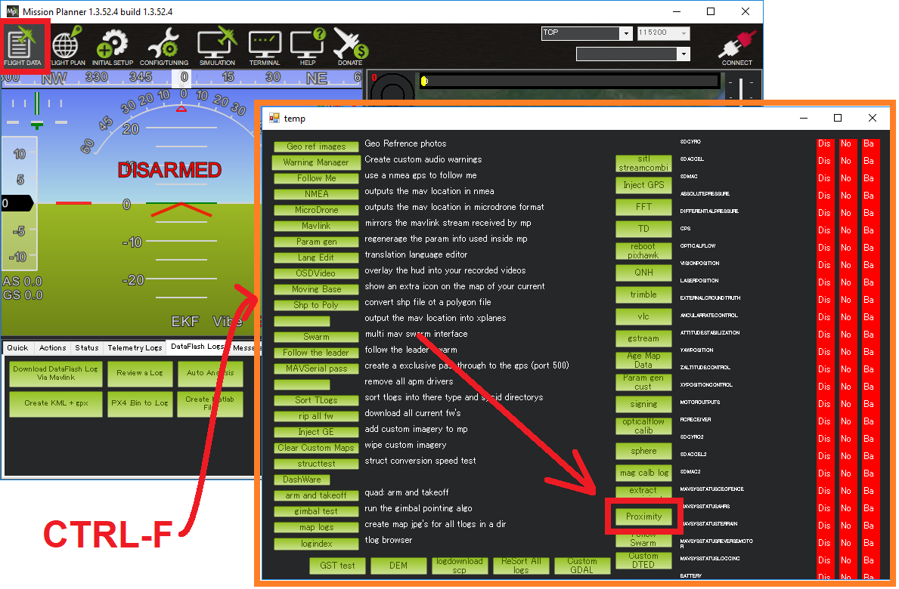

.. _common-proximity-landingpage:

================================
Proximity Sensors (landing page)
================================

Copter/Rover have support for avoidance obstacles that may appear in front of the vehicle. The first step to enable these features is to have a working Proximity Sensor. ArduPilot supports up to 4 sensors.

360 degree Lidars are typically used in object avoidance as proximity sensors, but multiple rangefinders sensors or stereo depth cameras can also be used for proximity detection.

.. note::

    Users often confuse RangeFinders with proximity sensors. Rangefinders are typically single dimensional sensors, that provide distances from a very narrow ray. Proximity Sensors is generally a name used for 360 Lidar and other sensors with a wider FOV. The settings and parameters used for both classes of sensors are different.

Configuration
=============

You will need to set up the parameter ``PRXx_TYPE`` correctly for the sensor(s) you are using.
Exclusion zones are provided for 360 degree Lidars, since these may have obstructions in their field of view. Exclusion zones are set via the ``PRXx_IGN_ANGx`` and ``PRXx_IGN_WIDx`` parameters, specifying a direction and width the frame obstruction presents and will be ignored. Up to 6 exclusion sectors can be specified.

Follow the links below for configuration information based upon your set-up:

-    :ref:`RangeFinders <common-rangefinder-setup>`
-    :ref:`Intel RealSense Depth Camera <common-realsense-depth-camera>`
-    :ref:`Lightware SF40/C (360 degree) <common-lightware-sf40c-objectavoidance>`
-    :ref:`Lightware SF45/B (350 degree) <common-lightware-sf45b>`
-    :ref:`RPLidar A2 360 degree laser scanner <common-rplidar-a2>`
-    :ref:`TerraRanger Tower (360 degree) <common-teraranger-tower-objectavoidance>`

Testing
=======

Real-time view
--------------

Real-time distances can be seen in the Mission Planner's proximity viewer

.. image:: ../../../images/copter-object-avoidance-radar-view.png

This window can be opened by moving to the MP's Flight Data screen, press Ctrl-F and push the Proximity button.

DataFlash logging
-----------------

Upward and downward facing range finder distances can be seen in the DataFlash Log's RFND message.

The distance to the nearest object in 8 quadrants around the vehicle is recorded in the DataFlash log's PRX messages.
Since Copter and Rover 4.1 have the ability to store 3D obstacles, various instances of PRX message log is used. 0th instance stands for obstacles detected between -75 to -45 degrees pitch. Similarly, PRX[1] stores from -45 to -15 degrees, and PRX[2] stores from -15 to + 15 degrees and so on.

Additional Features
===================

Filter
------

Various sensors can be attached to the autopilot. However, depending on the quality and use case of the sensor, it might give noisy data.
This noise will be stored onboard the autopilot as "obstacles" and the vehicle might suddenly start avoiding false objects. To counter this problem, Copter and Rover 4.1 have an inbuilt low pass filter on the raw sensor data.
The filter can be adjusted by :ref:`PRX_FILT <PRX_FILT>` (setting it to 0 will disable the feature).
By default, only the filtered values get logged. However, by setting :ref:`PRX_LOG_RAW <PRX_LOG_RAW>` = 1, raw values from the sensors will also be logged. This can be used for debugging purposes.

Ground detection
----------------

.. note::

    This feature requires a valid downward facing rangefinder configured first and only works with Copter.

For low altitude obstacle avoidance, and while just taking off and landing, sometimes the sensor will pick up the ground below as obstacle. This can be dangerous because the vehicle will try and "avoid" these obstacles (if avoidance features are turned on).
By setting :ref:`PRX_IGN_GND <PRX_IGN_GND>` = 1, we attempt to detect and ignore any obstacles that are near the ground.

.. warning::

    This feature only works when the vehicle is armed
    It might also ignore valid obstacles when the vehicle is flying very close to the ground.
    Detected obstacles will not be visible on the Mission Planner Proximity Viewer, or data flash logs.

[copywiki destination="copter,rover"]
