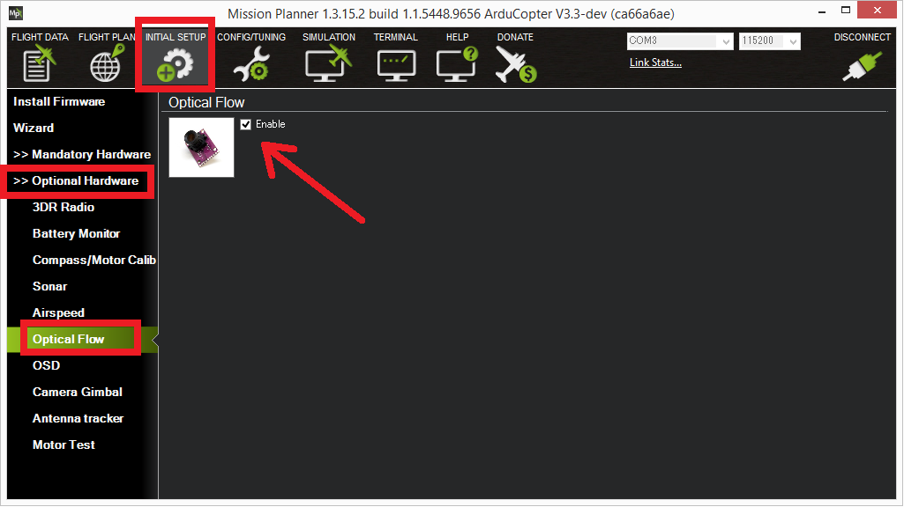
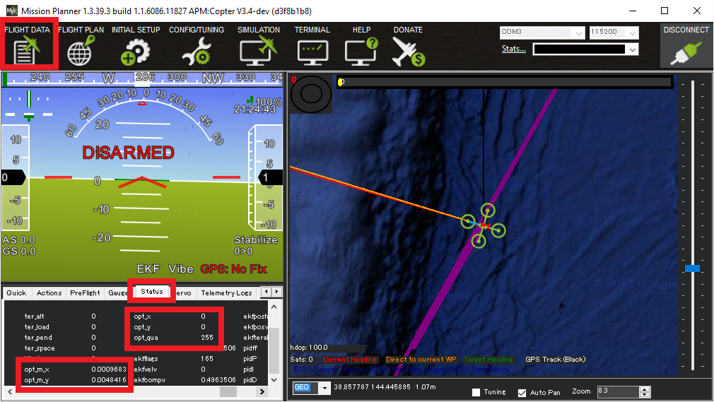
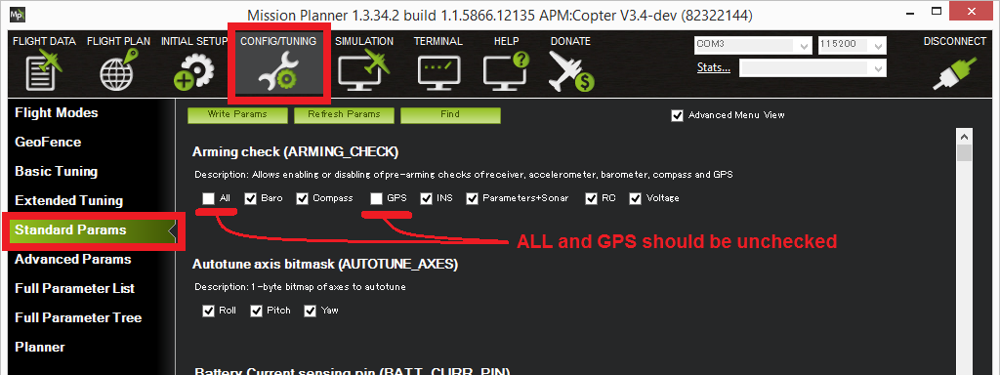

.. _common-px4flow-overview:

==========================================
PX4FLOW Optical Flow Camera Board Overview
==========================================

This article describes how to setup the `PX4FLOW (Optical Flow) Sensor <https://northox.myshopify.com/collections/frontpage/products/px4flow>`__ which can be used in place of a GPS.

..  youtube:: LP8kl4hGfMw
    :width: 100%

.. warning::

   The PX4FLOW is supported from Copter 3.3 and higher. It is not yet supported in Plane or Rover.

Overview
========

The `PX4FLOW (Optical Flow) Sensor <https://northox.myshopify.com/collections/frontpage/products/px4flow>`__ is a
specialized high resolution downward pointing camera module and a 3-axis gyro that uses
the ground texture and visible features and a separate rangefinder to determine
aircraft ground velocity. Although the sensor has plus a built-in
Maxbotix LZ-EZ4 sonar to measure height, this has not been reliable
enough over a range of surfaces in testing, so its readings are not used
and instead a separate :ref:`Range Finder <common-rangefinder-landingpage>`
such as the :ref:`LightWare SF10b <common-lightware-sf10-lidar>`
must also be attached to the vehicle.

.. warning::

   To use this flow sensor you will need to purchase a separate range
   finder like the :ref:`LightWare SF10b <common-lightware-sf10-lidar>`

Upgrade the PX4Flow sensor's firmware
=====================================

The PX4Flow firmware must be updated prior to connecting to the Pixhawk.  This can be accomplished with `QGround Control <http://qgroundcontrol.com/>`__ or Mission Planner but the instructions below only cover the method using Mission Planner.

.. warning::

   QGroundControl currently defaults to an incompatible firmware for PX4Flow. In order to load the correct release, download px4flow-klt-06Dec2014.px4 from the link below and upload it by selecting custom firmware file on QGC the Firmware Upgrade Menu.
   Mission Planner defaults to the correct firmware, and supports setup of the device for ArduCopter.

#. Download and unzip the `PX4Flow-KLT firmware <http://download.ardupilot.org/downloads/wiki/advanced_user_tools/px4flow-klt-06Dec2014.zip>`__
   (`source code here <https://github.com/priseborough/px4flow/tree/klt_flow>`__)
#. Connect the PX4Flow sensor to your computer using a micro USB cable.  On a Windows machine a "PX4Flow" device should appear in Connection drop-down of the Mission Planner (and the Windows Device Manager).  If it does not you may need to download, unzip and manually install the `px4flow windows driver <http://download.ardupilot.org/downloads/wiki/advanced_user_tools/px4flow_win_driver.zip>`__ which may in turn require allowing installing unsigned drivers.
#. Open the Initial Setup, Install Firmware screen, select the COM port and click the "Load custom firmware" link.  Select the px4flow-klt-06dec2014.px4 binary you downloaded in Step 1.  You may need to unplug and plug back in the sensor to start the upload.

   .. image:: ../../../images/PX4Flow_FirmUpgrade1_MP.png
       :target: ../_images/PX4Flow_FirmUpgrade1_MP.png

Focusing the lens
=================

Normally sensors are shipped without being focused.

#. Connect the flow sensor to your PC with a micro USB cable
#. Open the Mission Planner and select the appropriate COM port and press Connect
#. Open the Initial Setup > Optional Hardware > PX4Flow screen
#. Remove the lens cap and point the camera at a high contrast object at least 3m away.  Remove the small screw that stops the lens from turning and adjust the focus until the image appears clearly

   .. image:: ../../../images/PX4Flow_Focus_MP.png
       :target: ../_images/PX4Flow_Focus_MP.png

Connect to the Pixhawk
======================

.. image:: ../../../images/OptFlow_Pixhawk.jpg
    :target: ../_images/OptFlow_Pixhawk.jpg

The sensor should be connected to the Pixhawk's the 4-pin I2C port.  In
most cases an `I2C splitter <http://store.jdrones.com/Pixhawk_I2C_splitter_p/dstpx4i2c01.htm>`__
should be used to allow other I2C devices (like the external RGB LED and
GPS/Compass module's compass) to share the same port.

Mounting to the Frame
=====================

The default mounting of the flow sensor is for it to be pointing straight down with the micro USB port pointing towards the front of the vehicle.
On the back of the sensor you should see the axis printed, the X axis should point forwards and the Y axis to the right.
The :ref:`FLOW_ORIENT_YAW <copter:FLOW_ORIENT_YAW>` parameter can be used to account for other yaw orientations.

It is important that the flow sensor be mounted where it does not experience
angular angular vibration that could blur the image.

.. note::

   The default mounting orientation is different to that shown on
   the \ `ETH PX4FLOW wiki <http://pixhawk.org/modules/px4flow>`__. If you
   mount the board as shown in the \ `ETH PX4FLOW wiki <http://pixhawk.org/modules/px4flow>`__, you will need to set
   :ref:`FLOW_ORIENT_YAW <copter:FLOW_ORIENT_YAW>` to -9000.

Enabling the sensor
===================

The sensor can be enabled by connecting to the flight controller with the Mission Planner and
then on the **Initial Setup \| Optional Hardware \| Optical Flow** page
check the **Enable** checkbox.  Alternatively the :ref:`FLOW_ENABLE <copter:FLOW_ENABLE>`
parameter should be set to "1" through the full parameters list.  The
sensor will be initialised once the Pixhawk board is rebooted.

Testing the sensor
==================

With the sensor connected to the flight controller's I2C port, connect to the flight controller with the Mission Planner and open the Flight Data screen's Status tab.  If the sensor is operating you should see non-zero opt_m_x, opt_m_y and an opt_qua values.

Calibrating the sensor
======================
#. Connect to your flight controller and ensure that logging while disarmed is enabled (In Copter-3.3 set :ref:`LOG_BITMASK <copter:LOG_BITMASK>` to 131071, In Copter-3.4 :ref:`LOG_DISARMED <copter:LOG_DISARMED>` to 1)
#. Find a location with a textured surface and good lighting (natural light or strong incandescent)
#. Remove Propellers (safety first)
#. Power on the vehicle and hold level away from your body and at eye level
#. Rotate about the vehicle in roll through a range from -15 to +15
   degrees in about a second and then back again. Repeat this 5 to 10
   times. By closing one eye you will be able to keep the centre of the
   sensor stationary against the background while you do the rotation.
#. Repeat  about the vehicle pitch axis.
#. Download the data flash logs and plot the ``OF.flowX``, ``OF.bodyX``
   and ``IMU.GyrX`` data. It should look something like this:

   .. image:: ../../../images/OF-roll-calibration.png
       :target: ../_images/OF-roll-calibration.png
    
#. If ``OF.flowX`` is larger or smaller than ``OF.bodyX``, then it can
   be adjusted by changing the ``FLOW_FXSCALER`` parameter
#. IF ``OF.bodyX`` is uncorrelated or opposite sign to ``IMU.GyrX``,
   the :ref:`FLOW_ORIENT_YAW <copter:FLOW_ORIENT_YAW>` parameter is probably set incorrectly or
   you do not have the flow sensor pointing downwards
#. Plot the ``OF.flowY``, ``OF.bodyYband``, ``IMU.GyrY`` data. It should
   look something like this:

   .. image:: ../../../images/OF-pitch-calibration.png
       :target: ../_images/OF-pitch-calibration.png
   
#. If ``OF.flowY`` is larger or smaller than ``OF.bodyY``, then it can
   be adjusted by changing the ``FLOW_FYSCALER`` parameter
#. IF ``OF.bodyY`` is uncorrelated or opposite sign to ``IMU.GyrY``,
   the :ref:`FLOW_ORIENT_YAW <copter:FLOW_ORIENT_YAW>` parameter is probably set incorrectly or
   you do not have the flow sensor pointing downwards

Range Sensor Check
==================

Check the EKF5.meaRng message in the flashlog from your flow
sensor calibration test. Check the following:

#. There is continuous range measurement.
#. It outputs a range on the ground that is 10cm of the expected value
   (remember that measured range will increase when you roll or pitch
   the vehicle because the laser is then measuring on a slant)

Pre-Arm checks
==============

To allow arming and taking off in Loiter without a GPS the GPS arming
check should be turned off as shown below.  Unchecking "All" and "GPS"
and leave all other options checked.

Because optical flow requires good sonar/range finder data when the
optical flow is enabled, an additional pre-arm check is enforced.

**While the vehicle is disarmed you should lift the vehicle straight up
to at least 50cm but no higher than 2m** (if the rangefinder sees a
distance of over 2m you will need to restart the flight controller).

The error message when arming fails this check is "PreArm: check range
finder"

This check can be disabled by unchecking the "Parameter/Sonar" arming
check.

First Flight (Copter Only)
==========================

#. Set ``EKF_GPS_TYPE = 0`` (we don't want the optical flow being used by the EKF at this stage)
#. Perform a short test flight hovering in stabilise or AltHold at small lean angles at heights ranging from 50cm to 3m with 
#. Download the flash log and plot the following in mission planner
#. EKF5.meaRng should correlate with the change in vehicle height
#. ``OF.flowX`` and ``OF.flowY`` should be varying
#. ``OF.bodyX`` and ``OF.bodyY`` should be consistent with IMU.GyrX and IMU.GyrY

Second Flight (Copter only)
===========================

.. warning::

   You will need at least 15m of clear space around the vehicle to do this flight safely.
   If the optical flow velocity estimates are bad, you will have little warning and the copter may lean to it's maximum lean angle very quickly.

#. Set the EKF_GPS_TYPE parameter to 3 to make the EKF ignore GPS and use the flow sensor
#. Ensure you have Loiter and either AltHold or Stabilize mode available on you transmitter.
#. Take-off in loiter and bring the copter to about 1m height
#. If the vehicle starts to accelerate away or there is erratic pitch or roll
   movement, then switch to Stabilise or AltHold and land. You will need to
   download the log file and share it on `the forums <http://discuss.ardupilot.org/c/arducopter>`__ to understand why.
#. If it holds location then congratulations, you have succeeded and can
   now start experimenting with height changes and moving it around in
   LOITER

Example Video (Copter-3.4)
==========================

..  youtube:: Bzgey8iR69Q
    :width: 100%
