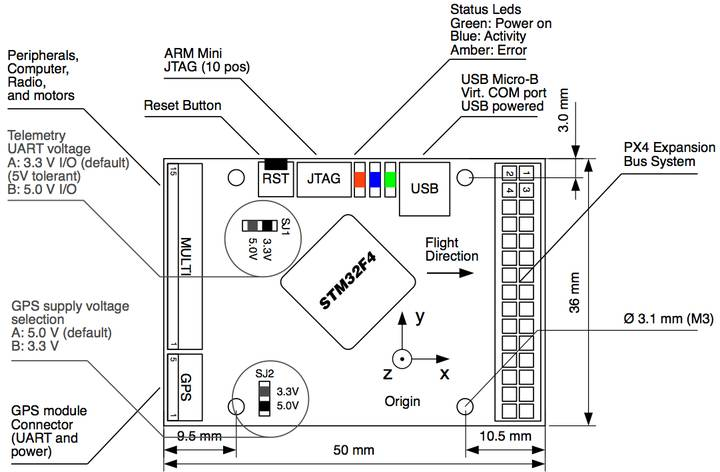

.. _common-px4fmu-overview:

========================
Archived:PX4FMU Overview
========================

.. warning::

    **ARCHIVED**
    
    The PX4FMU (v1) is end of life and is not generally available for purchase. 
    This article is made available for existing users.

This page provides an overview of the Pixhawk Flight Management Unit.

Pixhawk (FMUv2) and PX4FMU (FMUv1)
==================================

The Pixhawk (FMUv2) single board flight controller evolved from the original "PX4 system", 
which consists of the PX4FMU and various piggyback boards including the PX4IO and PX4IOAR.

The Pixhawk incorporates several additional features to provide
extended capabilities for our ArduPilot flight system.

A connector diagram of the Pixhawk is shown below, but :ref:`Go to this link for full information on the Pixhawk <common-pixhawk-overview>`

The PX4FMU/PX4IO (FMUv1) Flight Management System Includes:
===========================================================

-  **The PX4-FMU (Flight Management Unit).**

   -  A powerful Cortex M4F micro-controller and flash memory for
      controlling flight and communications.
   -  A socket for a plug in SD memory card.
   -  A 3 axis gyro for determining orientation.
   -  A 3 axis Accelerometer for determining outside influences.
   -  A compass (magnetometer).
   -  A barometric pressure sensor for determining altitude.
   -  A connection for an externally mountable UBLOX LEA GPS for
      determining absolute position.
   -  Stackable board interconnections for adding various peripheral
      boards.
   -  Communications interfaces for USB, JTAG and Serial connections.
   -  Connections for PPM-SUM RC radio input and servo outputs.

-  **The PX4-IO (Input Output) Board.**

   -  Contains its own on board micro-controller and stacks with the FMU.
   -  Direct battery input power supply.
   -  8 High speed servo PWM outputs.
   -  Futaba SBUS or PPM-SUM serial servo output.
   -  A variety of PPM-SUM / SBUS input connectors.
   -  Two user assignable relays, two 1/2 amp 5 volt outputs and an
      analog input port.

-  **The PX4FLOW Smart (Optical Flow) Camera.**

   -  Specialized downward pointing camera module that uses ground
      texture and features to determine aircraft motion over the ground.
   -  The PX4FLOW has the same powerful Cortex M4F micro-controller as
      is used in the PX4FMU.
   -  The built in micro-controller performs on board automated binned
      pixel image analysis to determine motion relative to ground.
   -  A built in 3 axis gyro enables automatic compensation for variance
      in aircraft tilt angle.

-  **The PX4-IOAR Quad Carrier is a specialized interface board for the
   Parrot AR.Drone.**

**The PX4FMU circuit board comes preassembled and ready to load the
firmware for your airframe using the Mission Planner.**

Detailed Description
====================

**The Back of the PX4FMU board showing the SD card carrier and buzzer
socket:**

.. image:: ../../../images/PX4FMUbottom1.jpg
    :target: ../_images/PX4FMUbottom1.jpg

PX4FMU Connector diagram
========================

Analog and digital pins
=======================

This section lists what pins (analog and digital) are available on the PX4FMU.

PX4v1 Analog inputs
-------------------

The PX4FMUv1 has the following “available” Analog input port pins which may
be put to a variety of uses.

**Pin 10** (High voltage analog pin):

-  FMU battery voltage measured on pin 5 of the 15 pin multi-connector
   on the end of the FMU board. It has 5.7:1 scaling, allowing it to
   measure up to 18.8V.
-  Located on pin 5 of the DF13 15 pin "multi-connector" of the PX4FMU
   board.
-  This pin can accept up to 18.6 volts. (You can add an additional
   resistor divider and set the scaling appropriately for higher
   voltages).
-  With the Advanced Parameter VOLT_DIVIDER set to 1 voltage can be
   read directly.

   -  For old releases VOLT_DIVIDER needed to be set to 5.66 for direct
      voltage scaling.

**Pin 11** (Analog airspeed input pin)

-  Located on pin 2 of the 3 pin "FMU-PRS" DF13 connector on the PX4IO
   board.
-  Generally used in Plane for the Air Speed Sensor with VCC on pin 1,
   Sensor on pin 2 and Ground on pin 3.

   -  Plane Advanced Parameter: ASPD_PIN set to 11.

-  This pin is directly connected to the ADC on the PX4FMU.
-  This pin can accept up to 6.6 volts (it has an internal voltage
   divider with 2:1 scaling).

**Pin 12** (Analog 2 input)

-  Located on pin 3 of the "FMU-SPI" port on the PX4IO board.
-  Commonly used for Sonar

   -  Copter and Rover Advanced Parameter: SONAR_PIN set to 12

-  This pin is directly connected to the ADC on the PX4FMU.
-  This pin can accept up to 3.3 volts.

**Pin 13** (Analog 3 input)

-  Located on pin 4 of the "FMU-SPI" port on the PX4IO board.
-  Commonly used for Sonar 2 in dual Sonar installations.

   -  Rover Advanced Parameter: SONAR2_PIN set to 13

-  This pin is directly connected to the ADC on the PX4FMU.
-  This pin can accept up to 3.3 volts.

**Pin 100** (Battery voltage measured on the power connector on the IO
board. Limit is 18V).

-  A virtual analog input pin for voltage of a battery connected to the
   6V to 18V input of the PX4IO voltage regulator.
-  This is the normal pin to use for LiPo monitoring on the PX4IO.
-  If using this pin then set VOLT_DIVIDER to 1 for correct battery
   voltage reading.
-  Virtual "pin" 100's input comes only from the battery power in jack
   on the PX4IO board.
-  This "pin" is not brought out for separate user access.
-  This pin is separate from the Pin 10 high voltage analog pin on the
   PX4FMU listed above which can also be used as a battery voltage
   monitor.

**Pin 101**: Battery current measured on the pin next to the power
connector on the IO board.

A virtual analog input pin for a battery current sensor connected to the
"current" pin next to the power connector on the PX4IO.

.. warning::

   You need to be careful
      to use a current sensor that will not provide over 3.3V as too high a
      voltage on this pin can cause the PX4IO to reset.

-  For use with a current sensor, a 0.1uF capacitor between this pin and
   ground will help reduce "noise".

.. image:: ../../../images/px4_pins2.jpg
    :target: ../_images/px4_pins2.jpg

PX4v1 Digital outputs
---------------------

The PX4V1 digital output pins come in two types, one is pins that give
5V when on and 0V when off, and the other are 'relay' pins which provide
low resistance when on and high resistance when off.

**Pin 111**: FMU Relay pin 1

**Pin 112**: FMU Relay pin 2

**Pin 113**: IO Relay pin 1

**Pin 114**: IO Relay pin 2

**Pin 115**: IO digital accessory pin 1

**Pin 116**: IO digital accessory pin 2

[site wiki="copter"]

Copter wiring (diagram and instructions)
========================================

.. image:: ../../../images/PX4IOWiring2PPMSUMrec.jpg
    :target: ../_images/PX4IOWiring2PPMSUMrec.jpg

#. **Wire the PX4-IO board.**

   #. The PX4IO board has a built in Power Supply which can connect to
      up to 18 volts.
   #. Insert the white PAP-02-VS 2 pin connector with the black and red
      wires coming out of it into the mating power connector you
      soldered in previously on the PX4IO board.
   #. Battery Plus is the(red wire) and should be soldered to your
      battery red power lead / connector.
   #. Battery Ground is the(black wire) and should be soldered to your
      battery black battery (Ground) lead / connector.

#. **The main power inputs of your ESC's will also need to connect to
   these wires and to a battery connector.**

   #. A Power Distribution board can also be used.

#. **Connect your PPM-Sum RC receiver's 3 wire cable to the end of the 9
   x 3 angle connector that is nearest the edge of the PX4IO board with
   the signal wire furthest from the board and the ground closest to the
   board.**
#. **Wire the PX4FMU boards servo out signals to your ESC control inputs.**

   #. Run the Signal wires ONLY from the ESCs to the 3 x 9 Servo
      Connector on the PX4IO board.
   #. The PX4IO board connector for Motor 1 is at the edge of the
      connector next to the Battery power in wires.
   #. Insert the Motor ESC wires arranged progressively from that edge,
      (1,2,3,4,etc) for 2 to 8 motors depending on your copter type.
   #. You can put the ESC Signal wires into a single inline connector
      with the correct number of pins for your copter.
   #. The ESC Signal Wires / connector should be plugged into the top
      row (furthest from the board) of the PX4IO boards 3 x 9 Servo
      Connector.

#. **Note, the cable that is supplied in the plastic envelope with the
   UBLOX GPS which has white 6 pin connectors on both ends is not the
   correct cable for the PX4FMU board.**

   #. The correct longer GPS cable is provided in a separate envelope
      and has a 5 pin "beige" connector on one end and a 6 pin white
      connector on the other end.
   #. Plug the correct GPS cable's white 6 pin connector into the 6 pin
      socket on the GPS.
   #. Plug the beige 5 pin connector into the PX4FMU board's 5 pin GPS
      socket which is next to the 15 pin DF13 Mini connector.

#. **Plug the 2 pin connector attached to the lead supplied with the
   buzzer into the buzzer socket on the side of the PX4FMU board that
   has the SD card holder on it.**
#. **Connect the "Arming Switch" to the Arming switch connector on the
   PX4IO board on the opposite side of the board from the Battery
   pads.**

[/site]

.. toctree::
    :maxdepth: 1
    
    PX4IO <common-px4io-overview>
    
[site wiki="rover"]
    Archived:Rover PX4FMU/PX4IO Wiring Quick Start <rover-px4-quickstart>
[/site]

[site wiki="copter"]
    Archived:PX4FMU Wiring QuickStart <px4fmu-plus-px4io-wiring>
[/site]

[site wiki="plane"]
    Archived:PX4FMU Wiring QuickStart <px4fmu-plus-px4io-wiring>
[/site]
