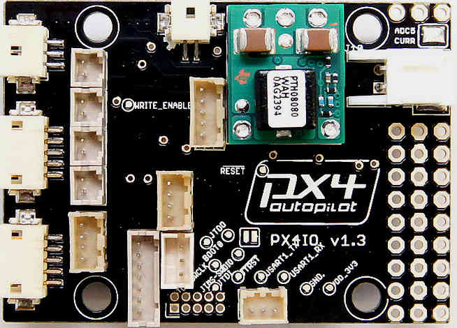

.. _common-px4io-overview:

=======================
Archived:PX4IO Overview
=======================

.. warning::

    **ARCHIVED**
    
    The PX4FMU ("PX4") is end of life and is not generally available for purchase
    - ditto this companion board! This article is made available for existing users.

-  The PX4-IO board Contains its own on board microcontroller and stacks
   with the PX4-FMU board.
-  Built in Brownout proof direct battery input power supply.
-  8 High speed servo PWM outputs.
-  Futaba SBUS or PPM-SUM serial servo output.
-  Futaba SBUS, PPM-SUM or Spektrum serial inputs from your receiver.
-  Two user assignable relays, two 1/2 amp 5 volt outputs and an analog
   input port.
-  All power inputs are reverse polarity protected.
-  All power outputs are current limited.
-  All logic inputs and outputs are ESD protected.
-  All PX4IO boards use positive retention DF13 connectors and a variety
   of connectors.
-  Wires with pre-crimped sockets and pre-made cables are available
   inexpensively for the PX4-IO from 3DRobotics.

The Bottom of the PX4IO Board
==============================

.. image:: ../../../images/PX4io-bottom.jpg
    :target: ../_images/PX4io-bottom.jpg

-  Note the Red Circled item above is ferrite L1.
-  For high power servos you can remove L1 to allow you to supply power
   from an external power supply to a servo connector center pin.

The Top of the PX4IO Board
==========================

A Breif Description of the PX4IO Board
======================================

.. image:: ../../../images/PX4IOdiagram.jpg
    :target: ../_images/PX4IOdiagram.jpg

The PX4IO Board Connector pin assignments
=========================================

The PX4IO Board Stacks On Top of the PX4-FMU board
==================================================

.. image:: ../../../images/PX4-STACK1.jpg
    :target: ../_images/PX4-STACK1.jpg
