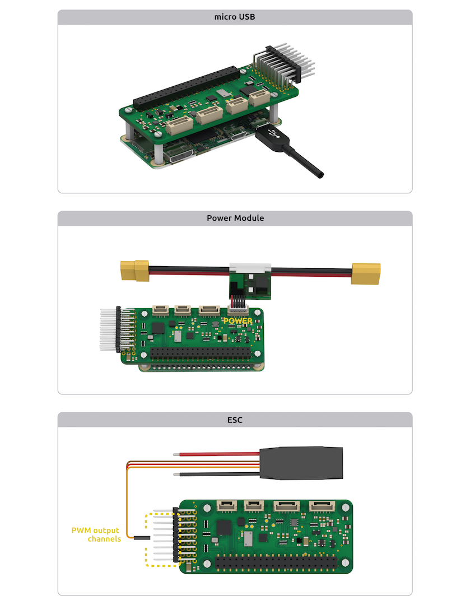
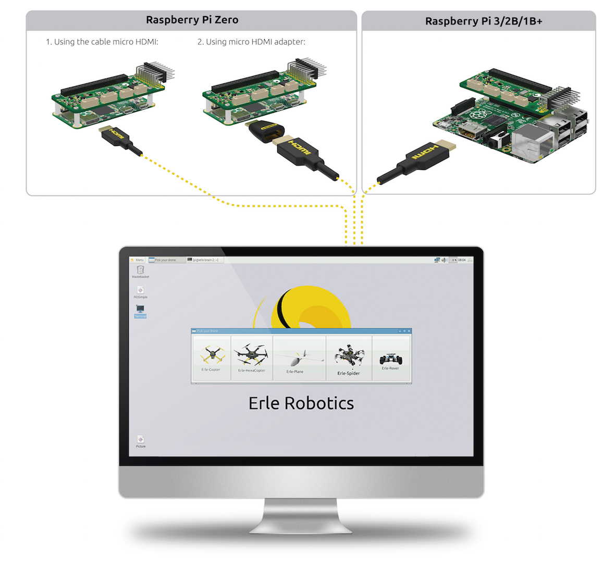
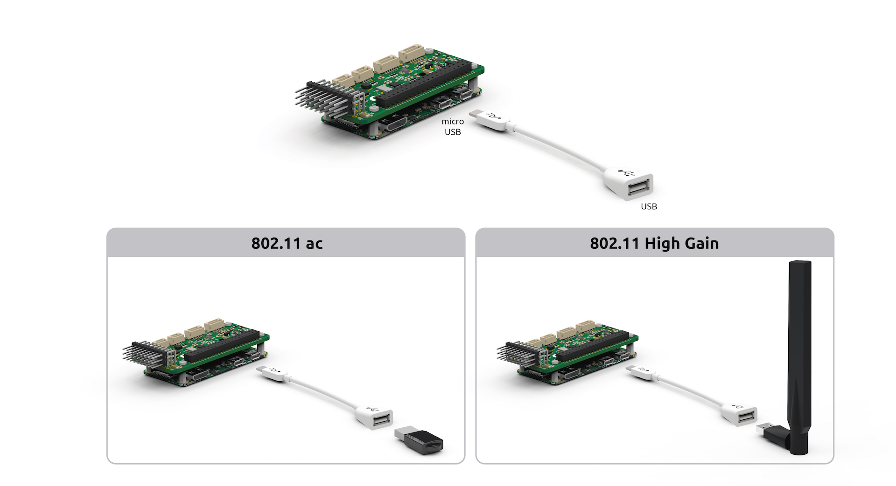

.. _common-pxfmini-wiring-quick-start:

==========================
PXFmini Wiring Quick Start
==========================

.. note::

    PXFmini uses JST-GH connectors instead of DF13. This is the latest adoption made by the DroneCode Foundation
    

This article provides high level information about how to power
:ref:`PXFmini` and connect its most important peripherals.

.. _common-pxfmini-wiring-quick-start_pxfmini_wiring_chart:

PXFmini Wiring Chart
====================

.. image:: ../../../images/PXFmini_intro.jpg
    :target: ../_images/PXFmini_intro.jpg

[site wiki="copter"]
Copter users should also see the 
`official setup documentation <http://erlerobotics.com/docs/Robots/Erle-Copter/index.html>`__.
[/site]

Power PXFmini
=============

PXFmini is typically powered via its "power" port, as shown in the
picture below. The power port simultaneously powers PXFmini and
reads voltage and current analog measurements.

It can be also powered using a BEC, you just need to connect to the PWM rail.

Additionally, for developing/configuration purposes, it can be powered
using a micro USB charger (2A recommended).

.. warning::

   Always use a power module to feed PXFmini while flying your
   drone

HDMI Connector
==============

If you wish to work straight under your Linux based autopilot, you can use the HDMI connector
 and make your own configurations:

Connect remote control inputs
=============================

PXFmini is compatible with PPM remote control (RC) receivers. For
traditional single-wire-per-channel (PWM) receivers a PPM encoder can be
used to convert the receiver outputs to PPM-SUM.

For more information see :ref:`Compatible RC Transmitter and Receiver Systems (Erle-Brain 2) <common-compatible-rc-transmitter-and-receiver-systems-erle-brain-2>`. The PXFmini is compatible with the tecnology used in Erle-Brain 2.

.. figure:: ../../../images/FRSkyTaranis.jpg
   :target: ../_images/FRSkyTaranis.jpg

   FRSky Taranis Transmitter

GPS+Compass
===========

The `uBlox GPS + Compass Module <hhttps://erlerobotics.com/blog/product/gpscompass-ublox-neo-m8n-gps-with-compass-kit/>`__
is the recommended GPS for PXFmini. The GPS port is connected with
the six-position DF13 cable, and the Compass port is connected to the
I2C port with the four-position JST-GH cable, as shown in the next image:

Connect Motors
==============

Use the PWM rail in order to connect them:

.. note::

   Be aware of how you connect ESCs wires to PWM rail. The signal
   wire (white or orange color) should be connected at the top, the ground
   wire (black or brown color) at the bottom.

[site wiki="copter"]

For Copter see :ref:`Connect ESCs and Motors <copter:connect-escs-and-motors>`.

In overview, for copters connect each signal wire from the PDB to the
main output signal (S) pins by motor number:

-  Pin 1 = Motor 1 - - Pin 5 = Motor 5
-  Pin 2 = Motor 2 - - Pin 6 = Motor 6
-  Pin 3 = Motor 3 - - Pin 7 = Motor 7
-  Pin 4 = Motor 4 - - Pin 8 = Motor 8

[/site]

[site wiki="plane"]

For planes connect the control channel wires to the main output signal
pins:

-  Pin 1 = Aileron
-  Pin 2 = Elevator
-  Pin 3 = Throttle
-  Pin 4 = Rudder

[/site]

[site wiki="rover"]

For Rovers connect the throttle and steering wires to the main output
signal pins:

-  Pin 3 = Throttle
-  Pin 1 = Steering

[/site]

USB ports
=========

You could attach different dongle/devices to the USB ports that includes Raspberry Pi 2/3/Zero:

WiFi dongle
-----------

Use a (regular or high gain) WiFi dongle to create a hotspot that can,
for example, be used for sending telemetry data and commands to a Ground
Station.  If you use the `images <http://erlerobotics.com/docs/Artificial_Brains_and_Autopilots/Operating_System_images/Debian.html>`__ provided 
by Erle Robotics, they automatically generate a WiFi hotspot.

.. note::

   Edimax AC (regular and high gain) are the officially supported
   dongles. These can be purchased from Erle-Brain with your
   autopilot/vehicle.

Bluetooth dongle
----------------

Use a Bluetooth dongle to connect additional devices, such as joysticks.

.. note::

   You will need to configure BlueTooth interface to make it
   work

Connect other peripherals
=========================

Depending on your hardware there may be any number of other peripherals
attached, including sensors, cameras, grippers etc. These can be found
as sub-pages of the topic :ref:`Optional Hardware <common-optional-hardware>`.

More information in `official documentation <http://erlerobotics.com/docs/Artificial_Brains_and_Autopilots/Additional_Sensors/Lidar.html>`__.

Related information
===================

`Erle Robotics official documentation <http://erlerobotics.com/docs/Intro.html>`__ includes
additional information about how to use PXFmini.

.. toctree::
    :maxdepth: 1

    Compatible RC Transmitter and Receiver Systems (Erle-Brain 2) <common-compatible-rc-transmitter-and-receiver-systems-erle-brain-2>

