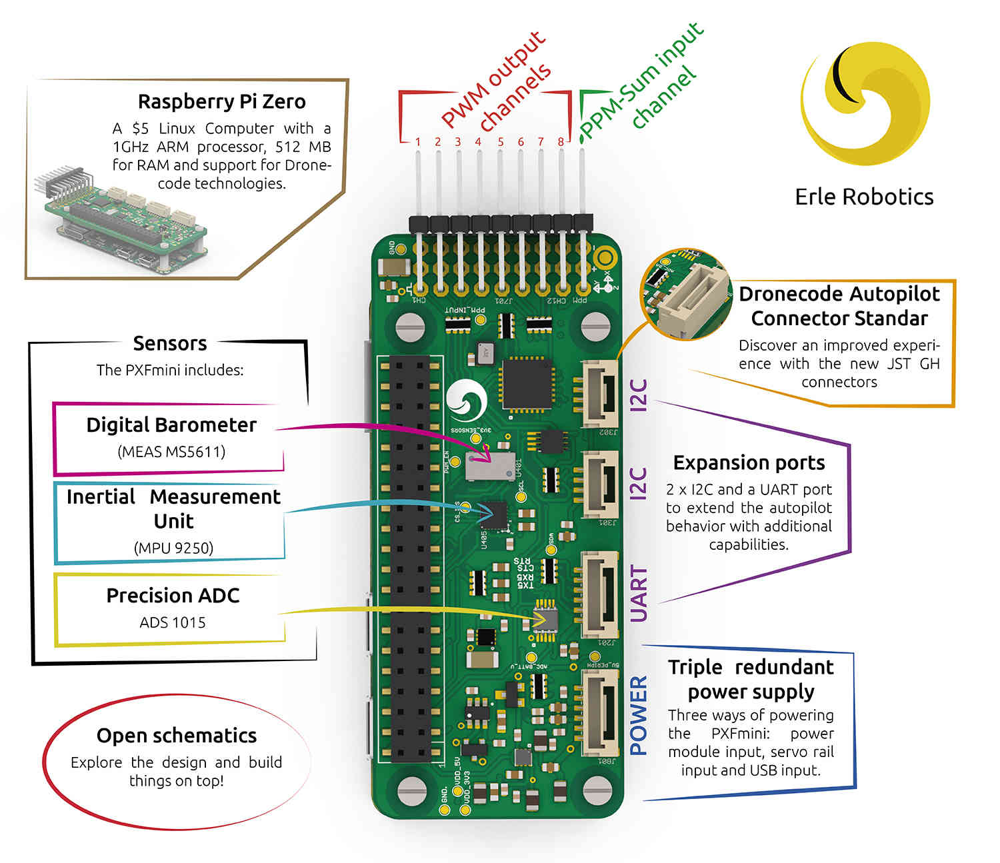

.. _common-pxfmini:

=======
PXFmini 
=======

The `PXFmini (Pixhawk Fire Cape Mini) Autopilot Shield <http://erlerobotics.com/blog/pxfmini>`__ made by `Erle Robotics <https://erlerobotics.com/>`__ is a low cost
and open autopilot shield for the Raspberry Pi that allows you to create
a ready-to-fly autopilot with support for ArduPilot.
The shield has been designed specially for the Raspberry Pi Zero but it
is also pin to pin compatible with other models from the Raspberry Pi
family.

The PXFmini shield weighs only 15 grams and embeds all the power
electronics necessary to comply with most of the existing components for
drones through its I2C and UART ports. PXFmini includes 3 axes gravity
sensor, 3 axes gyroscope, 3 axes digital compass, pressure sensor,
temperature sensor and an ADC. It includes new JST GH connectors
provide an amazing new experience.

What's best, the PXFmini schematics are open for you to hack around and
create your own robots based on the design. The board can be purchased
`here <https://erlerobotics.com/blog/product/pxfmini/>`__.

Quick start
-----------

All the documentation related to this product (specs, software,
schematics,...) can be found in the Erle Robotics `documentation site <http://erlerobotics.com/docs/>`__.

