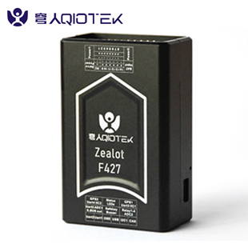
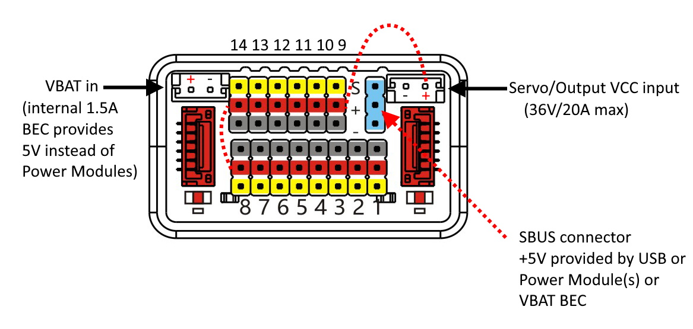

.. _common-qiotek-zealot:

==================
QioTek Zealot F427
==================

.. note:: This autopilot is supported in 4.1 and later firmware

The QioTek Zealot F427 is an internally vibration dampened autopilot with a protective CNC metal case for ruggedness. It features fully redundant sensors, expanded number of outputs, temperature controlled IMUs, and is the first high performance autopilot with integrated OSD chip.

Specifications
==============

-  **Processor**:

   -  MCU - STM32F427VIT6 
   -  16KB FRAM - FM25V01

-  **Sensors**

   -  Gyro/Accelerometers: ICM20689, ICM20602, and BMI088
   -  Barometers: MS5611 and DPS3018
   -  Compass: IST8310 or QMC5883L

-  **Power**

   -  5-5.5VDC from USB (internal circuitry and RX only) or via 2 x PowerModule connectors, or via internal BEC off VBAT input pin. All 5V pins are powered when USB, or Power Module(s), or VBAT input is used.
   -  Internal 5V, 1.5A BEC directly can be used with up to 6S LIPO batteries to supply board and peripheral power up to 1.5A max with voltage only monitoring via BATT2 monitor (500ma max recommended).
   -  ADC monitoring of board voltage??
   -  ADC monitoring of Servo/Output's power rail
   
-  **Interfaces/Connectivity**

   -  14 PWM Outputs with independent power rail for external power source
   -  4 Relay outputs
   -  MicroSD card reader
   -  Micro USB or remote USB via a JST_GH connector
   -  Builtin RGB LED
   -  External Buzzer interface
   -  2, 6.6V tolerant ADC inputs for RSSI, Analog Airspeed, etc.
   -  5 UARTs
   -  Safety Switch connector

-  **Dimensions**

   -  Weight ?
   -  Size 42mm x 65mm x 25mm

Connector pin assignments
=========================

Unless noted otherwise all connectors are JST GH

UART2(TELEM1), UART1(TELEM2) ports
----------------------------------

.. raw:: html

   <table border="1" class="docutils">
   <tbody>
   <tr>
   <th>Pin</th>
   <th>Signal</th>
   <th>Volt</th>
   </tr>
   <tr>
   <td>1</td>
   <td>VCC</td>
   <td>+5V</td>
   </tr>
   <tr>
   <td>2</td>
   <td>TX (OUT)</td>
   <td>+3.3V</td>
   </tr>
   <tr>
   <td>3</td>
   <td>RX (IN)</td>
   <td>+3.3V</td>
   </tr>
   <tr>
   <td>4</td>
   <td>GND</td>
   <td>GND</td>
   </tr>
   </tbody>
   </table>

OSD
---

.. raw:: html

   <table border="1" class="docutils">
   <tbody>
   <tr>
   <th>Pin</th>
   <th>Signal</th>
   <th>Volt</th>
   </tr>
   <tr>
   <td>1</td>
   <td>VIN</td>
   <td>+3.3V</td>
   </tr>
   <tr>
   <td>2</td>
   <td>GND</td>
   <td>GND</td>
   </tr>
   <tr>
   <td>3</td>
   <td>GND</td>
   <td>GND</td>
   </tr>
   <tr>
   <td>4</td>
   <td>VOUT</td>
   <td>3.3V</td>
   </tr>
   </tbody>
   </table>
   
USB remote port
---------------

.. raw:: html

   <table border="1" class="docutils">
   <tbody>
   <tr>
   <th>PIN</th>
   <th>SIGNAL</th>
   <th>VOLT</th>
   </tr>
   <tr>
   <td>1</td>
   <td>USB VDD</td>
   <td>+5V</td>
   </tr>
   <tr>
   <td>2</td>
   <td>DM</td>
   <td>+3.3V</td>
   </tr>
   <tr>
   <td>3</td>
   <td>DP</td>
   <td>+3.3V</td>
   </tr>
   <tr>
   <td>4</td>
   <td>GND</td>
   <td>GND</td>
   </tr>
   </tbody>
   </table>

I2C1 port
---------
.. raw:: html

   <table border="1" class="docutils">
   <tbody>
   <tr>
   <th>PIN</th>
   <th>SIGNAL</th>
   <th>VOLT</th>
   </tr>
   <tr>
   <td>1</td>
   <td>VCC</td>
   <td>+5V</td>
   </tr>
   <tr>
   <td>2</td>
   <td>SCL1</td>
   <td>+3.3V</td>
   </tr>
   <tr>
   <td>3</td>
   <td>SDA1</td>
   <td>+3.3V</td>
   </tr>
   <tr>
   <td>4</td>
   <td>GND</td>
   <td>GND</td>
   </tr>
   </tbody>
   </table>

CAN port
--------

.. raw:: html

   <table border="1" class="docutils">
   <tbody>
   <tr>
   <th>PIN</th>
   <th>SIGNAL</th>
   <th>VOLT</th>
   </tr>
   <tr>
   <td>1</td>
   <td>VCC</td>
   <td>+5V</td>
   </tr>
   <tr>
   <td>2</td>
   <td>CAN_H</td>
   <td>+12V</td>
   </tr>
   <tr>
   <td>3</td>
   <td>CAN_L</td>
   <td>+12V</td>
   </tr>
   <tr>
   <td>4</td>
   <td>GND</td>
   <td>GND</td>
   </tr>
   </tbody>
   </table>

USART5/ADC1/SBus Out port
-------------------------

.. raw:: html

   <table border="1" class="docutils">
   <tbody>
   <tr>
   <th>PIN</th>
   <th>SIGNAL</th>
   <th>VOLT</th>
   </tr>
   <tr>
   <td>1</td>
   <td>VCC</td>
   <td>+5V</td>
   </tr>
   <tr>
   <td>2</td>
   <td>TX5</td>
   <td>+3.3V</td>
   </tr>
   <tr>
   <td>3</td>
   <td>RX5</td>
   <td>+3.3V</td>
   </tr>
   <tr>
   <td>4</td>
   <td>SBUS Out</td>
   <td>+3.3V</td>
   </tr>
   <tr>
   <td>5</td>
   <td>ADC1 </td>
   <td>+6V</td>
   </tr>
   <tr>
   <td>6</td>
   <td>GND </td>
   <td>GND</td>
   </tr>
   </tbody>
   </table>

Safety/Buzzer port
------------------
.. raw:: html

    <table border="1" class="docutils">
   <tbody>
   <tr>
   <th>PIN</th>
   <th>SIGNAL</th>
   <th>VOLT</th>
   </tr>
   <tr>
   <td>1</td>
   <td>VCC3.3</td>
   <td>+3.3V</td>
   </tr>
   <tr>
   <td>2</td>
   <td>VCC5.5</td>
   <td>+5V</td>
   </tr>
   <tr>
   <td>3</td>
   <td>SafKey</td>
   <td>+3.3V</td>
   </tr>
   <tr>
   <td>4</td>
   <td>SafLED</td>
   <td>+3.3V</td>
   </tr>
   <tr>
   <td>5</td>
   <td>BUZZER-</td>
   <td>+5V</td>
   </tr>
   <tr>
   <td>6</td>
   <td>GND</td>
   <td>GND</td>
   </tr>
   </tbody>
   </table>

Relay/ADC2 port
---------------

.. raw:: html

   <table border="1" class="docutils">
   <tbody>
   <tr>
   <th>PIN</th>
   <th>SIGNAL</th>
   <th>VOLT</th>
   </tr>
   <tr>
   <td>1</td>
   <td>ADC2</td>
   <td>+6V</td>
   </tr>
   <tr>
   <td>2</td>
   <td>Relay1</td>
   <td>+5V</td>
   </tr>
   <tr>
   <td>3</td>
   <td>Relay2</td>
   <td>+5V</td>
   </tr>
   <tr>
   <td>4</td>
   <td>Relay3</td>
   <td>+5V</td>
   </tr>
   <tr>
   <td>5</td>
   <td>Relay4</td>
   <td>+5V</td>
   </tr>
   <tr>
   <td>6</td>
   <td>GND</td>
   <td>GND</td>
   </tr>
   </tbody>
   </table>

USART3(GPS1/I2C1), UART4(GPS2/I2C2) ports
-----------------------------------------

.. raw:: html

   <table border="1" class="docutils">
   <tbody>
   <tr>
   <th>PIN</th>
   <th>SIGNAL</th>
   <th>VOLT</th>
   </tr>
   <tr>
   <td>1</td>
   <td>VCC</td>
   <td>+5V</td>
   </tr>
   <tr>
   <td>2</td>
   <td>TX</td>
   <td>+3.3V</td>
   </tr>
   <tr>
   <td>3</td>
   <td>RX</td>
   <td>+3.3V</td>
   </tr>
   <tr>
   <td>4</td>
   <td>SCL</td>
   <td>+3.3V</td>
   </tr>
   <tr>
   <td>5</td>
   <td>SDA</td>
   <td>+3.3V</td>
   </tr>
   <tr>
   <td>6</td>
   <td>GND</td>
   <td>GND</td>
   </tr>
   </tbody>
   </table>

Power1, Power2 ports
--------------------

.. raw:: html

   <table border="1" class="docutils">
   <tbody>
   <tr>
   <th>PIN</th>
   <th>SIGNAL</th>
   <th>VOLT</th>
   </tr>
   <tr>
   <td>1</td>
   <td>VCC</td>
   <td>+5V</td>
   </tr>
   <tr>
   <td>2</td>
   <td>VCC</td>
   <td>+5V</td>
   </tr>
   <tr>
   <td>3</td>
   <td>CURRENT</td>
   <td>+3.3V</td>
   </tr>
   <tr>
   <td>4</td>
   <td>VOLTAGE</td>
   <td>+3.3V</td>
   </tr>
   <tr>
   <td>5</td>
   <td>GND</td>
   <td>GND</td>
   </tr>
   <tr>
   <td>6</td>
   <td>GND</td>
   <td>GND</td>
   </tr>
   </tbody>
   </table>

VBAT Input
----------

30V maximum input. A 5V, 1.5A regulator drops this input to the +5V used and supplied by the autopilot. Do not connect power to this input if Power Module 2 input is used as they share the BATT2 voltage monitoring circuitry. This connector is a JST-EH type.

SERVO VCC Rail Input
--------------------

This provides a means to power servos attached to the output connector block by an external BEC or power source. Maximum power rating is 36V @ 20A.

RC Input
--------

All compatible RC protocols can be decoded by attaching the Receiver's output to the SBUS input pin next to the Servo/Output VCC input connector. Note that some protocols such as CRSF or, FPort including telemetry, require connection to, and setup of, one of the UARTs instead of this pin.

Default UART order
==================

- SERIAL0 = console = USB
- SERIAL1 = Telemetry1 = USART2
- SERIAL2 = Telemetry2 = USART1
- SERIAL3 = GPS1 = USART3
- SERIAL4 = GPS2 = UART4
- SERIAL5 = USER = UART5

Dshot capability
================

All motor/servo outputs are Dshot and PWM capable. However, mixing Dshot and normal PWM operation for outputs is restricted into groups, ie. enabling Dshot for an output in a group requires that ALL outputs in that group be configured and used as Dshot, rather than PWM outputs. The output groups that must be the same (PWM rate or Dshot, when configured as a normal servo/motor output) are: 1/2/3/4, 5/6/7/8, 9/10/11/12. Outputs 13 and 14 cannot support Dshot, only PWM.

Battery Monitor Settings
========================

These should already be set by default. However, if lost or changed:

Enable Battery monitor with these parameter settings :

:ref:`BATT_MONITOR<BATT_MONITOR>` =4

Then reboot.

:ref:`BATT_VOLT_PIN<BATT_VOLT_PIN>` 13

:ref:`BATT_CURR_PIN<BATT_CURR_PIN>` 12

:ref:`BATT_VOLT_MULT<BATT_VOLT_MULT>` 17.5

:ref:`BATT_AMP_PERVLT<BATT_AMP_PERVLT>` 17

:ref:`BATT2_VOLT_PIN<BATT2_VOLT_PIN>` 9

:ref:`BATT2_CURR_PIN<BATT2_CURR_PIN>` 8

:ref:`BATT2_VOLT_MULT<BATT2_VOLT_MULT>` 17.5

:ref:`BATT2_AMP_PERVLT<BATT2_AMP_PERVLT>` 17

Where to Buy
============

`QIOTEK <http://www.Qio-Tek.com>`_