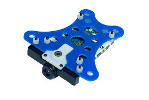

.. _common-qualcomm-snapdragon-flight-kit:

========================================
Archived: Qualcomm Snapdragon Flight Kit
========================================

The Snapdragon Flight platform is a high performance CPU autopilot with a two onboard cameras.

.. warning::

   Numerous developers have reported this board is difficult to get working perhaps because of a lack of documentation or issues with underlying software on the board. If you are looking for a high performance Linux autopilot, you may wish to consider the :ref:`Navio2 <common-navio2-overview>` instead.

Overview
========

The `Qualcomm® Snapdragon Flight™ Kit (Developer’s Edition) <http://shop.intrinsyc.com/products/snapdragon-flight-dev-kit>`__
is small (58x40mm) but offers a lot of CPU power and two on-board
cameras. It contains 4 ‘Krait’ ARM cores which run Linux (Ubuntu 14.04
Trusty, by default), and 3 ‘Hexagon’ DSP cores which run the QURT RTOS.
In addition it includes Wi-Fi, Bluetooth connectivity, automotive-grade
GPS and many more features.

.. warning::

   Due to some rather unusual licensing terms from Intrinsyc we
   cannot distribute binaries of ArduPilot (or any program built with the
   Qualcomm libraries). So you will have to build the firmware yourself:
   :ref:`Building for Qualcomm Snapdragon Flight Kit <dev:building-for-qualcomm-snapdragon-flight-kit>`
   (Dev Wiki).

Specifications
==============

Detailed specifications are available on `www.intrinsyc.com here <https://www.intrinsyc.com/vertical-development-platforms/qualcomm-snapdragon-flight/>`__
(behind a short survey).

-  **System on Chip**: Snapdragon 801

   -  CPU: Quad-core 2.26 GHz Krait
   -  DSP: Hexagon DSP (QDSP6 V5A) – 801 MHz+256KL2 (running the flight
      code)
   -  GPU: Qualcomm® Adreno™ 330 GPU
   -  RAM: 2GB LPDDR3 PoP @931 MHz
   -  Storage: 32GB eMMC Flash

-  **Sensors**

   -  MPU: Invensense MPU-9250 9-Axis Sensor, 3x3mm QFN
   -  Barometer: Bosch BMP280 barometric pressure sensor
   -  Optical Flow: Omnivision OV7251 on Sunny Module MD102A-200
   -  Video: Sony IMX135 on Liteon Module 12P1BAD11 (4k@30fps 3840×2160
      video capture to SD card with H.264 @ 100Mbits (1080p/60 with
      parallel FPV), 720p FPV)
   -  GPS: Telit Jupiter SE868 V2 module

-  **Power**

   -  5VDC via external 2S-6S battery regulated down to 5V via APM
      adapter

-  **Interfaces/Connectivity**

   -  Wifi: Qualcomm® VIVE™ 1-stream 802.11n/ac with MU-MIMO †
      Integrated digital core
   -  BT/WiFi: BT 4.0 and 2G/5G WiFi via QCA6234
   -  802.11n, 2×2 MIMO with 2 uCOAX connectors on-board for connection
      to external antenna
   -  uCOAX connector on-board for connection to external GPS patch
      antenna
   -  CSR SiRFstarV @ 5Hz via UART
   -  One USB 3.0 OTG port (micro-A/B)
   -  Micro SD card slot
   -  Gimbal connector (PWB/GND/BLSP)
   -  ESC connector (2W UART)
   -  I2C
   -  60-pin high speed Samtec QSH-030-01-L-D-A-K expansion connector
   -  2x BLSP (BAM Low Speed Peripheral)

-  **Dimensions**

   -  Weight ?
   -  pcb = 57x40, pcb+connectors+camera=68x52

More details can be found from the `Intrinsyc shop <http://shop.intrinsyc.com/products/snapdragon-flight-dev-kit>`__.

Connector pin assignments
=========================

The Qualcomm Flight board has 4 DF13 6 pin UART connectors.

.. warning::

   The pinout is different from Pixhawk!

The pinout for all of the UART is:

-  **pin1**: power
-  **pin2**: TX
-  **pin3**: RX
-  **pin5**: GND

The 4 ports are called **/dev/tty-1**, **/dev/tty-2**, **/dev/tty-3**
and **/dev/tty-4**. The first port is the one closest to the USB3
connector. The ports proceed counter-clockwise from there. So tty-2 is
the one closest to the power connector.

The *default assignment* of the ports is:

-  **/dev/tty-1**: RC input (Spektrum satellite only)
-  **/dev/tty-2**: telemetry at 57600
-  **/dev/tty-3**: RC output (see below)
-  **/dev/tty-4**: GPS

3 of the 4 ports provide 3.3V power on **pin1**, while the
**/dev/tty-1** provides 5V power (note that **pin6** is not ground,
unlike on a Pixhawk). You will need to check whether your GPS can be
powered off 3.3V. A uBlox GPS is recommended, although any ArduPilot
compatible serial GPS can be used.

.. image:: ../../../images/snapdragon_ports.jpg
    :target: ../_images/snapdragon_ports.jpg

WiFi
----

WLAN0, WLAN1 (+BT 4.0): U.FL connector: `Taoglas adhesive antenna (DigiKey) <https://www.digikey.com/product-detail/en/FXP840.07.0055B/931-1222-ND/3877414>`__

J9 / GPS
--------

.. raw:: html

   <table>
   <tbody>
   <tr>
   <th>Pin</th>
   <th>Signal</th>
   <th>Comment</th>
   </tr>
   <tr>
   <td>1</td>
   <td>3.3V</td>
   <td>Output (3.3V)</td>
   </tr>
   <tr>
   <td>2</td>
   <td>UART2_TX</td>
   <td>-</td>
   </tr>
   <tr>
   <td>3</td>
   <td>UART2_RX</td>
   <td>Input (3.3V)</td>
   </tr>
   <tr>
   <td>4</td>
   <td>I2C2_SDA</td>
   <td>(3.3V)</td>
   </tr>
   <tr>
   <td>5</td>
   <td>GND</td>
   <td>-</td>
   </tr>
   <tr>
   <td>6</td>
   <td>I2C2_SCL</td>
   <td>(3.3V)</td>
   </tr>
   </tbody>
   </table>

J12 / Gimbal bus
----------------

.. raw:: html

   <table>
   <tbody>
   <tr>
   <th>Pin</th>
   <th>Signal</th>
   <th>Comment</th>
   </tr>
   <tr>
   <td>1</td>
   <td>3.3V</td>
   <td>-</td>
   </tr>
   <tr>
   <td>2</td>
   <td>UART8_TX</td>
   <td>Output (3.3V)</td>
   </tr>
   <tr>
   <td>3</td>
   <td>UART8_RX</td>
   <td>Input (3.3V)</td>
   </tr>
   <tr>
   <td>4</td>
   <td>APQ_GPIO_47</td>
   <td>(3.3V)</td>
   </tr>
   <tr>
   <td>5</td>
   <td>GND</td>
   <td>-</td>
   </tr>
   <tr>
   <td>6</td>
   <td>APQ_GPIO_48</td>
   <td>(3.3V)</td>
   </tr>
   </tbody>
   </table>

J13 / ESC bus
-------------

.. raw:: html

   <table>
   <tbody>
   <tr>
   <th>Pin</th>
   <th>Signal</th>
   <th>Comment</th>
   </tr>
   <tr>
   <td>1</td>
   <td>5V</td>
   <td>-</td>
   </tr>
   <tr>
   <td>2</td>
   <td>UART6_TX</td>
   <td>Output (5V)</td>
   </tr>
   <tr>
   <td>3</td>
   <td>UART6_RX</td>
   <td>Input (5V)</td>
   </tr>
   <tr>
   <td>4</td>
   <td>APQ_GPIO_29</td>
   <td>(5V)</td>
   </tr>
   <tr>
   <td>5</td>
   <td>GND</td>
   <td>-</td>
   </tr>
   <tr>
   <td>6</td>
   <td>APQ_GPIO_30</td>
   <td>(5V)</td>
   </tr>
   </tbody>
   </table>

J14 / Power
-----------

.. raw:: html

   <table>
   <tbody>
   <tr>
   <th>Pin</th>
   <th>Signal</th>
   <th>Comment</th>
   </tr>
   <tr>
   <td>1</td>
   <td>5V DC</td>
   <td>Power input</td>
   </tr>
   <tr>
   <td>2</td>
   <td>GND</td>
   <td>-</td>
   </tr>
   <tr>
   <td>3</td>
   <td>I2C3_SCL</td>
   <td>(5V)</td>
   </tr>
   <tr>
   <td>4</td>
   <td>I2C3_SDA</td>
   <td>(5V)</td>
   </tr>
   </tbody>
   </table>

J15 / Radio Receiver / Sensors
------------------------------

.. raw:: html

   <table>
   <tbody>
   <tr>
   <th>Pin</th>
   <th>Signal</th>
   <th>Comment</th>
   </tr>
   <tr>
   <td>1</td>
   <td>3.3V</td>
   <td>-</td>
   </tr>
   <tr>
   <td>2</td>
   <td>UART9_TX</td>
   <td>Output</td>
   </tr>
   <tr>
   <td>3</td>
   <td>UART9_RX</td>
   <td>Input</td>
   </tr>
   <tr>
   <td>4</td>
   <td>I2C9_SDA</td>
   <td>-</td>
   </tr>
   <tr>
   <td>5</td>
   <td>GND</td>
   <td>-</td>
   </tr>
   <tr>
   <td>6</td>
   <td>I2C9_SCL</td>
   <td>-</td>
   </tr>
   </tbody>
   </table>

ESC PWM Output
==============

To get signals to ESCs or servos you need to use a UART. The default
setup is to send 4 PWM signals as serial data on **/dev/tty-3**.

`This firmware <https://github.com/tridge/ardupilot/tree/hal-qurt/libraries/RC_Channel/examples/RC_UART>`__
will read the UART serial stream and output to the PWM output of the
board you use. For example, you could use a Pixracer or Pixhawk board.
It is designed to work with this firmware for any ArduPilot compatible
board.

.. note::

   `Qualcomm/Intrinsyc have released a ESC <https://shop.intrinsyc.com/products/qualcomm-electronic-speed-control-board>`__ for use with this board but it has not been tested for use with ArduPilot.

Logging
=======

Logs will appear in **/var/APM/logs** for QFLIGHT ARM port and in
**/usr/share/data/adsp/logs** for the QURT port.

You can copy the logs over WiFi using FTP, Samba, SCP or any other
common file copying tool (the board runs Samba by default, so you can
just add the log directory to the Samba config file to export it, and
then drag and drop from Windows). On QFLIGHT you can also download logs
over MAVLink.

Record and display live video
=============================

Recording and viewing live video from either of the two cameras is
possible using the qcamvid application on the autopilot.

-  Connect the ground station computer to the autopilot's wifi
   network (normally appears as *Atlanticus_XXXX*)
-  Use an ssh program such as
   `Putty <https://www.chiark.greenend.org.uk/~sgtatham/putty/latest.html>`__
   to login into the board
-  Type the following to record 10 minutes of video from the front
   camera to /root/video.h264 (other options can be seen by typing
   ``qcamvid -h``)

   ::

       qcamvid -c hires -t 600 -o /root/video.h264

-  The video can also be viewed in real-time by installing a program
   such as `VLC media player <http://www.videolan.org/vlc/index.html>`__
   on the ground station computer, and then opening the following
   network stream.

   ::

       rtsp://192.168.2.1:554/fpvview

   .. figure:: ../../../images/snapdragon_VLCMediaLiveVideoViewer.png
      :target: ../_images/snapdragon_VLCMediaLiveVideoViewer.png

      VLC Media Player: Stream Live Video

Additional information
======================

-  `ELC 2015 - Heterogeneous Multi-Core Architecture Support for Dronecode (Mark Charlebois,
   Qualcomm) <https://youtu.be/ggNTjAhjnJk>`__ (Video) 
- :ref:`Building for Qualcomm Snapdragon Flight Kit <dev:building-for-qualcomm-snapdragon-flight-kit>`
-  `QURT Port <https://github.com/ArduPilot/ardupilot/blob/master/libraries/AP_HAL_QURT/README.md>`__ (Github)
-  `QFlight Port <https://github.com/ArduPilot/ardupilot/tree/master/libraries/AP_HAL_Linux/qflight>`__ (Github)
