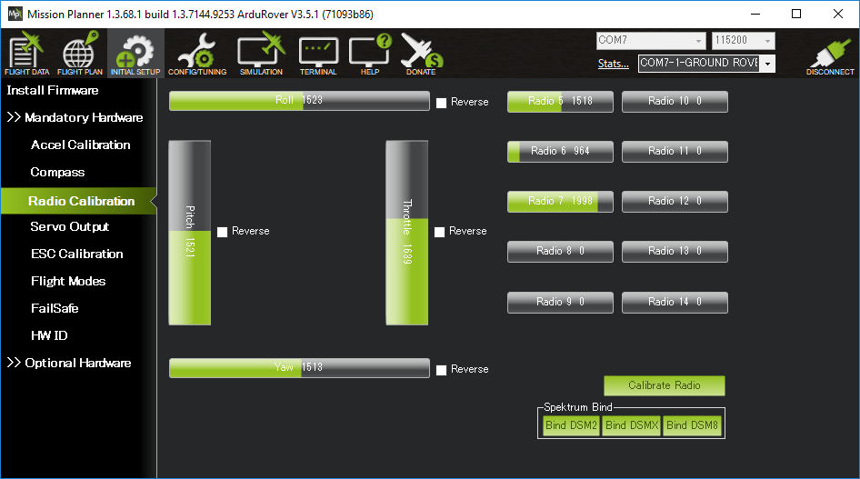
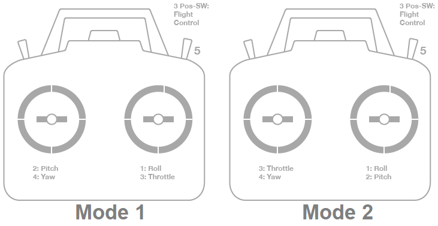

.. _common-radio-control-calibration:

=========================
Radio Control Calibration
=========================

This article shows how to perform radio control calibration using Mission Planner

Overview
========

RC transmitters allow the pilot to set the flight mode, control the vehicle's movement and orientation and also turn on/off auxiliary functions (i.e. raising and lowering landing gear, etc).

RC Calibration involves capturing each RC input channel's minimum, maximum and "trim" values so that ArduPilot can correctly interpret the input.

Check the Transmitter's Setup
-----------------------------

- Ensure the battery is disconnected (this is important because it is possible to accidentally arm the vehicle during the RC calibration process)
- Ensure the RC receiver is connected to the autopilot
- Turn on your RC transmitter and if it has "trim tabs" ensure they are in the middle
- Connect the autopilot to the PC using a USB cable
- On the Mission Planner press the "Connect" button and open Mission Planner's **INITIAL SETUP \| Mandatory Hardware \| Radio Calibration** screen
- Some green bars should appear showing the ArduPilot is receiving input from the Transmitter/Receiver. If no bars appear check the receiver's LED:

   -  No lights may indicate that it is incorrectly wired to the autopilot.  Look for connectors that may have been inserted upside down
   -  A Red or flashing LED may indicate that your RC transmitter/receiver need be bound.  See the manual that came with your RC equipment for instructions

- Check the channel mapping in the transmitter (ie. check which inputs channels are controlled by the transmitter's sticks, switches and knobs) by moving the sticks, knobs and switches and observing which (if any) green bars move.  If this is the first time the transmitter is being used with ArduPilot it is likely that the transmitter's channel mapping will need to be changed and normally this is done on the transmitter itself using its built-in configuration menu

  - Determine if your transmitter is Mode1 or Mode2 (see below)
  - Roll stick should control channel 1
  - Pitch stick should control channel 2
  - Throttle stick should control channel 3
  - Yaw stick should control channel 4
  - A 3 position switch (to control the flight mode) should be setup to control Channel 5 (if using Copter) or Channel 8 (if using Rover or Plane).  This channel can be moved by setting the :ref:`FLTMODE_CH <FLTMODE_CH>` or :ref:`MODE_CH <MODE_CH>` parameter
  - On Copter, a tuning knob should control Channel 6
  - On Copter and Rover, any remaining two or three position switches can be setup to control auxiliary functions by mapping them to channels 7 to 12
- Move the transmitter's roll, pitch, throttle and yaw sticks and ensure the green bars move in the correct direction:

  - for roll, throttle and yaw channels, the green bars should move in the same direction as the transmitter's physical sticks
  - for pitch, the green bar should move in the opposite direction to the transmitter's physical stick
  - if one of the green bars moves in the incorrect direction reverse the channel in the transmitter itself.  If it is not possible to reverse the channel in the transmitter you may reverse the channel in ArduPilot by checking the "Reversed" checkbox (Plane and Rover only).  If the checkbox is not visible it is possible to reverse the channel by directly changing the RCx_REVERSED parameter (where "x" is the input channel from 1 to 4).

Calibration
-----------

- Open Mission Planner's **INITIAL SETUP \| Mandatory Hardware \| Radio Calibration** screen
- Click on the green "Calibrate Radio" button on the bottom right
- Press "OK" when prompted to check the radio control equipment is on, battery is not connected, and propellers are not attached

   .. figure:: ../../../images/mp_calibrate_radio.jpg
      :target: ../_images/mp_calibrate_radio.jpg

- Move the transmitter's control sticks, knobs and switches to their limits.  Red lines will appear across the calibration bars to show minimum and maximum values seen so far

   .. figure:: ../../../images/mp_radio_calibration_click_when_done.jpg
      :target: ../_images/mp_radio_calibration_click_when_done.jpg

- Select **Click when Done**
[site wiki="plane,copter,planner"]
- A window will appear with the prompt, "Ensure all your sticks are centered and throttle is down and click ok to continue".  Move the throttle to zero and press "OK".
[/site]
[site wiki="rover"]
- A window will appear with the prompt, "Ensure all your sticks are centered and throttle is down and click ok to continue".  **Move the throttle to the center** and press "OK".
[/site]

- Mission Planner will show a summary of the calibration data. Normal values are around 1100 for minimums and 1900 for maximums.

   .. figure:: ../../../images/radi-calib-results.png
      :target: ../_images/radi-calib-results.png

Mode1 and Mode2 Transmitters
----------------------------

There are two main transmitter configurations:

-  *Mode 1*: left stick controls pitch and yaw, the right stick will
   control throttle and roll.
-  *Mode 2*: left stick controls throttle and yaw; the right stick will
   control pitch and roll.

[site wiki="rover"]Rover users may prefer to control both throttle and roll from the same stick.[/site]

Channel mappings
----------------

[site wiki="copter"]

Copter default channel mappings are:

-  **Channel 1**: Roll
-  **Channel 2**: Pitch
-  **Channel 3**: Throttle
-  **Channel 4**: Yaw
-  **Channel 5**: Flight modes
-  **Channel 6**: (Optional) Inflight tuning or camera mount (mapped to transmitter tuning knob)
-  **Channel 7 to 12**: (Optional) Auxiliary function switches

[/site]

[site wiki="plane"]

Plane default channel mappings are:

-  **Channel 1**: Roll
-  **Channel 2**: Pitch
-  **Channel 3**: Throttle
-  **Channel 4**: Yaw
-  **Channel 8** (default): Flight modes. Mode selection can be mapped to any RC channel using the :ref:`FLTMODE_CH <FLTMODE_CH>` parameter

Unused channels can be mapped to control additional peripherals.
[/site]

[site wiki="rover"]

Rover default channel mappings are:

-  **Channel 1**: Steering
-  **Channel 3**: Throttle
-  **Channel 8** (default): Flight modes. Mode selection can be mapped to any RC channel using the :ref:`MODE_CH <MODE_CH>` parameter
-  **Channel 7 to 12**: (Optional) Auxiliary function switches

Spring Centered Throttle Stick versus Free Moving
-------------------------------------------------

Rover's throttle channel is assumed to be normally centered, with forward commanding forward movement, and backward, reverse movement. Most RC systems for cars and boats have this spring centered throttle arrangement. However, most aircraft RC systems have a free moving throttle stick. Use of this arrangement presents a challenge to maintain the stick precisely centered for zero motion.

If the transmitter is capable of programming multiple throttle curves controlled by a switch, then it is easy to have one switch position (for FORWARD) have a throttle curve that starts at 1500uS (50%, or mid-range of the channel) at low stick and increases linearly to maximum output (+100% or ~2000us), and in the other position (for REVERSE) that again starts at mid range at low stick, but linearly decreases pulse width to the channel minimum value (-100% or ~1000us), representing full reverse throttle. Zero motion position of the stick is fully down in either case, making it much easier to use.

[/site]

Further Reading
---------------

- Roll, pitch, throttle and yaw channel mappings can be changed using :ref:`RCMAP Input Channel Mapping <common-rcmap>`
- Flight mode switch setup to specify which vehicle modes are enabled by each switch position can be found on the :ref:`RC Transmitter Flight Mode Configuration <common-rc-transmitter-flight-mode-configuration>` page
[site wiki="rover"]
- Rover steering and reversing behaviour setup are described on the :ref:`Steering Input Type and Reversing Behaviour <rover-steering-input-type-and-reversing-behaviour>` page
[/site]

[copywiki destination="copter,plane,rover,planner"]
