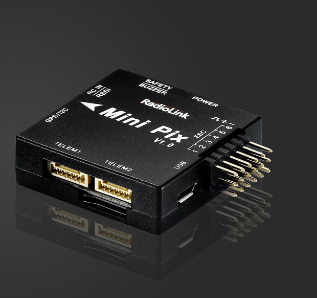
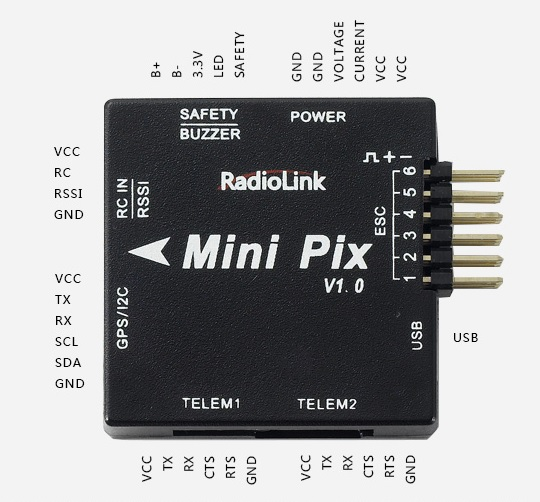
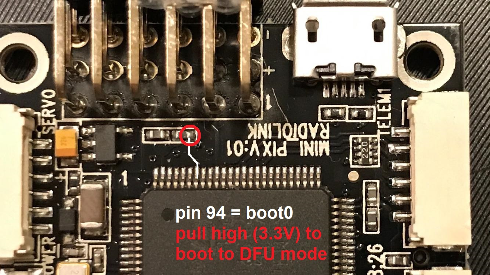

.. _common-radiolink-minipix:

========================
RadioLink MiniPix v10-II
========================

.. warning:: This autopilot is not recommended because the board is not compatible with the official ArduPilot software despite multiple efforts to work with the manufacturer to make it compatible. The manufacturer is also apparently not abiding by the GPLv3 license which requires releasing the modified source code to its customers. The information provided below is now outdated.

.. note:: There is a "version I" version of this board.  Its case lacks the faint "II" in grey present on the second generation boards.

*above image and some content courtesy of the* `RadioLink website <http://www.radiolink.com.cn/doce/product-detail-133.html>`__

Specifications
==============

-  **Processor and Sensors**

   -  STM32F405VGT6 ARM microcontroller
   -  InvenSense MPU6500
   -  Compass QMC5883L
   -  Barometer LPS22HB

-  **Interfaces**

   -  6x PWM outputs
   -  1x RC input (PWM/PPM, SBUS)
   -  3 UARTS (flow-control on Telem 1 & 2, no flow-control on GPS port)
   -  external I2C
   -  2 x ADC for voltage and current sensor
   -  1 x additional ADC for analog RSSI or analog airspeed
   -  SDIO microSD card slot
   -  micro USB connector
   -  includes buzzer / saftey-switch, power module, I2C expansion board and TS100 GPS / mag combo depending on kit features
   -  size 39 x 39 x 12 mm
   -  weight 12 g without wires

Where to Buy
============

-  RadioLink hardware is available from various warehouses like `banggood.com <https://www.banggood.com/de/Radiolink-Mini-PIX-F4-Flight-Controller-MPU6500-w-TS100-M8N-GPS-UBX-M8030-For-RC-Drone-FPV-Racing-p-1240423.html?cur_warehouse=CN>`__

Peripheral Connections
======================

Default UART order
==================

- SERIAL0 = console = USB
- SERIAL1 = Telemetry1 = USART3
- SERIAL2 = Telemetry2 = USART2 (see Notes for reversed plastic case labels!)
- SERIAL3 = GPS1 = UART4

Serial protocols can be adjusted to personal preferences.

Firmware handling
=================

This hardware comes preflashed with a RadioLink-branded version of ArduCopter and a master-ArduPilot *compatible* bootloader.  See "transitioning to upstream ArduPilot" below for details on moving to an ArduPilot-compatible bootloader.

In case a bootloader re-installation is required, you can boot your board to DFU-mode using the following solder-points:

.. warning::
    The flightcontroller's plastic case shows the telemetry ports' numbers reversed compared to the board's PCB imprints and the
    firmware's SERIALn assignments, this requires additional attention!

.. note::
    MiniPix voltage and current sensing pins use Pixhawk standard ( :ref:`BATT_VOLT_PIN<BATT_VOLT_PIN>` = 2, :ref:`BATT_CURR_PIN<BATT_CURR_PIN>` = 3).
    The additional ADC pin can be used for either RSSI or analog airspeed. Set required option to PIN = 11.

Transitioning to Upstream ArduPilot
===================================

The boards as shipped from the factory are running both a custom ArduPilot firmware and a custom bootloader.

To update the bootloader to have a board identifier compatible suitable for this board:
 - download https://firwmare.ardupilot.org/binaries/MiniPix-v1.0-II-Transition/arduplane.apj
 - use a tool to upload that firmware to your board - for example, MissionPlanner has an option to upload an arbitrary .apj file
 - reboot the board
 - use a tool to request ArduPilot flash the bootloader on the board - for example, MissionPlanner has a "Flash Bootloader" button.
 - reboot the board; it should stay in the bootloader, but the bootloader will now identify itself as a MiniPix-v1.0-II rather than a MiniPix
 - use a tool to flash a normal MiniPix-v1.0-II ArduPilot binary to the board.  For example, MissionPlanner will prompt you to upload the correct firmware based on the board id
 - OPTIONAL: flash the bootloader again from the new firmware.  This will ensure the bootloader is up-to-date
