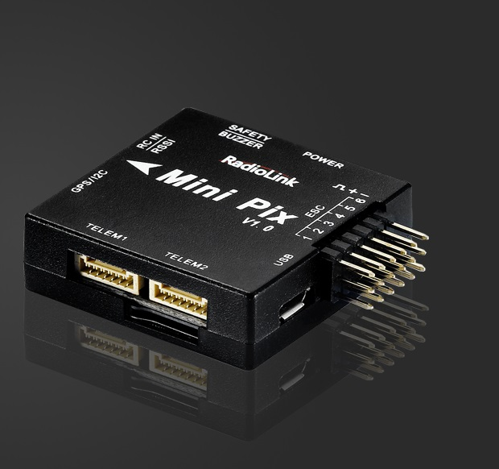
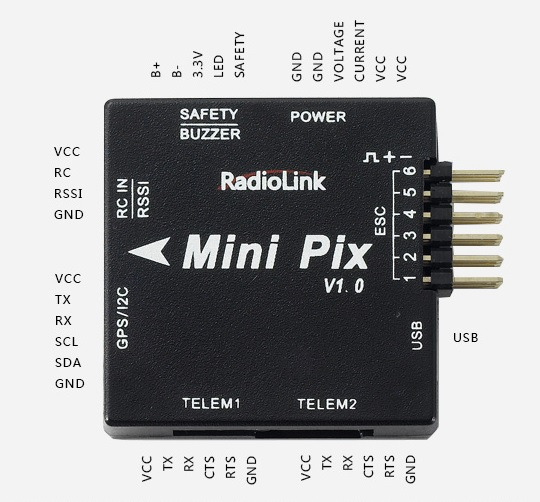
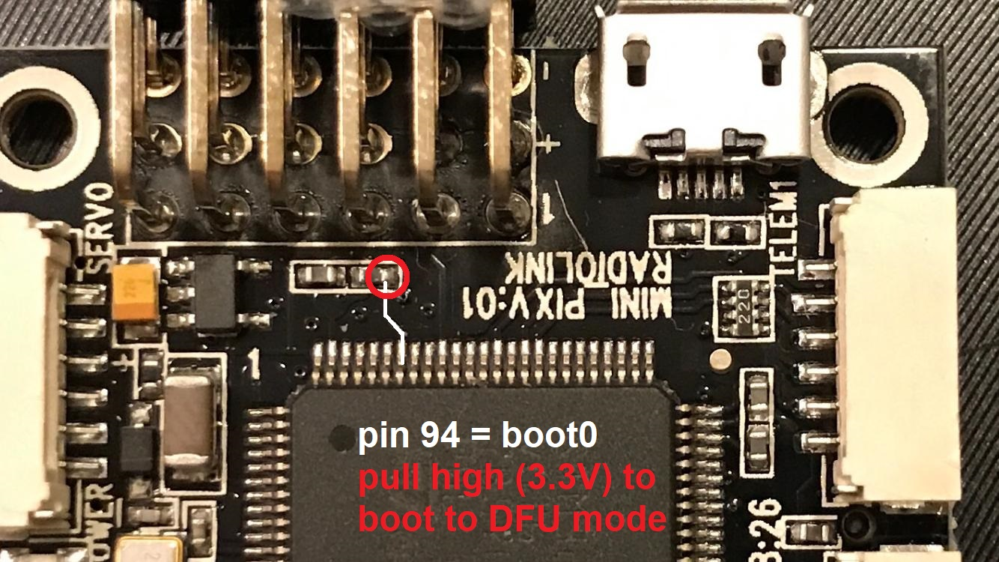

.. _common-radiolink-minipix:

========================================
RadioLink MiniPix
========================================

.. warning:: This autopilot is not recommended because the board is not compatible with the official ArduPilot software despite multiple efforts to work with the manufacturer to make it compatible. The manufacturer is also apparently not abiding by the GPLv3 license which requires releasing the modified source code to its customers. The information provided below is now outdated and current Ardupilot releases will not function on this flight controller.

*above image and some content courtesy of the* `RadioLink website <http://www.radiolink.com.cn/doce/product-detail-133.html>`__ 

Specifications
==============

-  **Processor and Sensors**

   -  STM32F405VGT6 ARM microcontroller
   -  InvenSense MPU6500
   -  Compass QMC5883L
   -  Barometer LPS22HB

-  **Interfaces**

   -  6x PWM outputs
   -  1x RC input (PWM/PPM, SBUS)
   -  3 UARTS (flow-control on Telem 1 & 2, no flow-control on GPS port)
   -  external I2C
   -  2 x ADC for voltage and current sensor
   -  1 x additional ADC for analog RSSI or analog airspeed
   -  SDIO microSD card slot
   -  micro USB connector
   -  includes buzzer / saftey-switch, power module, I2C expansion board and TS100 GPS / mag combo depending on kit features 
   -  size 39 x 39 x 12 mm
   -  weight 12 g without wires

Where to Buy
============

-  RadioLink hardware is available from various warehouses like `banggood.com <https://www.banggood.com/de/Radiolink-Mini-PIX-F4-Flight-Controller-MPU6500-w-TS100-M8N-GPS-UBX-M8030-For-RC-Drone-FPV-Racing-p-1240423.html?cur_warehouse=CN>`__

Peripheral Connections
======================

    
Default UART order
==================

- SERIAL0 = console = USB
- SERIAL1 = Telemetry1 = USART3
- SERIAL2 = Telemetry2 = USART2 (see Notes for reversed plastic case labels!)
- SERIAL3 = GPS1 = UART4

Serial protocols can be adjusted to personal preferences.

Firmware handling
=================

This hardware comes preflashed with a RadioLink-branded version of ArduCopter and an ArduPilot-compatible bootloader. To use non-branded ChibiOS-based ArduPilot firmware versions, download the required vehicle firmware .apj file from https://firmware.ardupilot.org/ and flash your board using MissionPlanner's "custom firmware" option.

In case a bootloader re-installation is required, you can boot your board to DFU-mode using the following solder-points:

Then follow the instructions on how to :ref:`load firmare onto ChibiOS boards <common-loading-firmware-onto-chibios-only-boards>`.

.. warning::
    The flightcontroller's plastic case shows the telemetry ports' numbers reversed compared to the board's PCB imprints and the  
    firmware's SERIALn assignments, this requires additional attention!
    
.. note::
    MiniPix voltage and current sensing pins use Pixhawk standard ( :ref:`BATT_VOLT_PIN<BATT_VOLT_PIN>` = 2, :ref:`BATT_CURR_PIN<BATT_CURR_PIN>` = 3).
    The additional ADC pin can be used for either RSSI or analog airspeed. Set required option to PIN = 11.
