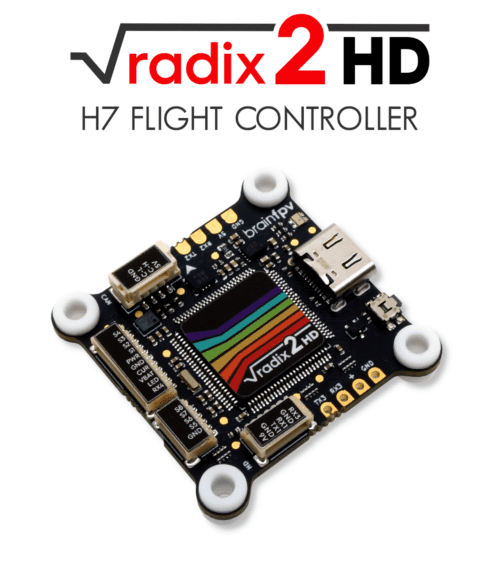
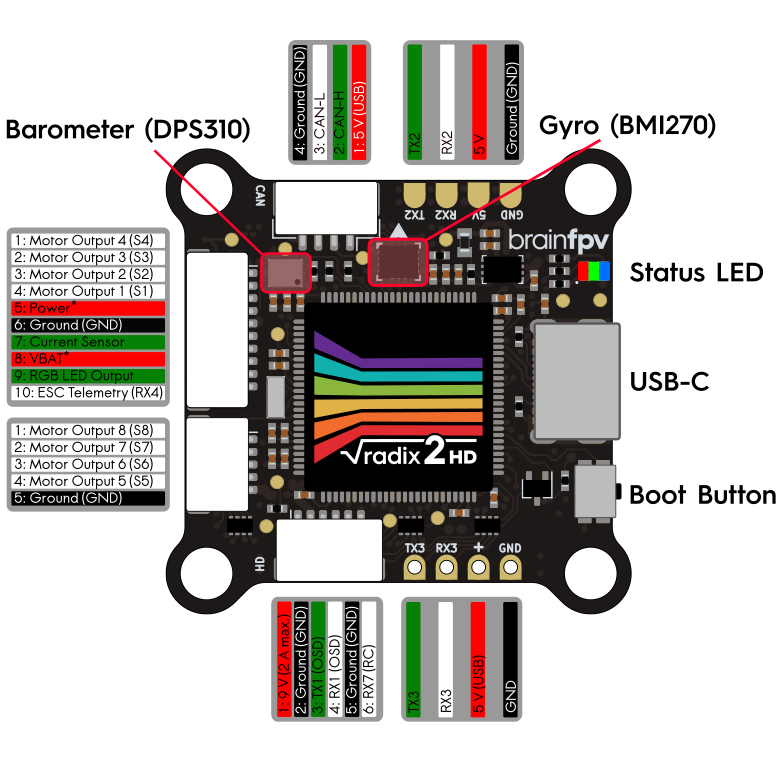
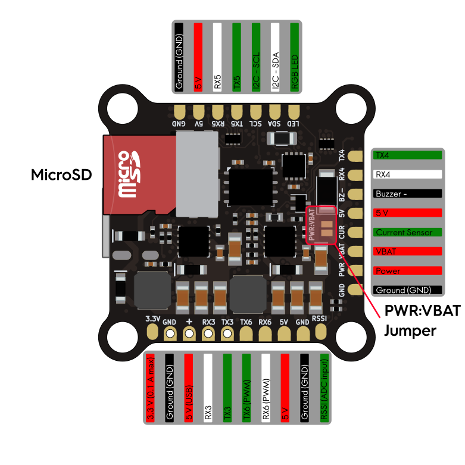

.. _common-radix2hd:

[copywiki destination="plane,copter,rover,blimp"]
==================
brainFPV RADIX2 HD
==================

The BrainFPV RADIX 2 HD is a flight controller primarily intended for
First Person View (FPV) applications that use a HD (digital) FPV system.

Specifications
==============

-  **Processor**

   -  STM32H750 ARM (480MHz)
   -  16MB external program flash loaded from SD card on boot

-  **Sensors**

   -  BMI270 IMU (accel, gyro)
   -  DPS310 barometer
   -  Voltage sensor (up to 12S)

-  **Power**

   -  2S - 8S Lipo input voltage 
   -  9V, 2A BEC for powering Video Transmitter
   -  5V, 1.5A BEC for internal and peripherals

-  **Interfaces**

   -  8x PWM outputs Bir-Directional DShot capable
   -  1x RC input
   -  CAN Bus port
   -  7x UARTs/serial for GPS and other peripherals. UART6 RX and TX can be re-tasked as the 9th and 10th PWM outputs
   -  I2C port for external compass, airspeed, etc.
   -  microSDCard for program firmward, logging, etc.
   -  USB-C port
   -  Analog Current sense input
   -  Buzzer output
   -  Analog RSSI Input

-  **Size and Dimensions**

   - 37mm x 37mm (30.5mm hole spacing)
   - 7g

Where to Buy
============

`brainFPV <https://www.brainfpv.com/kb/radix-2-hd/>`__

User Manual and Wiring
======================

`brainFPV RADIX2 HD User Manual <https://www.brainfpv.com/knowledgebase/radix-2-hd-flight-controller-manual/>`__

Pinout
======

Refer to the User Manual link above for how to use the "PWR:VBAT" jumper.

Default UART order
==================

The UARTs are marked Rn and Tn in the above pinouts. The Rn pin is the
receive pin for UARTn. The Tn pin is the transmit pin for UARTn.

- SERIAL0 -> USB
- SERIAL1 -> UART1 (DMA-enabled, MSP DisplayPort OSD on DJI Connector)
- SERIAL2 -> UART2 (DMA-enabled, GPS)
- SERIAL3 -> UART3 (DMA-enabled, RCin)
- SERIAL4 -> UART4 (RX on ESC connector for ESC Telemetry)
- SERIAL5 -> UART5 (spare)
- SERIAL6 -> UART6 (spare, PWM 9 and 10 by default, use :ref:`BRD_ALT_CONFIG<BRD_ALT_CONFIG>` = 1 for UART)
- SERIAL7 -> UART7 (RX pin only on DJI Connector)

RC Input
========

The RC receiver 5 V pad next to RX3 ("+") is also powered from USB for easy and safe configuration without having to connect the main battery.

The RX3 pin, can be used for all ArduPilot supported single wire receiver protocols, except CRSF/ELRS and SRXL2 which require a true UART connection. However, FPort, when connected in this manner, will only provide RC without telemetry. 

To allow CRSF and embedded telemetry available in Fport, CRSF, and SRXL2 receivers, use the TX3 pin also.

- PPM is not supported.

- SBUS needs no special configuration.

- FPort requires connection to TX3 and :ref:`SERIAL3_OPTIONS<SERIAL3_OPTIONS>` be set to "7".

- CRSF also requires a TX3 connection, in addition to RX3, and automatically provides telemetry. Set :ref:`SERIAL3_OPTIONS<SERIAL3_OPTIONS>` to "0".

- SRXL2 requires a connection to Tx6 and automatically provides telemetry.  Set :ref:`SERIAL3_OPTIONS<SERIAL3_OPTIONS>` to "4".

Any UART can be used for RC system connections in ArduPilot also, and is compatible with all protocols except PPM. See :ref:`common-rc-systems` for details.

RX6 can be configured for RCin coming from DJI air units by setting `:ref:`SERIAL3_PROTOCOL<SERIAL3_PROTOCOL>` to something other than "23" and setting `:ref:`SERIAL7_PROTOCOL<SERIAL7_PROTOCOL>` to "23".

Motor/Servo Outputs
===================

The RADIX 2 HD has a total of 10 PWM outputs. All support PWM and DShot. The first 8 outputs salso upport BDSHOT and
are on the two 4-in-1 ESC connectors. The PWM outputs are in groups of 2 channels each,
all channels in the same group need to use the same configuration / rate.

 - PWM 1-2 Group 1
 - PWM 3-4 Group 2
 - PWM 5-6 Group 3
 - PWM 7-8 Group 4
 - PWM 9-10 Group 5 (These are output on the TX6 and RX6 pads by default and can also be reconfigured for use as SERIAL6 instead using :ref:`BRD_ALT_CONFIG<BRD_ALT_CONFIG>` = 1 )

Analog inputs
=============

The RADIX 2 HD has 3 analog inputs:

 - ADC Pin 10 -> Battery Voltage (VBAT pin, builtin 1:17.6 voltage divider)
 - ADC Pin 3  -> Battery Current Sensor, 3.3V max (CUR pin)
 - ADC Pin 11 -> RSSI voltage monitoring, 3.3V max (RSSI pad)

Video Transmitter Power Control
===============================

The 9V output supply can be turned off by using the RELAY function in ArduPilot. By default it is turned on, but turn it off:

or example, use RC Channel 10 to control the supply switch using Relay 2:

- :ref:`RELAY2_PIN<RELAY2_PIN>`  = "81"
- :ref:`RC10_OPTION<RC10_OPTION>` = "34" (Relay2 Control)

A low on the switch will turn off the supply to the 9V pad.

Battery Monitoring
==================

The RADIX 2 HD can monitor battery voltages up to 12S using a built-in voltage divider.
The board itself can be powered by battery voltages up to 8S (35 V) and there is a jumper
to use the same pin for battery voltage monitoring and for powering the board.

.. warning:: Powering the board with more than 8S (35 V) with the "PWR:VBAT" jumper soldered will permanently damage it. Refer to the above linked User Manual for more details.

In addition to voltage sensing, the board also has an input for an external current sensor.

Parameters for use with a typical 4in1 ESC are already set by default. The value of the :ref:`BATT_AMP_PERVLT<BATT_AMP_PERVLT>` may need to be changed to match your ESC:

The default parameter settings are:

Enable Battery monitor with these parameter settings :

:ref:`BATT_MONITOR<BATT_MONITOR>` =4

Then reboot.

:ref:`BATT_VOLT_PIN<BATT_VOLT_PIN>` 10

:ref:`BATT_CURR_PIN<BATT_CURR_PIN>` 3

:ref:`BATT_VOLT_MULT<BATT_VOLT_MULT>` 17.6

:ref:`BATT_AMP_PERVLT<BATT_AMP_PERVLT>` 28.5

Loading Firmware
================

The RADIX 2 HD uses a proprietary bootloader which needs a firmware file in a custom file format. There are several ways of obtaining the firmware file, as explained below. Once you have obtained the file, copy it to the USB drive that appears when connecting the RADIX 2 HD to your computer when it is in bootloader mode (hold the BOOT button and release when connecting to USB). Once it finishes copying, safely remove the drive. At this point the RADIX 2 HD will reboot and run the ArduPilot firmware.

.. note:: When using ArduPilot, it is necessary to have a microSD card inserted, without it the firmware won't run.

Option 1: Download the Firmware File the BrainFPV Website
---------------------------------------------------------

The easiest way to get firmware files for your RADIX 2 HD is to download them from the BrainFPV website. You can do so `here <https://www.brainfpv.com/firmware/>`__.

Option 2: Download the Firmware From the ArduPilot Firmware Server
------------------------------------------------------------------

Download the ELF file from the `ArduPilot Firmware Server <https://firmware.ardupilot.org>`__. Make sure you download the file for the "RADIX2HD" target. For example, the ELF file for ArduCopter is called "arducopter.elf". At this time, only the 4.5 ("latest") versions are available.

In order to use the ELF file with your RADIX 2 HD, it needs to be converted using the BrainFPV Firmware Packer. This utility is implemented in Python, so you will need a Python installation.

If you are using Linux, use your package manager to install Python 3. If you are using Windows, download the Python 3 installer from the Python Website and run it. When installing, make sure to select "Add Python to PATH", so you will be able to use Python from the Windows Command Prompt.

After installing Python, start the Command Prompt and install the BrainFPV Firmware Packer using the following command:

.. code::

     pip install https://github.com/BrainFPV/brainfpv_fw_packer/archive/main.zip

After installing it, you can use the following command to convert the "arducopter.elf" (or other vehicle elf file) file to a "arducopter.bin" file that can be used with the RADIX 2 HD:

.. code::

    brainfpv_fw_packer.py --name arducopter --in arducopter.elf --out arducopter.bin ^
                      --dev radix2hd -t firmware -b 0x90400000 -z --noheader

Option 3: Compile the Firmware Yourself
---------------------------------------

If you have a working :ref:`ArduPilot build environment<building-the-code>`, you can compile the firmware yourself and then convert it to the format needed by the BrainFPV bootloader. You will also need the BrainFPV Firmware Packer to do so. Install it using the "pip install" command shown above.

For Copter, build the firmware as follows:

.. code::

     ./waf configure --board RADIX2HD
     ./waf copter

other vehicles can be built, but the RADIX2HD is targeted primarily for copter applications. Then use the firmware packer script to create the firmware file that can be used with the BrainFPV bootloader:

.. code::

    ./libraries/AP_HAL_ChibiOS/hwdef/RADIX2HD/pack_firmware.sh copter

To use it, copy the resulting arducopter_{VERSION}_brainfpv.bin to the USB drive that appears when the RADIX 2 HD is in bootloader mode.

[copywiki destination="plane,copter,rover,blimp"]
