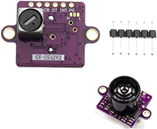

. _common-rangefinder-gy-us42:

===============
GY-US42v2 Sonar
===============

The GY-US042v2 Sonar is a very inexpensive, short range (up to 4m) range finder primarily designed for indoor use but which has been successfully used outdoors on Copter. It does provide more consistent height control below 4m than many barometers.

This sensor is similar to the :ref:`common-rangefinder-maxbotixi2c` , but has the ability to operate in serial and triggered pulse modes (similar to :ref:`common-rangefinder-hcsr04`) in addition to i2c.

For I2C mode, set the :ref:`RNGFND1_TYPE<RNGFND1_TYPE>` = “2" and no bridging of the three solder pads is required.

For Triggered Pulse mode, tie the center pad to "L" and set the :ref:`RNGFND1_TYPE<RNGFND1_TYPE>` = “30". 

For Serial Mode, tie the center pad to "H" and set  :ref:`RNGFND1_TYPE<RNGFND1_TYPE>` = “31". And set the Serial Port used to communicate with it to ``SERIALx_PROTOCOL`` = "9" (Rangefinder) and ``SERIALx_BAUD`` = 9 (9600).

This device has a maximum useful range of 4m, so set -  :ref:`RNGFND1_MAX_CM<RNGFND1_MAX_CM>` = "400".

Pinout:

- "CR" pin is either the SCL (I2C mode), Serial RX, or Trigger input
- "DT" pin is either the  SDA (I2C mode), Serail TX, or Echo output
  
