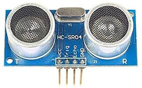

.. _common-rangefinder-hcsr04:

=========================
HC-SR04 Sonar Rangefinder
=========================

The HC-SR04 Sonar is a very inexpensive, short range (up to 2m) range finder primarily designed for
indoor use but which has been successfully used outdoors on Copter. It does provide more consistent height control below 2m than many barometers.

.. warning::
   
   ``RNGFNDx_MAX_CM`` must be set to a tested, appropriate value.  If ``RNGFNDx_MAX_CM`` is set to a value  greater than 2m, the autopilot will not respond correctly to the data provided.

Connection to the autopilot
===========================

Two :ref:`GPIOs <common-gpios>` are required for the Trigger pin (starts the sonar pulse) and Echo pin (indicates reception of the echo). These can be a PWM output if the :ref:`BRD_PWM_COUNT<BRD_PWM_COUNT>` is set such that two are available, or if the autopilot has dedicated GPIO outputs (see the autopilot's :ref:`description <common-autopilots>` or datasheet).

To setup as the first rangefinder. Reboot after setting parameters:

-  :ref:`RNGFND1_MAX_CM<RNGFND1_MAX_CM>` = "200" (i.e. 2m max range)
-  :ref:`RNGFND1_MIN_CM<RNGFND1_MIN_CM>` = "20" (i.e. 20cm min range)
-  :ref:`RNGFND1_STOP_PIN<RNGFND1_STOP_PIN>` = Enter GPIO number for pin attached to HC-SRO4 "Trigger" pin. For example, on PixHawk with :ref:`BRD_PWM_COUNT<BRD_PWM_COUNT>` = 4, AUX6 (GPIO 55) could be used here, and AUX5 (GPIO54) could be used below.
-  :ref:`RNGFND1_PIN<RNGFND1_PIN>` = Enter GPIO number for pin attached to HC-SRO4 "Echo" pin.
-  :ref:`RNGFND1_TYPE<RNGFND1_TYPE>` = “30" (HC-SR04 sonar)
-  :ref:`RNGFND1_ORIENT<RNGFND1_ORIENT>` = "25" (Downward facing) if used for altitude control.

