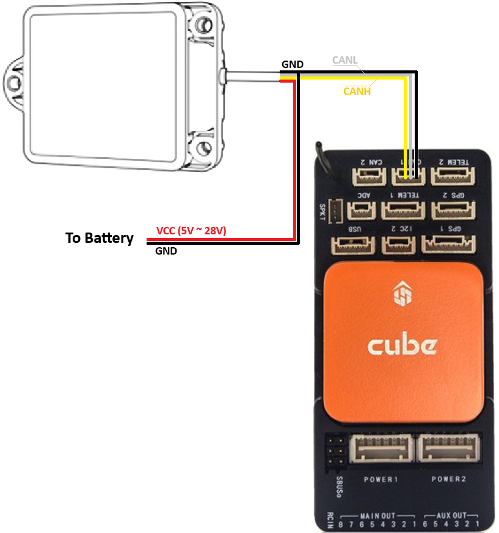

.. _common-rangefinder-hexsoon-24g.rst:

=================
Hexsoon 24G Radar
=================

The `Hexsoon 24G radar <http://www.hexsoon.com/en/list-4-27.html>`__ (available in `20m <http://www.hexsoon.com/en/product/product-96-167.html>`__, `100m <http://www.hexsoon.com/en/product/product-88-685.html>`__, and `200m <http://www.hexsoon.com/en/product/product-85-346.html>`__ versions) are 24Ghz-band radar useful for :ref:`surface tracking <copter:terrain-following-manual-modes>`, :ref:`terrain following <copter:terrain-following>` and :ref:`object avoidance <common-object-avoidance-landing-page>`

.. note::

    ArduPilot only supports the CAN versions of these sensors

.. note::

    Support is available in ArduPilot versions 4.7 and higher

Connecting to the Autopilot
===========================

Mount the radar to the vehicle so that the radar points downwards and connect to one of the autopilot's CAN ports as shown below

Set the following parameters assuming the sensor is connected to CAN1

- :ref:`CAN_P1_DRIVER <CAN_P1_DRIVER>` = 1 (First CAN driver)
- :ref:`CAN_P1_BITRATE <CAN_P1_BITRATE>` = 500000
- :ref:`CAN_D1_PROTOCOL <CAN_D1_PROTOCOL>` = 14 (RadarCAN)
- :ref:`RNGFND1_TYPE <RNGFND1_TYPE>` = 44 (HexsoonRadar)
- :ref:`RNGFND1_MAX <RNGFND1_MAX>` = 18 (meters), 95 (meters) or 190 (meters) depending upon the model (this is the maximum range of the radar minus a few meters of buffer)
- :ref:`RNGFND1_MIN <RNGFND1_MIN>` = 0.5 (0.5m minimum range)
- :ref:`RNGFND1_RECV_ID <RNGFND1_RECV_ID>` = 0 (ID of the sensor, 0 to accept all CAN ids for distance)

.. note::

    ArduPilot does not currently support the same type of CAN rangefinders connected to different CAN ports. If you would like to use multiple CAN rangefinders together, connect them to the same CAN port.

Testing the sensor
==================

Distances read by the sensor can be seen in the Mission Planner's Flight
Data screen's Status tab. Look closely for "rangefinder1".
