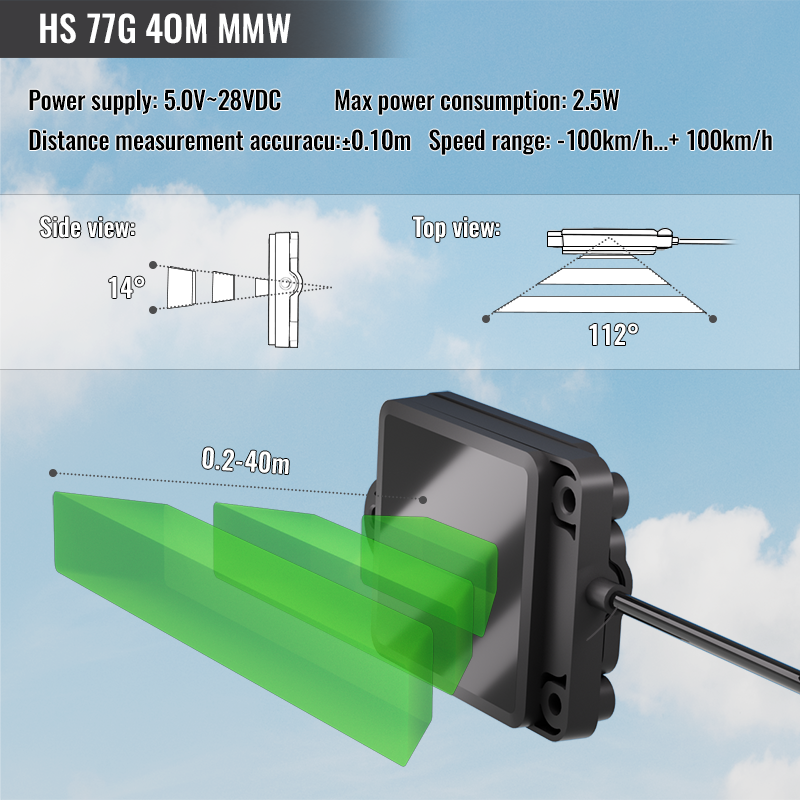
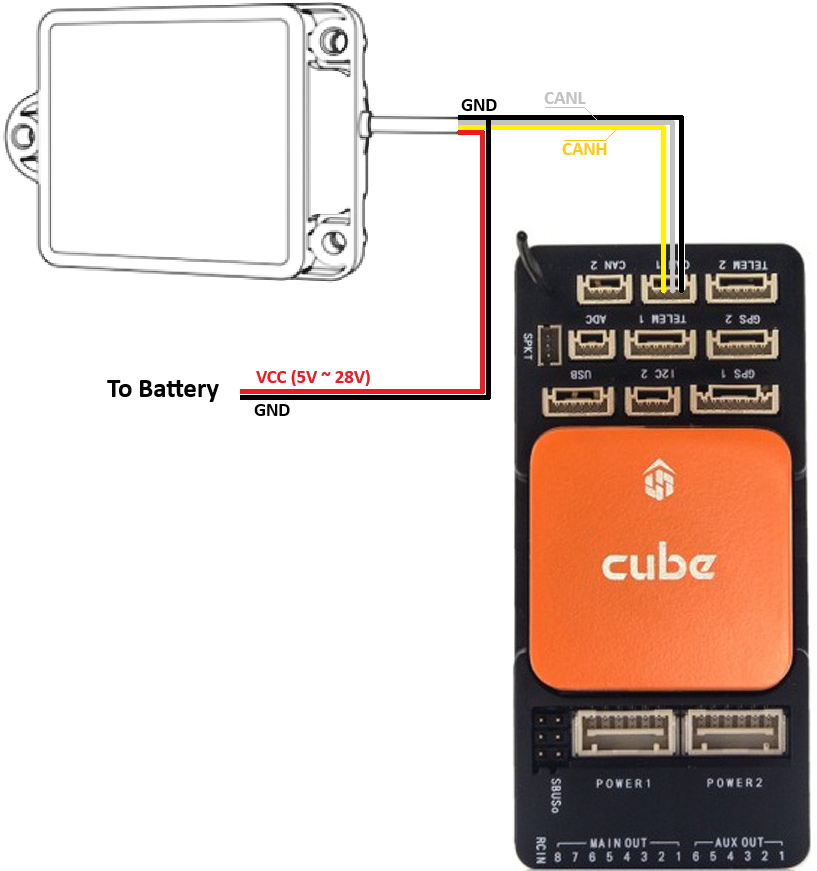

.. _common-rangefinder-hexsoon-radar.rst:

=====================
Hexsoon 77G MWW Radar
=====================

The `Hexsoon HS77G MMW radar <http://www.hexsoon.com/en/list-4-27.html>`__ (available in `20m <http://www.hexsoon.com/en/product/product-84-684.html>`__, `40m <http://www.hexsoon.com/en/product/product-87-23.html>`__, and `80m <http://www.hexsoon.com/en/product/product-7-973.html>`__ versions) are 77Ghz-band radar useful for horizontal :ref:`object avoidance <common-object-avoidance-landing-page>`

.. note::

    ArduPilot only supports the CAN versions of these sensors

.. note::

    Support is available in Copter and Rover versions 4.7 and higher

Connecting to the Autopilot
===========================

Mount the radar to the vehicle so that the radar senses obstacles horizontally.  The power and communication wire should be to the right.

Connect the radar to the autopilot's CAN port as shown above and set the following parameters assuming the radar is connected to CAN1:

- :ref:`CAN_P1_DRIVER <CAN_P1_DRIVER>` = 1 (First CAN driver)
- :ref:`CAN_P1_BITRATE <CAN_P1_BITRATE>` = 500000
- :ref:`CAN_D1_PROTOCOL <CAN_D1_PROTOCOL>` = 14 (RadarCAN)
- :ref:`PRX1_TYPE <PRX1_TYPE>` = 18 (Hexsoon Radar)
- :ref:`PRX1_YAW_CORR <PRX1_YAW_CORR>` = 0 (forward) if the radar is mounted pointing forwards

After setting the above parameters reboot the autopilot

Connecting Multiple Radar
=========================

Up to 3 radar may be connected to a single autopilot.  Please follow these steps:

- Connect each radar's GND, CANL and CANH pins to one of the autopilot's CAN ports as shown above
- Connect each radar's GND and VCC pins to an external BEC providing between 5V and 28V
- Download and run the `configuration tool <http://www.hexsoon.com/en/download/download-11-748.html>`__ to set each radar's ID to a unique number
- :ref:`PRX2_TYPE <PRX2_TYPE>` = 18 (Hexsoon Radar)
- :ref:`PRX2_YAW_CORR <PRX2_YAW_CORR>` = angle that the 2nd radar is mounted at relative to the forward direction of the vehicle
- :ref:`PRX3_TYPE <PRX2_TYPE>` = 18 (Hexsoon Radar)
- :ref:`PRX3_YAW_CORR <PRX2_YAW_CORR>` = angle that the 3rd radar is mounted at relative to the forward direction of the vehicle

More details on using this sensor for object avoidance on Copter can be found :ref:`here <common-object-avoidance-landing-page>`.

Testing the sensor
==================

Distances read by the sensor can be seen in the Mission Planner's Flight
Data screen's Status tab. Look closely for "rangefinder1".
