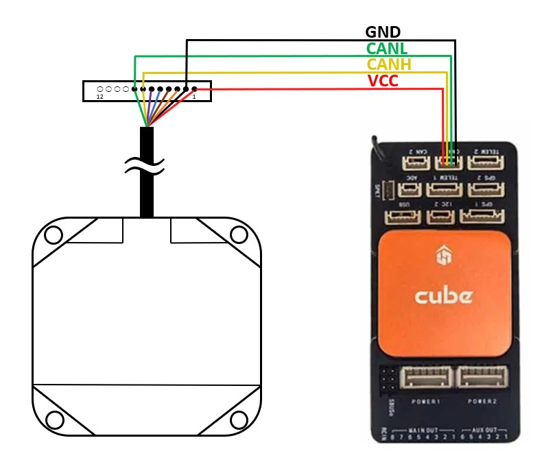

.. _common-rangefinder-jae-jre-30:

================
JAE JRE-30 Radar
================

The JAE (Japan Aviation Electronics Industry) JRE-30 radar is a light weight (110g) radar with a maximum range of over 50m.  The relatively wide beam width (about 20 deg) and reliable ranging even in difficult environments can make it a better choice than lidar for some applications.

The sensor supports both CAN and Serial interfaces.

Where to Buy
============

The JAE JRE-30 radar can be purchased directly from `JAE <https://www.jae.com/en/>`__.  Note that it is only certified for use in Japan.

Specifications
==============

- Size: 75mm x 77mm x 19mm
- Weight: 110g
- Power consumption: under 500mA
- Input voltage: 4.75V ~ 15V
- Range: 0.1m ~ 95m
- Accuracy: +- 10cm
- Update rate: 50hz
- Antenna: 23 deg / 31 deg
- Frequency: 24.05 ~ 24.25 Ghz (190Mhz)

Connection to Autopilot
=======================

The radar has an 12-pin PicoBlade Molex connector with the following pinout

+--------+--------+------------------------+
| Pin No | Name   | Details                |
+========+========+========================+
|   1    | VCC    | 4.75 - 15V input       |
+--------+--------+------------------------+
|   2    | GND    |                        |
+--------+--------+------------------------+
|   3    | TxD    | UART Tx                |
+--------+--------+------------------------+
|   4    | GND    |                        |
+--------+--------+------------------------+
|   5    | RxD    | UART Rx                |
+--------+--------+------------------------+
|   6    | GND    |                        |
+--------+--------+------------------------+
|   7    | CAN_H  | CAN High               |
+--------+--------+------------------------+
|   8    | CAN_L  | CAN Low                |
+--------+--------+------------------------+
|  9~12  | NC     | Not connected          |
+--------+--------+------------------------+

If you choose to build a custom cable BPH-002T-PO.5S socket connectors should be used.

Setup using Serial
==================

Set the following parameters which assume the radar is connected to the autopilot's Serial1 port

- Set :ref:`SERIAL1_PROTOCOL<SERIAL1_PROTOCOL>` =  9 (Rangefinders)
- Set :ref:`SERIAL1_BAUD<SERIAL1_BAUD>` = 460 (460800 Baud)
- Set :ref:`RNGFND1_TYPE<RNGFND1_TYPE>` = 41 (JRE Serial)
- Set :ref:`RNGFND1_MIN_CM<RNGFND1_MIN_CM>` = 10 (cm)
- Set :ref:`RNGFND1_MAX_CM<RNGFND1_MAX_CM>` = 5000 (cm)

Setup using CAN
===============

Set the following parameters which assume the radar is connected to the autopilot's CAN1 port

- Set :ref:`CAN_P1_DRIVER<CAN_P1_DRIVER>` = 1 (First Driver)
- Set :ref:`CAN_P1_BITRATE<CAN_P1_BITRATE>` = 1000000 (1 Mbps)
- Set :ref:`CAN_D1_PROTOCOL<CAN_D1_PROTOCOL>` = 1 (DroneCAN)
- Set :ref:`RNGFND1_TYPE<RNGFND1_TYPE>` = 24 (DroneCAN)
- Set :ref:`RNGFND1_MIN_CM<RNGFND1_MIN_CM>` = 10 (cm)
- Set :ref:`RNGFND1_MAX_CM<RNGFND1_MAX_CM>` = 5000 (cm)
- Set :ref:`RNGFND1_ADDR<RNGFND1_ADDR>` = 1
