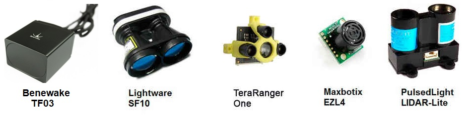

.. _common-rangefinder-landingpage:

===========================
Rangefinders (landing page)
===========================

Copter/Plane/Rover support a number of different rangefinders including Lidars (which use lasers or infra-red beams for distance measurements) and Sonars (which use ultrasonic sound), and also includes Maxbotix Sonar and Pulsed Light LED range finders. These devices can be used for measuring distance near to  the ground for precision landings and altitude control, water depth, or object distance as proximity sensors for avoiding objects.

360 degree Lidars are typically used in object avoidance as proximity sensors. While multiple 1D (single dimensional) sensors can be used for proximity detection.

[site wiki="plane"]
.. tip::

   If you get a "Bad LiDAR Health" message in *Mission Planner* this
   is caused because the rangefinder isn't enabled for landing.  This is
   done through the ``RNGFND_LANDING`` parameter and if set you should see
   the message disappear.
[/site]

[site wiki="copter"]
.. note::

   Downward facing rangefinders are automatically used in flight modes which have height control, such
   as Altitude Hold, Loiter and PosHold Mode.  The data from the sensor
   will be used until you exceed ``RNGFNDx_MAX_CM``, after that it switches to
   the barometer.

   Copter-3.4 (and higher) includes support for :ref:`Terrain Following <terrain-following>` in Auto mode.

   Copter-3.5 (and higher) and Rover-3.5 (and higher) can use rangefinders for :ref:`Object Avoidance <common-object-avoidance-landing-page>`.
[/site]

   
.. warning::
   
   ``RNGFNDx_MAX_CM`` must be set to a tested, appropriate value.  If ``RNGFNDx_MAX_CM`` is set to a value
   greater than the range of the sensor, the autopilot will not respond correctly to the 
   data provided.

Follow the links below (or in sidebar) for configuration information
based upon your set-up.

.. toctree::
    :maxdepth: 1

    Rangefinder Setup Overview <common-rangefinder-setup>

    Aerotenna US-D1 Radar Altimeter <common-aerotenna-usd1>
    Attollo Engineering Wasp200 <common-wasp200-lidar>
    Benewake TF02 / TF03 <common-benewake-tf02-lidar>
    Benewake TFmini / TFmini Plus <common-benewake-tfmini-lidar>
    Garman Lidar-Lite <common-rangefinder-lidarlite>
    LeddarTech Leddar One <common-leddar-one-lidar>
    LeddarTech LeddarVu8 <common-leddartech-leddarvu8-lidar>
    LightWare SF20 / LW20 Lidar <common-lightware-lw20-lidar>
    LightWare SF10 / SF11 Lidar <common-lightware-sf10-lidar>
    Lightware SF02 Lidar <common-rangefinder-sf02>
    Lightware SF40c (360 degree) <common-lightware-sf40c-objectavoidance>
    Maxbotix I2C Sonar <common-rangefinder-maxbotixi2c>
    Maxbotix Analog Sonar <common-rangefinder-maxbotix-analog>
    RPLidar A2 360 degree laser scanner <common-rplidar-a2>
    ST VL53L0X / VL53L1X Lidar <common-vl53l0x-lidar>
    TeraRanger One Rangefinder <common-teraranger-one-rangefinder>
    TerraRanger Tower (360 degree) <common-teraranger-tower-objectavoidance>
    Underwater Sonar <common-underwater-sonars-landingpage>

[site wiki="copter"]
    Analog Sonar (AC3.1) <sonar>
[/site]

