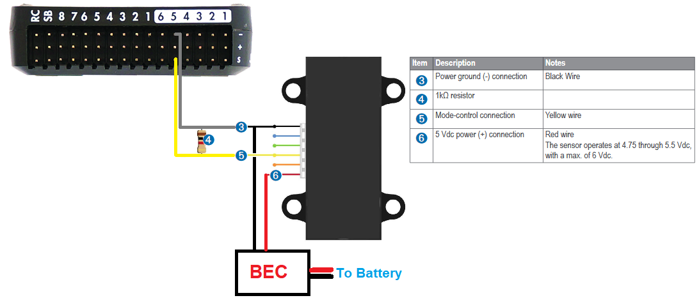

.. _common-rangefinder-lidarlite:

======================
LIDAR-Lite Rangefinder
======================

The `Garmin / PulsedLight LIDAR-Lite <https://support.garmin.com/support/manuals/manuals.htm?partNo=010-01722-00>`__ rangefinder is a low-cost optical distance measurement solution with a 40m range under most operating conditions, low power consumption, and small form factor.  This sensor can be purchased from many online retailers including `Sparkfun <https://www.sparkfun.com/products/14032>`__.  Technical info can be found `here <https://support.garmin.com/support/manuals/manuals.htm?partNo=010-01722-00>`__.

..  youtube:: 3I06AOwIQVY
    :width: 100%

Problems with the Lidar-Lite v1 & v2
====================================

A number of problems have been found with the Lidar-Lite v1 & v2 and it is not yet clear if these issues are resolved in v3. Attempts to resolve these issues with the manufacture have not been entirely successful. These notes serve as a warning to potential users.

The problems are:

-  13m offset from true distance on both "blue-label" and "black-label" Lidars
-  Interference with other I2C devices when using "blue-label" Lidars
-  Sensor lock-ups when using I2C with the older "black-label" Lidars
-  GPS interference with the older "black-label" Lidars

13m offset (Blue-Label and Black-Label Lidars)
----------------------------------------------

The lidar will sometimes (rarely) return a distance of approximately 13m greater than the true distance. This happens on both I2C and PWM. The problem has been recorded in several flight logs on several different aircraft and has also been reproduced in extensive bench testing.

When the problem happens the 13m offset usually locks in place, so all remaining readings from the Lidar for the rest of the flight will give a 13m offset. There have however been cases where the 13m offset disappears after a few seconds or minutes.

The problem is much more likely to occur if the Lidar power supply fluctuates too much. The problem can be easily reproduced in a bench setup where the Lidar is initially powered at below 4V then the voltage raised.

Unfortunately low supply voltage is not the only trigger for the problem, so ensuring a good power supply will reduce the probability of the issue but not eliminate it. Multiple flight logs where the supply voltage to the Lidar is being monitored show the problem can occur with a good power supply.

There is no known workaround for this issue. Detailed traces of the issue have been provided to the makers of the device with no resolution. The issue has also been reproduced using the device makers own software and own recommended hardware setup.

I2C interference (Blue-Label Lidars)
------------------------------------

The newer blue-label Lidars have been associated with interference problems on I2C with other I2C devices on the same bus. In particular, incorrect airspeed readings have been seen when used on the same I2C bus as a digital airspeed sensor. This issue does not occur in all aircraft, but when it does occur the results are quite dramatic, with airspeed readings being off by more than 10m/s.

Although bench testing has reproduced the result we have not yet managed to capture a logic trace of it happening. The problem is solved by using the Lidar via PWM instead of I2C.

Sensor Lock-up on I2C (Black-Label Lidar)
-----------------------------------------

The first issue (Lock-ups on I2C with black-label lidars) is solved by either using the new blue-label Lidars or by using the PWM output method, preferably with a reset pin. The issue is not common, but it is relatively easy to reproduce in bench tests by covering the Lidars lenses. It appears to be more likely to happen when the Lidar is reading short distances. There are two manifestations of the issue - one is where the lock-up is solved by sending a I2C reset command, the the other does not respond to an I2C reset.

GPS Interference (Black-Label Lidars)
-------------------------------------

The older black-label Lidars cause significant GPS interference. This manifests as longer time to get GPS lock on power up and higher levels of GPS noise when lock is achieved resulting in lower GPS accuracy. Testing shows that the interference includes both a conducted and radiated component.

Placing the Lidar as far away from the GPS as possible helps, but does not entirely eliminate the issue.

Connecting via I2C
==================

.. warning::

   Lidar-Lites manufactured before Feb 2015 have I2C interface communications issues.  For these lidar please connect using PWM.

The connector cable has a 6-pin CLIK Mate connector on one end and tinned leads on the other.  The leads should be soldered to a DF13 or JST connector and connected to the autopilot's I2C port as shown below

The power to the rangefinder should be supplied from a separate external BEC as shown in the diagram below.

Set the following parameters:

-  :ref:`RNGFND1_TYPE <RNGFND1_TYPE>` = 3 "LidarLite-I2c"
-  :ref:`RNGFND1_MAX_CM <RNGFND1_MAX_CM>` = 3500 (the maximum range the lidar can accurately report in cm)
-  :ref:`RNGFND1_MIN_CM <RNGFND1_MAX_CM>` = 20 (the mininum range the lidar can accurately report in cm)

Connecting via PWM
==================

The PWM interface is recommended because it avoids a number of issues with the I2C interface.

Connect the Lidar to the rear servo rail of the autopilot and BEC or ESC (to provide power) as shown below:

The resistor can be between 200 Ohm and 1kOhm.  Connecting a resistor between the Mode-control pin (number "5") and ground (number "3") puts the Lidar into continuous acquisition mode.

Set the following parameters:

-  :ref:`RNGFND1_TYPE <RNGFND1_TYPE>` = 5 "PWM"
-  :ref:`RNGFND1_PIN <RNGFND1_PIN>` = 54 "AUX5" (if using 4.0.0 or higher any Auxiliary output may be used)
-  :ref:`RNGFND1_MAX_CM <RNGFND1_MAX_CM>` = 3500 (the maximum range the lidar can accurately report in cm)
-  :ref:`RNGFND1_MIN_CM <RNGFND1_MAX_CM>` = 20 (the mininum range the lidar can accurately report in cm)
-  :ref:`RNGFND1_SCALING <RNGFND1_SCALING>` = 1 ("0.8" may produce more accurate readings for some units)
-  :ref:`RNGFND1_OFFSET <RNGFND1_OFFSET>` = 0
-  :ref:`BRD_PWM_COUNT <BRD_PWM_COUNT>` = 4 (ensures AUX5 is not used as a servo output)

Optional Power Saving
---------------------

When using the PWM driver you can optionally configure the lidar to be disabled when the vehicle is more than a specified height above the terrain (using SRTM altitudes) saving about 100mA of current.

Set the following parameters:

-  :ref:`RNGFND1_STOP_PIN <RNGFND1_STOP_PIN>` to 55 "AUX6" (other auxiliary pins may also be used)
-  :ref:`RNGFND1_PWRRNG <RNGFND1_PWRRNG>` to a terrain height in meters above which the Lidar will be disabled to save power

When the terrain data indicates that the vehicle is above the :ref:`RNGFND1_PWRRNG <RNGFND1_PWRRNG>` height the :ref:`RNGFND1_STOP_PIN <RNGFND1_STOP_PIN>` will be used to disable the Lidar

[site wiki="plane,copter"]
Your GCS must :ref:`provide terrain data <common-terrain-following>` for this to work.
[/site]

Testing the sensor
==================

Distances read by the sensor can be seen in the Mission Planner's Flight
Data screen's Status tab.  Look closely for "sonarrange".
It's best to place the Lidar several known distances (1m, 3m, 5m) from
a large flat wall to test it.  If the Lidar is constantly reading
wrong by a fixed offset e.g. it's always 50cm out at each distance then
adjust the ``RNGFNDx_OFFSET`` parameter by the correct amount.  If however
it gets the distance wrong each time by a different amount then the
``RNGFNDx_SCALING`` parameter needs changing.  Update it (maybe 1.1 or 0.9)
and test again and repeat until it's correct.

.. image:: ../../../images/mp_rangefinder_lidarlite_testing.jpg
    :target: ../_images/mp_rangefinder_lidarlite_testing.jpg
    :width: 350px

Video guide
===========

The video guide below shows the setup using PWM but is based on out-of-date instructions and skips the setting of the :ref:`RNGFND1_PIN <RNGFND1_PIN>` parameter

..  youtube:: FUT-ZsKGtxI
    :width: 100%
