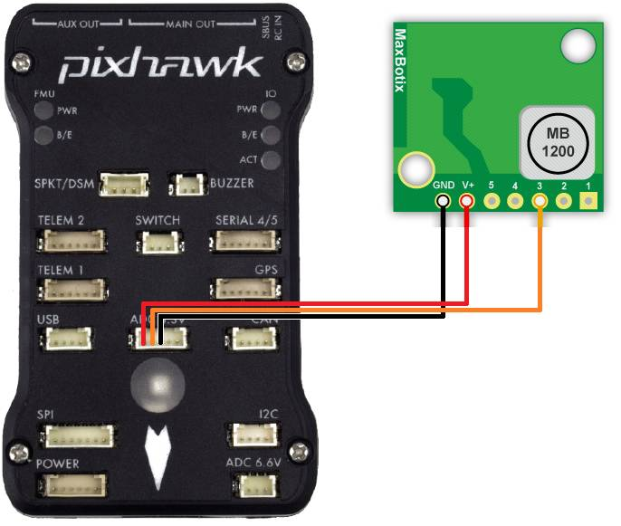

.. _common-rangefinder-maxbotix-analog:

=====================
Maxbotix Analog Sonar
=====================

`XL-Maxbotix-EZ <https://www.maxbotix.com/product-category/xl-maxsonar-ez-products/>`__
line of analog sonars (XL-MaxSonar-EZ0, EZ4 and EZL0) are relatively
inexpensive, short range (7m to 10m) range finder primarily designed for
indoor use but which has been successfully used outdoors on Copter and
Rover.  These are the predecessors to :ref:`I2C sonar <common-rangefinder-maxbotixi2c>`.

[site wiki="copter"]
These instructions are for Copter 3.2 and later
versions of Plane, Rover.  Setup instructions for Copter-3.1.5 (and
earlier) :ref:`can be found here <copter:sonar>`.
[/site]

The `EZ4 <https://www.maxbotix.com/Ultrasonic_Sensors/MB1240.htm>`__
(recommended) has the narrowest beam providing the best noise resistance
while the `EZ0 <https://www.maxbotix.com/Ultrasonic_Sensors/MB1200.htm>`__ has the
widest beam and higher sensitivity.  The long range
`EZL0 <https://www.maxbotix.com/Ultrasonic_Sensors/MB1260.htm>`__ has the
same sensitivity as the EZ0 but a 10m range (as opposed to 7m).

Connecting to the Pixhawk
=========================

The sonar should be connected to the Pixhawk's ADC 3.3V port as shown
below. The Pixhawk will provide the regulated 5V power supply the sonar
requires.

Setup through the mission planner
=================================

please first connect with the Mission Planner and then open the
Config/Tuning >> Full Parameter List page and set the following
parameters (example shown if first rangefinder:

-  :ref:`RNGFND1_PIN<RNGFND1_PIN>` = "14" for Pixhawk's ADC 3.3v pin #2
-  :ref:`RNGFND1_MAX_CM<RNGFND1_MAX_CM>` = "700" (i.e. 7m max range) if using EZ0 or EZ4,
   "1000" if using EZL0
-  :ref:`RNGFND1_SCALING<RNGFND1_SCALING>` = "2.04" (i.e. 7m / 5v) if using EZ0 or EZ4, "4.08"
   (i.e. 10m / 5v) if using EZL0
-  :ref:`RNGFND1_TYPE<RNGFND1_TYPE>` = “1" (Analog)

.. note::

   The Maxbotix analogue rangefinders according to their data sheets
   output Vcc/1024 volts per centimetre, or 0.488 v/m when supplied
   with 5v (which the ADC 3.3v port supplies), which translates into
   2.04meters per volt. The range is 7.6m according to the datasheet,
   but analog output is limited to 7m. As we can only read up to 3.3v
   then that means 6.75m is the furthest it can really measure.

Testing the sensor
==================

Distances read by the sensor can be seen in the Mission Planner's Flight
Data screen's Status tab. Look closely for "sonarrange".

.. image:: ../../../images/mp_rangefinder_lidarlite_testing.jpg
    :target: ../_images/mp_rangefinder_lidarlite_testing.jpg
