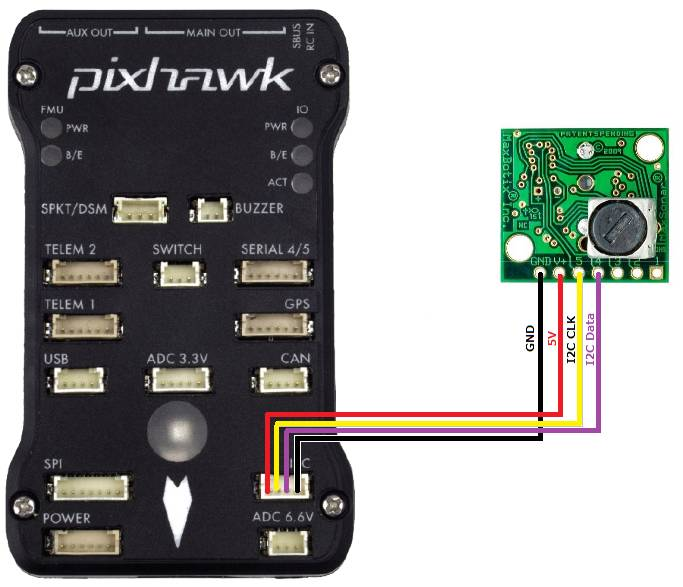
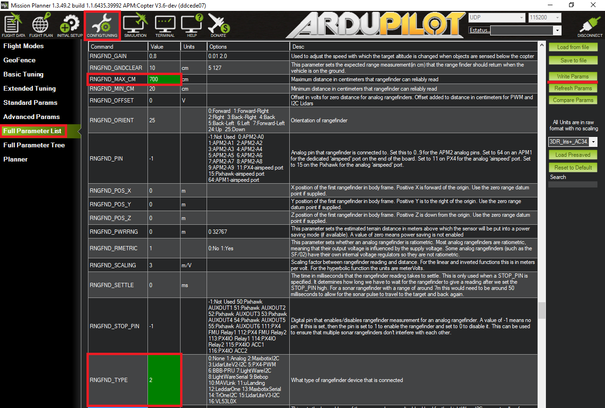
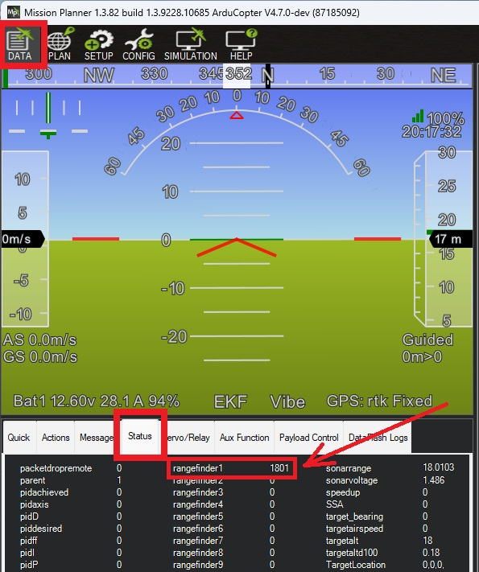

.. _common-rangefinder-maxbotixi2c:

==============================
Maxbotix I2C Sonar Rangefinder
==============================

`Maxbotix I2C EZ4 <https://www.maxbotix.com/product-category/i2cxl-maxsonar-ez-products>`__
sonar (also known as the I2CXL-MaxSonar-EZ4 or MB1242) is a relatively
inexpensive, short range (up to 7m) range finder primarily designed for
indoor use but which has been successfully used outdoors on Copter.

The EZ4 (recommended) has the narrowest beam providing the best noise
resistance while the EZ0 has the widest beam and highest sensitivity. 
`The datasheet can be found here <https://www.maxbotix.com/documents/I2CXL-MaxSonar-EZ_Datasheet.pdf>`__. 
Additional information on the similar :ref:`analog version of this sonar can be found here <copter:sonar>`.

.. warning::

   ``RNGFNDx_MAX_CM`` must be set to a tested, appropriate value.  If ``RNGFNDx_MAX_CM`` is set to a value
   greater than the range of the sensor, the autopilot will not respond correctly to the 
   data provided.

Connecting to the Pixhawk
=========================

The sonar should be connected to the Pixhawk's I2C port as shown below or
alternatively through an I2C expansion board. The Pixhawk will provide
the regulated 5V power supply the sensor requires.

Setup through the mission planner
=================================

To configure Copter, Plane or Rover to use the Maxbotix I2C, please
first connect with the Mission Planner and then open the Config/Tuning
>> Full Parameter List page and set the following parameters (example below is if it is first rangefinder):

-  :ref:`RNGFND1_MAX_CM<RNGFND1_MAX_CM>` = "700" (i.e. 7m max range)
-  :ref:`RNGFND1_TYPE<RNGFND1_TYPE>` = “2" (MaxbotixI2C sonar)

Testing the sensor
==================

Distances read by the sensor can be seen in the Mission Planner's Flight
Data screen's Status tab. Look closely for "sonarrange".

