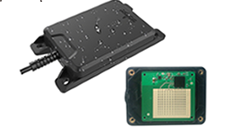
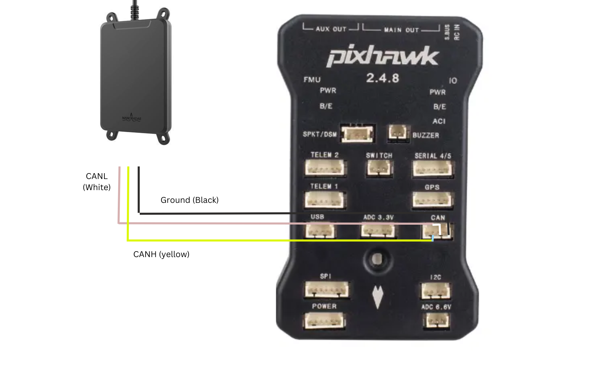

.. _common-rangefinder-MR72.rst:

==============
Nanoradar MR72
==============

.. note::
    Support for this sensor is available in firmware versions 4.6 and later. Plane does not support this sensor since its a Proximity sensor.

The `MR72 <http://en.nanoradar.cn/Article/detail/id/488.html>`__ is 77Ghz-band radar commonly used for object avoidance/detection. Currently only connection via CAN is supported. Serial versions of this Radar isn't officially supported.

Connecting via CAN
=========================

Setup the sensor through the NSM Software. In particular set the "ID" to a unique number if planning to use multiple MR72 on a single CAN bus. You can also set the bitrate from the software.

.. note::
    ArduPilot does not currently support  same CAN rangefinders connected to different CAN ports. If you would like yo use multiple CAN rangefinders together, connect them to the same bus.

Connecting to the Autopilot
==============================
Setup the sensor through the NSM toolprovided by the manufacturer. More details can be found `here <http://en.nanoradar.cn/File/download/id/466.html>`__. Set the "ID" to a unique number if planning to use multiple MR72 on a single CAN bus. You can also set the bitrate from the software to match the CAN bus bitrate (500000 is recommended).

For autopilot connection you can use any spare CAN port. Since this is not a DroneCAN based sensor, you will not be able to use the connected port with any other sensor. The diagram below shows how to connect to CAN2.

Set the following parameters

-  :ref:`CAN_P2_DRIVER <CAN_P2_DRIVER>` = 2 (to enable the 2nd CAN port using the second CAN driver)
-  :ref:`CAN_P2_BITRATE<CAN_P2_BITRATE>` = 500000 (Or as set in NAssistant)
-  :ref:`CAN_D2_PROTOCOL<CAN_D2_PROTOCOL>` = 14 (NanoRadar)
-  :ref:`PRX1_TYPE <PRX1_TYPE>` = 17 (MR72_CAN) Reboot afer setting this.
-  :ref:`PRX1_ORIENT <PRX1_ORIENT>` = "0" if mounted on the top of the vehicle, "1" if mounted upside-down on the bottom of the vehicle.
-  :ref:`PRX1_YAW_CORR <PRX1_YAW_CORR>` allows adjusting the forward direction of the unit.  One way to determine this angle is to use the Mission Planner's Setup >> Advanced, Proximity viewer and then walk around the vehicle and ensure that the sector distances shorten appropriately.
-  :ref:`PRX1_IGN_ANG1 <PRX1_IGN_ANG1>` and :ref:`PRX1_IGN_WID1 <PRX1_IGN_WID1>` should be left at default.
 
More details on using this sensor for object avoidance on Copter can be found :ref:`here <common-object-avoidance-landing-page>`.

Testing the sensor
==================

Distances read by the sensor can be seen in the Mission Planner's Flight
Data screen's Status tab. Look closely for "rangefinder1".
