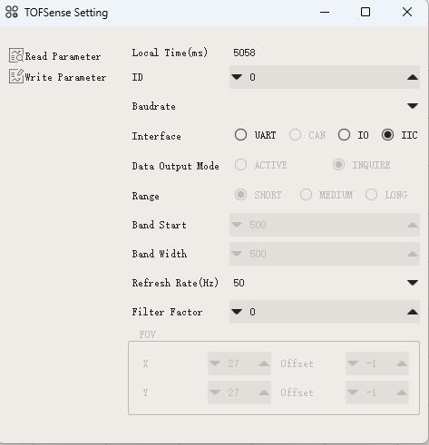
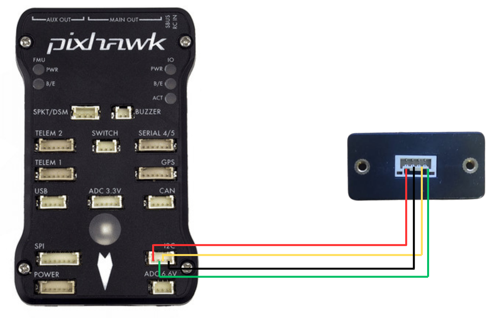

.. _common-rangefinder-nooploop-tofsense-f.rst:

===================
Nooploop TOFSense F
===================

.. note::
    Support for this sensor is available in firmware versions 4.5 and later.

The `TOFSense F/FP <https://ftp.nooploop.com/software/products/tofsense-f/doc/TOFSense-F_Datasheet_V1.2_en.pdf>`__ is
lightweight rangefinder module that provides fast and accurate distance measurements up to 25 meters (FP variant only).
ArduPilot currently supports this sensor only via UART. I2C support will be added in the future.

Connecting via UART to Autopilot
================================

The same steps as the Nooploop TOFSense P (UART) can be followed, as linked :ref:`here <common-rangefinder-nooploop-tofsense-p>`.
:ref:`RNGFND1_MAX_CM <RNGFND1_MAX_CM>` can be changed as per the sensor specifications (1500 for TOFSense F and 2500 for TOFSense FP)

Connecting via I2C
==================
Setup the sensor through the NAssistant Software provided by the manufacturer. More details can be found `here <https://www.nooploop.com/download/>`__. For I2C mode, in the setup screen set "Interface" to I2C. You can also set the "ID" to a unique number if planning to use multiple TOFSenseF.
The I2C adress of the sensor is linked to the ID set in the NAssistant software. The default address is 0x08 for ID 0 (or 8 in decimal; i.e the parameter you will set in the GCS), 0x09 (or 9) for ID 1 and 0x10 (or 10) for ID 2. The address can be calculated as 0x08 + ID. For example, if the ID is set to 2, the address will be 0x0A (or 10).

.. warning::
    The 4 Pin JST-GH connector wiring of the sensor does not match with the I2C 2 port wiring of most autopilots (For example, Cube Orange). Wiring incorrectly can lead to damaged sensor and/or autopilot.

For a I2C connection you can use any spare I2C port.

Set the following parameters

-  :ref:`RNGFND1_TYPE <RNGFND1_TYPE>` = “40" (Reboot after setting this)
-  :ref:`RNGFND1_ADDR <RNGFND1_ADDR>` = I2C slave address of the sensor (Default is 8, which corresponds to ID 0 in the NAssistant software)

Testing the sensor
==================

Distances read by the sensor can be seen in the Mission Planner's Flight
Data screen's Status tab. Look for "rangefinder1".
