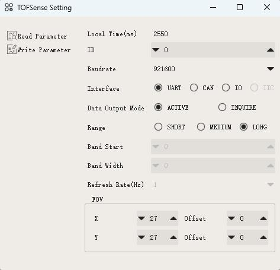
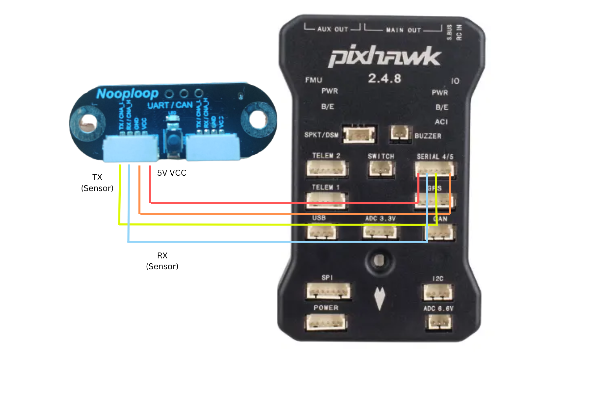
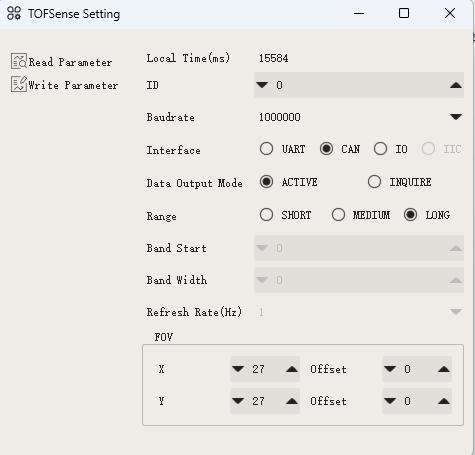
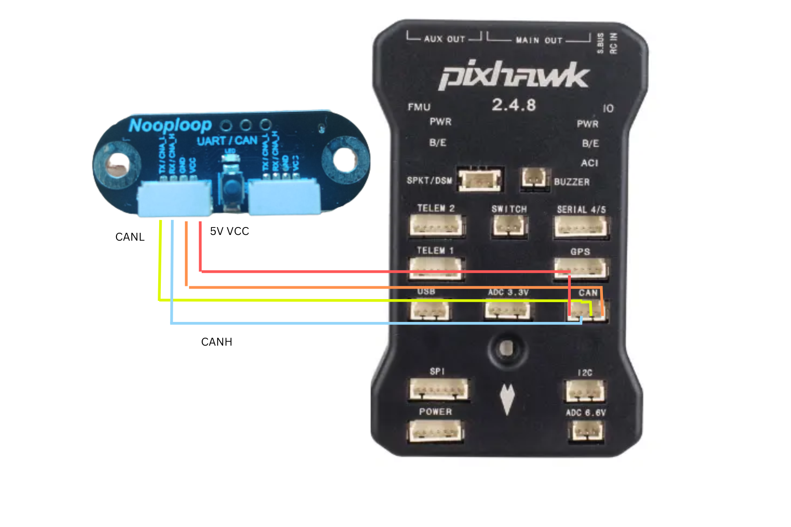

.. _common-rangefinder-nooploop-tofsense-p:

===================
Nooploop TOFSense P
===================

.. note::
    Support for this sensor is available in firmware versions 4.5 and later.

The `TOFSense P/PS <https://ftp.nooploop.com/software/products/tof/doc/TOFSense_User_Manual_V2.5_en.pdf>`__ is
lightweight rangefinder module that provides fast and accurate distance measurements up to 8 meters.
It also has an adjustable field of view (FOV), ranging from 15 to 27 degrees with a measurement resolution of 1mm.
ArduPilot currently supports this sensor via both UART and CAN.

Connecting to the Autopilot
===========================

This sensor my be connected either via UART or CAN.

Connecting via UART
===================

Setup the sensor through the NAssistant Software provided by the manufacturer. More details can be found `here <https://www.nooploop.com/download/>`__. For UART mode, in the setup screen set "Interface" to UART, correct baudrate and Mode to "active". It is recommended to reduce the baudrate from the default 921600, to a smaller option (For example: 230400)

You can use any spare autopilot Serial/UART port. The diagram below shows how to connect to SERIAL4 and the example parameters will be shown assuming this Serial port is used.

Set the following parameters:

-  :ref:`SERIAL4_PROTOCOL<SERIAL4_PROTOCOL>` = 9 (Lidar)
-  :ref:`SERIAL4_BAUD<SERIAL4_BAUD>` = 230400 (Or as set in NAssistant)
-  :ref:`RNGFND1_TYPE <RNGFND1_TYPE>` = “37" (Reboot after setting this)
-  :ref:`RNGFND1_MAX_CM <RNGFND1_MAX_CM>` = "800" (i.e. 8m max range)
-  :ref:`RNGFND1_MAX_CM <RNGFND1_MIN_CM>` = "2"

Connecting via CAN
==================

Setup the sensor through the NAssistant Software provided by the manufacturer. More details can be found `here <https://www.nooploop.com/download/>`__. For CAN mode, in the setup screen set "Interface" to CAN, Mode to "active", and bitrate to "1000000". You can also set the "ID" to a unique number if planning to use multiple TOFSenseP on a single CAN bus. Setting ID to 0 will accept all ID's. 

.. note::
    ArduPilot does not currently support  multiple instances of these rangefinders connected to different CAN ports. If you would like to use multiple instances of these CAN rangefinders together, connect them to the same bus.

.. warning::
    The 4 Pin JST-GH connector wiring of the sensor does not match with the CAN wiring of most autopilots. Wiring incorrectly can lead to damaged sensor and/or autopilot.

For a CAN connection you can use any spare CAN port. Since this is not a DroneCAN based sensor, you will not be able to use the connected port with any other type of sensor. The diagram below shows how to connect to CAN2.

Set the following parameters

-  :ref:`CAN_P2_DRIVER <CAN_P2_DRIVER>` = 1 (to enable the 1st CAN port)
-  :ref:`CAN_P2_BITRATE<CAN_P2_BITRATE>` = 1000000 (Or as set in NAssistant)
-  :ref:`CAN_D2_PROTOCOL<CAN_D2_PROTOCOL>` = 13
-  :ref:`RNGFND1_TYPE <RNGFND1_TYPE>` = “38" (Reboot after setting this)
-  :ref:`RNGFND1_MAX_CM <RNGFND1_MAX_CM>` = "8000" (i.e. 8m max range)
-  :ref:`RNGFND1_MAX_CM <RNGFND1_MIN_CM>` = "2"
-  :ref:`RNGFND1_RECV_ID <RNGFND1_RECV_ID>` = ID of the sensor (0 to accept all sensors connected)

Testing the sensor
==================

Distances read by the sensor can be seen in the Mission Planner's Flight
Data screen's Status tab. Look for "rangefinder1".
