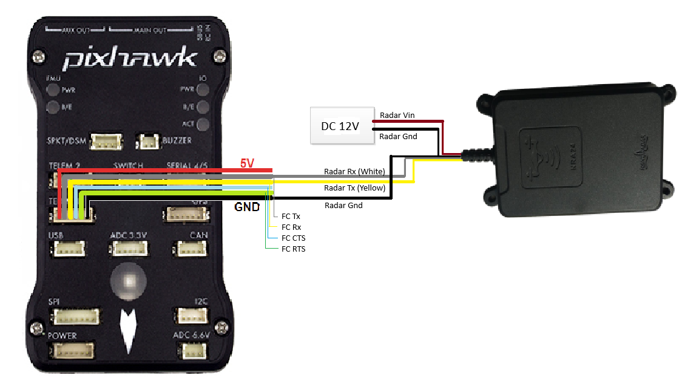

.. _common-rangefinder-nra24.rst:

================
Nanoradar NRA 24
================

.. note::
    Support for this sensor is available in firmware versions 4.5 and later.

The `NRA24 <http://en.nanoradar.cn/Article/detail/id/372.html>`__ is K-band radar commonly used for detecting height above terrain in all-weather conditions.Currently, only connection via CAN is supported for more than one NRA24 module. Serial (UART) versions of this Radar have only been tested with a single NRA24 module.

Connecting via CAN
==================

Setup the sensor through the NSM Software. In particular set the "ID" to a unique number if planning to use multiple NRA24 on a single CAN bus. You can also set the bitrate from the software.

.. note::
    ArduPilot does not currently support the same type CAN rangefinders connected to different CAN ports. If you would like to use multiple CAN rangefinders together, connect them to the same bus.

Connecting to the Autopilot
===========================
Setup the sensor through the NSM tools provided by the manufacturer. More details can be found `here <http://en.nanoradar.cn/File/download/id/467.html>`__. Set the "ID" to a unique number if planning to use multiple NRA24 on a single CAN bus. You can also set the bitrate from the software to match the CAN bus bitrate (500000 is recommended).

For a serial connection you can use any spare CAN port. Since this is not a DroneCAN based sensor, you will not be able to use the connected port with any other sensor. The diagram below shows how to connect to CAN2.

.. image:: ../../../images/nra24_connection.png
    :target: ../_images/nra24_connection.png

Set the following parameters

-  :ref:`CAN_P2_DRIVER <CAN_P2_DRIVER>` = 2 (to enable the second CAN driver)
-  :ref:`CAN_P2_BITRATE <CAN_P2_BITRATE>` = 500000 (Or as set in NSM tools)
-  :ref:`CAN_D2_PROTOCOL <CAN_D2_PROTOCOL>` = 14 (RadarCAN)
-  :ref:`RNGFND1_TYPE <RNGFND1_TYPE>` = 39 (NRA-24). Reboot after setting this.
-  :ref:`RNGFND1_MAX <RNGFND1_MAX>` = 19000 (i.e. 200m max range with 10m buffer)
-  :ref:`RNGFND1_MAX <RNGFND1_MIN>` = 50 (0.5m min range)
-  :ref:`RNGFND1_RECV_ID <RNGFND1_RECV_ID>` = ID of the sensor (0 to accept all CAN ids for distance)

Connecting via UART
===========================

.. warning:: This is the recommended configuration by Nanoradar given `here <http://en.nanoradar.cn/Article/detail/id/495.html>`__, but ArduPilot has not verified that all operational edge cases are satisfied using the USD-1 driver. Caution is advised.

Set the following parameters (Example for setup on TELEM1/SERIAL1)

-  :ref:`SERIAL1_BAUD <SERIAL1_BAUD>` = 115 (Baud rate as per the official documentation `here <http://en.nanoradar.cn/File/view/id/436.html>`__)
-  :ref:`SERIAL1_PROTOCOL <SERIAL1_PROTOCOL>` = 9 (which translates to Rangefinder)
-  :ref:`RNGFND1_TYPE <RNGFND1_TYPE>` = 11 (which is USD1_Serial). Reboot after setting this.
-  :ref:`RNGFND1_MAX <RNGFND1_MAX>` = 19000 (i.e. 200m max range with 10m buffer)
-  :ref:`RNGFND1_MAX <RNGFND1_MIN>` = 50 (0.5m min range)

Testing the sensor
==================

Distances read by the sensor can be seen in the Mission Planner's Flight
Data screen's Status tab. Look closely for "rangefinder1".
