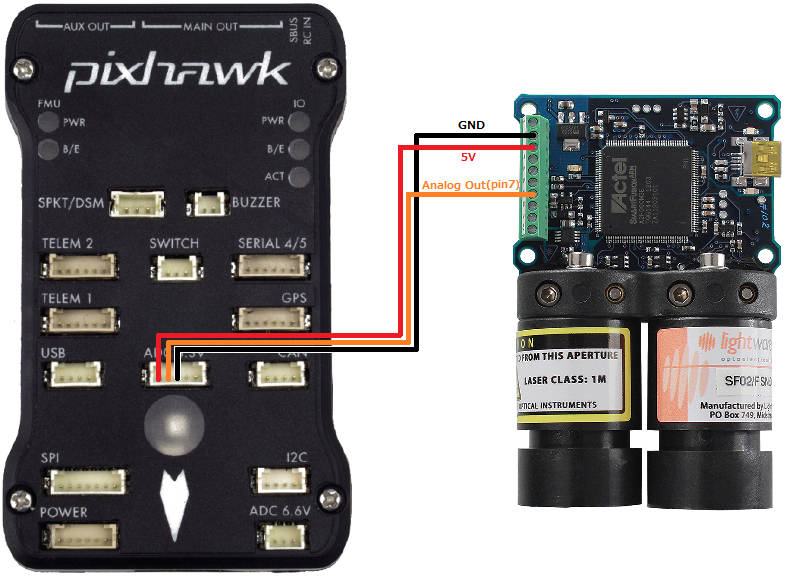
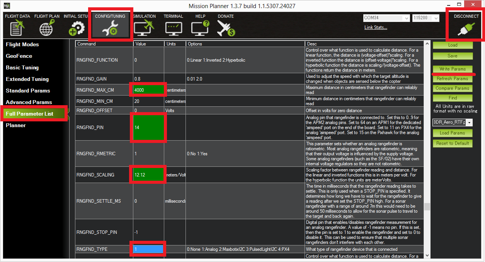

.. _common-rangefinder-sf02:

==========================
Lightware SF02 Rangefinder
==========================

The `Lightware SF02 <http://documents.lightware.co.za/SF02%20-%20Laser%20Rangefinder%20Manual%20-%20Rev%2012.pdf>`__ is
lightweight laser rangefinder module that provides fast and accurate distance measurements up to 40 meters (130 feet). 
In `tests by the development team <https://diydrones.com/profiles/blogs/testing-laser-rangefinders-with-arduplane>`__
the sensor has produced very reliable distance measurements for long and
short ranges even on fast moving vehicles.

Connecting to the Pixhawk
=========================

The SF02's Analog Out pin should be connected to the Pixhawk's 3.3V ADC
(analog to digital converter) as shown below.  The Pixhawk will provide
the regulated 5V power supply the sensor requires.

Setup through the mission planner
=================================

To configure Copter, Plane or Rover to use the LIDAR-Lite, please first
connect with the Mission Planner and then open the Config/Tuning >> Full
Parameter List page and set:

-  :ref:`RNGFND1_MAX_CM <RNGFND1_MAX_CM>` = "3700" (i.e. 40m max range - 3m buffer.  This buffer is required so the flight code can detect when there is nothing in range)
-  :ref:`RNGFND1_PIN <RNGFND1_PIN>` = "14" (2nd pin of 3.3V ADC connector)
-  :ref:`RNGFND1_SCALING <RNGFND1_SCALING>` = "12.12" (ie. 40m / 3.3v = 12.12) **
-  :ref:`RNGFND1_TYPE <RNGFND1_TYPE>` = “1" (Analog)
-  :ref:`RNGFND1_RMETRIC <RNGFND1_RMETRIC>` = "0" (non-ratiometric, shown incorrectly in the
   diagram below)

** The default range for an SF02 is 33m / 3.3V = 10 m/V

Testing the sensor
==================

Distances read by the sensor can be seen in the Mission Planner's Flight
Data screen's Status tab. Look closely for "sonarrange".

.. image:: ../../../images/mp_rangefinder_lidarlite_testing.jpg
    :target: ../_images/mp_rangefinder_lidarlite_testing.jpg
