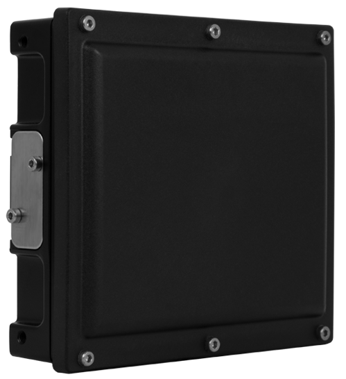
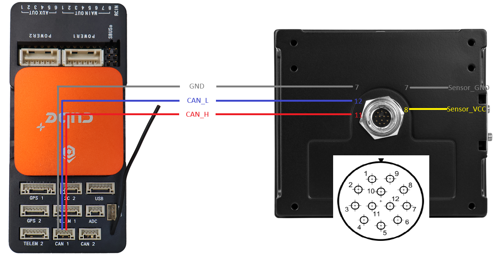
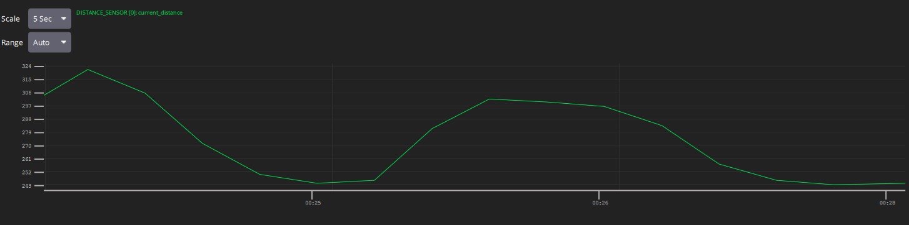

.. _common-rangefinder-smartmicro-t132.rst:

[copywiki destination="plane,copter"]

================================
Smartmicro T132 Drone Altimeter
================================

The `Smartmicro T132 <https://www.smartmicro.com/airborne/drone-altimeter/>`__ is a radar-based distance sensor with a DroneCAN
interface. It can be used as a rangefinder with ArduPilot.

The T132 supports altitude measurements up to 175 m and communicates over
DroneCAN using a 1 Mbit/s CAN bus. The sensor uses 29-bit CAN identifiers and
has an update interval of 55 ms. Once configured, the sensor
publishes distance measurements at approximately 18.2 Hz. 

The T132 is particularly suitable for altitude measurement on UAVs,
including operation in GNSS-denied environments.

Hardware Specifications
=======================

* Altitude: up to 175 m possible
* Automatic dual mode operation (medium/long range mode)
* Operates in 76-77 GHz band approved for altimeter operation in Europe
* Made in Germany, specially designed for European drone manufactures
* ITAR free, not dual-use classified
* Mature hardware, in full production, available in high volume
* High electromagnetic susceptibility robustness: difficult to jam
* Low observability (narrow beam, short dwell time)
* Interface: DroneCAN
* CAN bitrate: 1 Mbit/s
* CAN identifiers: 29-bit
* Update rate: approximately 18.2 Hz
* Supply voltage: DC 8-32 V
* Power consumption: 3.75-5 W
* Weight: 274 g
* Dimensions: 94.7 x 84.4 x 26.4 mm (plus connector)
* Connector: Hirose LF10 series
* Operating temperature: -40 to +85 °C
* Protection: IP67
* Internal CAN termination

Hardware Setup
==============

Sensor Setup
------------

For optimal performance, the antenna of the radar should be parallel to the
surface of the earth during normal flight.

The antenna is located directly behind the black plastic radome. The black
plastic surface should therefore face down when the sensor is used for
altitude measurement.

The word "TOP" on the sensor label and the accompanying arrow should point
either in the direction of flight or directly opposite the direction of
flight. The arrow should not point perpendicular to the direction of flight.

The sensor may be mounted behind a flat plastic surface, for example inside
the fuselage, provided that the surface is radar transparent.

Wiring
------

The sensor connector is a 12-pin male bayonet type connector (waterproof IP67, series LF10WBRB-12PD, manufacturer Hirose, Japan).

Connect the following signals to the flight controller:

* CAN_H
* CAN_L
* GND
* Power supply

.. warning::

    Make sure that the complete CAN bus has correct termination. The T132
    contains an internal termination resistor, so the CAN bus topology must
    be taken into account when connecting additional CAN devices.

* Smartmicro does not provide a cable that connects to Pixhawk-standard CAN bus connectors out of the box. But different cable options with D-Sub-9 connector or as "Open Wire" are available.

Firmware
--------

The T132 is supplied with firmware and does not require an initial sensor
configuration for normal operation.

Future firmware updates can be performed using Smartmicro proprietary
software over the CAN interface.

Connecting to the Autopilot
===========================

Connect the T132 to a CAN port on the flight controller.

The T132 uses DroneCAN, so the CAN port can be shared with other DroneCAN
devices on the same CAN bus.

For example, when using CAN1, configure:

* :ref:`CAN_P1_DRIVER <CAN_P1_DRIVER>` = 1
* :ref:`CAN_P1_BITRATE <CAN_P1_BITRATE>` = 1000000
* :ref:`CAN_D1_PROTOCOL <CAN_D1_PROTOCOL>` = 1 (DroneCAN)

The rangefinder must then be configured using:

* :ref:`RNGFND1_TYPE <RNGFND1_TYPE>` = 24 (DroneCAN)
* :ref:`RNGFND1_ADDR <RNGFND1_ADDR>` = 0
* :ref:`RNGFND1_MIN <RNGFND1_MIN>` = 1
* :ref:`RNGFND1_MAX <RNGFND1_MAX>` = 175

A reboot is required after changing the rangefinder type or the CAN
configuration.

Sensor Operation
================

The measured altitude is perpendicular to the radome of the sensor. When the vehicle rolls or pitches, the measured altitude is too high and must be compensated by roll and pitch angles.

The radar automatically operates in medium- and long-range modes according
to the measurement conditions.

If the sensor is unable to determine the current altitude (too high, too low or occluded radome) this is signaled as (DroneCAN) ``reading_type=undefined``.

Testing the Sensor
==================

After configuring the CAN interface and rangefinder, reboot the flight
controller.

The T132 should then be detected automatically as a DroneCAN rangefinder. Measurements are shown in the MAVLink Inspector like this:

Troubleshooting
===============

Sensor is not detected
----------------------

Check the following:

* The T132 is supplied with 8-32 V DC.
* CAN_H and CAN_L are connected correctly.
* The CAN bitrate is set to 1 Mbit/s.
* :ref:`CAN_P1_DRIVER <CAN_P1_DRIVER>` is configured correctly.
* :ref:`CAN_D1_PROTOCOL <CAN_D1_PROTOCOL>` is set to 1 (DroneCAN).
* The flight controller has been rebooted after changing the CAN parameters.
* The CAN bus has appropriate termination.
* The T132 is connected to the same CAN bus as the configured CAN interface.

No rangefinder measurement
---------------------------

Check:

* :ref:`RNGFND1_TYPE <RNGFND1_TYPE>` is set to 24 (DroneCAN).
* :ref:`RNGFND1_MIN <RNGFND1_MIN>` is configured correctly.
* :ref:`RNGFND1_MAX <RNGFND1_MAX>` is configured correctly.
* :ref:`RNGFND1_ADDR <RNGFND1_ADDR>` matches the DroneCAN sensor ID when
  multiple sensors are connected.
* The radar radome has an unobstructed view.
* The target is within the specified measurement range.
