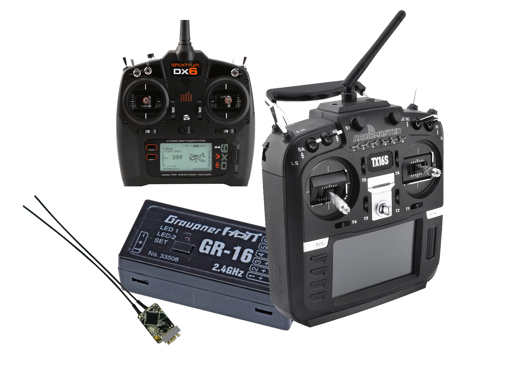
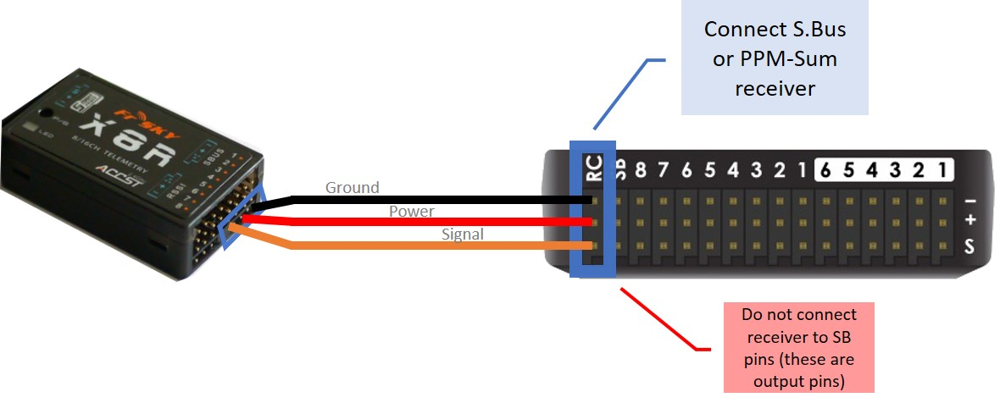
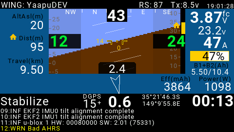
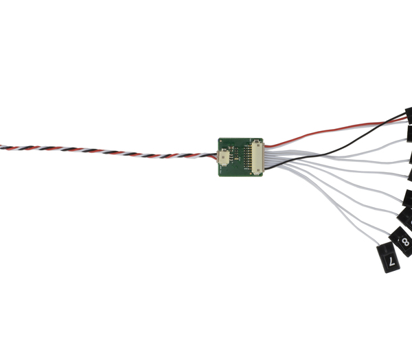

.. _common-rc-systems:

=====================
Radio Control Systems
=====================

This article provides an overview of the RC Transmitter and Receiver
Systems that can be used with ArduPilot autopilots.

Compatible RC Protocols
=======================

ArduPilot autopilots are compatible with the following receiver output protocols:

    #. PPM-Sum receivers
    #. SBus receivers 
    #. IBUS receivers
    #. :ref:`common-FPort-receivers`
    #. :ref:`Spektrum DSM, DSM2, and DSM-X Satellite receivers<common-spektrum-rc>`
    #. :ref:`SRXL version 1 and version 2 receivers<common-srxl-receivers>`
    #. :ref:`Graupner SUM-D<common-graupner-rc>`
    #. Parallel PWM outputs encoded to PPM-Sum using an external encoder (see below)
    #. Crossfire (CRSF) (coming in a future firmware release)
    #. SRXL2 (coming in a future firmware release)

Connecting the Receiver
=======================

For all protocols above, ArduPilot auto-detects the protocol of the RC receiver system. However, depending on the protocol and autopilot type, the physical connection to the autopilot may differ.

PPM-Sum/SBus/IBus
-----------------

These receivers are usually connected to the RCin or SBUS input pin on the autopilot.

To connect a PPM-Sum/SBus/IBus receiver to a Pixhawk, for example, plug the ground (black), power (red) and signal (usually white - orange in the diagram below) wires to the RCin pin on the Pixhawk. 

.. tip::

   The parameter to enable the SBus output from the PixHawk style autopilots is
   :ref:`BRD_SBUS_OUT<BRD_SBUS_OUT>` . This is only to pass SBus externally to other devices, like servos. Not to connect a receiver to RCin or SBus In.

DSM/DSM2/DSM-X/SRXL1/SUM-D
--------------------------

For autopilots that do not provide a separate ``DSM`` input, these can be connected as above. However, for performance reasons on autopilots that use an IOMCU (The Pixhawk/Cube family), the autopilot's ``DSM`` input connection is highly recommended.

.. image:: ../../../images/pixhawk_spektrum_connection.jpg

FPort/FPort2
------------

(future feature, see :ref:`Upcoming features <common-master-features>` )

FPort is a bi-directional protocol, using SBus RC in one direction, and serial telemetry in the other. The RC portion can be decoded when attached to an autopilot as if it were SBus, but the embedded telemetry would be lost. See the :ref:`FPort setup documentation<common-FPort-receivers>` for details on connection to one of the autopilots Serial Ports.

SRXL2/CRSF
-----------

(future feature, see :ref:`Upcoming features <common-master-features>` )

These bi-directional protocols require the use of a Serial Port. See links below for setup and connections.

(add TOC entries here for CRSF page and SRXL2 page)

RC input to Serial Port
-----------------------

.. note:: ArduPilot firmware releases 4.0 and later, any UART RX input will auto-detect all the protocols, if the serial port protocol is set to 23 (for example :ref:`SERIAL2_PROTOCOL<SERIAL2_PROTOCOL>` for the TELEM2 UART is used)

Radio System Selection
======================

Selection will depend on many factors: range,telemetry requirements, cost, compatibility with existing equipment, etc. Most manufacturers often many different models with differing capabilities. Many systems have been reverse-engineered and "cloned" by other manufacturers offering more economical versions of transmitters and receivers. Many Transmitters offer multiple protocols and are based on the `OpenTX <https://www.open-tx.org/>`__ firmware which is extremely flexible and also allows the use of LUA scripts to display telemetry data on their LCD screens.

Range
-----

RC control range varies greatly depending on system used, installation, antennas used, terrain, and even weather conditions. But in general, for discussion purposes here, RC systems can be categorized into Short Range (2km and under) , Medium (2-10km) and Long Range (>10km). In addition, they may offer uni-directional (Vehicle to Transmitter) or bi-directional (Vehicle to/from Transmitter) telemetry.

Telemetry
---------

FrSky Horus Transmitter running Yaapu LUA script

Some systems provide transparent radio modems to the telemetry from the autopilot, and others have proprietary protocols. Those with proprietary protocols often have means of displaying  telemetry data on the transmitter display itself, like FRSky or other `OpenTX <https://www.open-tx.org/>`__ based Transmitters.

Telemetry speeds vary from 56K to 1-2K baud depending on protocol and, in some cases, distance. Often telemetry range will be less than radio control range.

Number of channels
------------------

ArduPilot requires at least 5 channels for most vehicles, however, 8 to 16 channels are commonly available in most systems and are very convenient for controlling other vehicle functions such as cameras or flight feature options. Many vehicles require 8 channels just for basic operation, such as many QuadPlanes.

Below is a table with some commonly  available systems showing these elements. Note, not all versions of transmitters and/or receivers from a particular manufacturer may have these characteristics. Note: that many "clone" or "compatible" versions of this systems also exist, only the OEM system is listed.

+-----------------------+------+----------+------------+-----------+--------------+--------+
|Original Manufacturer  |Range | Telemetry| Telem Speed| TX Display| RC Protocol  |  Notes |
+=======================+======+==========+============+===========+==============+========+
|DragonLink             |Long  |  Bi-dir  |     56K    |    na     | PPM_SUM/SBUS |    1   |
+-----------------------+------+----------+------------+-----------+--------------+--------+
|FLYSKY                 |Short |    No    |     -      |   -       |  IBus        |        |
+-----------------------+------+----------+------------+-----------+--------------+--------+
|FRSky  X series        |Short |  Bi-dir  |    Medium  |   yes     | PPM-SUM/SBUS |    2   |
+-----------------------+------+----------+------------+-----------+--------------+--------+
|FRSky  R9 series       |Medium|  Bi-dir  |    Medium  |   yes     | PPM-SUM/SBUS |    2   |
+-----------------------+------+----------+------------+-----------+--------------+--------+
|Futaba                 |Short |    No    |     -      |   -       |  SBus        |        |
+-----------------------+------+----------+------------+-----------+--------------+--------+
|Graupner               |Short |    Yes   |    Medium  |   yes     |  SUM-D       |        |
+-----------------------+------+----------+------------+-----------+--------------+--------+
|Multiplex              |Short |     No   |      -     |    -      | SRXL1        |        |
+-----------------------+------+----------+------------+-----------+--------------+--------+
|Spektrum               |Short |    No    |     -      |   -       |  DSM/DSM2    |        |
|                       |      |          |            |           |  DSM-X/      |        |
|                       |      |          |            |           |  SRXL1       |        |
+-----------------------+------+----------+------------+-----------+--------------+--------+

Note 1: DragonLink provides a 56Kbaud transparent link for telemetry, allowing full MAVLink telemetry to/from the vehicle from the transmitter module. Dragonlink is an add-on module to the transmitter, such as an FRSky Taranis or RadioMaster T16. See :ref:`common-dragonlink-rc`

Note 2: See :ref:`common-frsky-yaapu`. Future firmware versions will offer the ability to change parameters over FRSky telemetry from an Open TX compatible transmitter in addition to displaying the telemetry data. Most FRSky compatible transmitters use `OpenTX <https://www.open-tx.org/>`__. Note that R9 systems are not quite Long Range, but much further range than normal FRSky systems, themselves at the very high end of the Short Range category at 1.6-2km range.

Links to Radio Control Systems
==============================

Without integrated telemetry:

.. toctree::
    :maxdepth: 1

    FLYSKY <common-flysky-rc>
    Futaba <common-futaba-rc>
    Spektrum <common-spektrum-rc>

With integrated telemetry:

.. toctree::
    :maxdepth: 1

    DragonLink <common-dragonlink-rc>
    FRSky <common-frsky-rc>
    Graupner (HOTT) <common-graupner-rc>
    Multiplex (no support in Ardupilot for M-Link telemetry yet) <common-multiplex-rc>

Multi-Protocol:

.. toctree::
    :maxdepth: 1

    Jumper T16 Pro/ RadioMaster T16 Transmitter <common-jumperT16pro>

Recommendations:
----------------
Its difficult to make a recommendations since there is such a wide spectrum of capabilites, features, and costs.

In Europe, Multiplex and Graupner are well established systems and comply with EU radiation recommendations (as do many other brands as an option).

FLYSKY produces very low cost, low end systems.

FRSky and Spektrum enjoy the largest established bases with Spektrum dominant in park flyer and entry level RC systems. FRSky has telemetry capabilities and utilizes `OpenTX <https://www.open-tx.org/>`__ which is very flexible and is continually adding features in the firmware.

The Jumper T16 and RadioMaster T16 are FRSky Horus-like OpenTX based transmitter clones with multiple RC protocols built-in.

PPM encoders
============

A `PPM Encoder <http://store.jdrones.com/pixhawk_px4_paparazzi_ppm_encoder_v2_p/eleppmenc20.htm>`__ will
allow you to use any older style RC receiver with only PWM outputs for each channel. Both the new and previous versions of the *3DR PPM-Sum encoder* (the linked encoder is compatible) are shown
below:

   Newest 3DR PPM-Sum encoder

.. figure:: ../../../images/PPMEncoderDesc.jpg
   :target: ../_images/PPMEncoderDesc.jpg

   Original 3DR PPM-Sumencoder

There are some downsides of using this encoder:

-  The PPM Encoder does require quite a bit of additional wiring to the receiver.
-  It uses quite a bit of power making it likely you will need to plug
   in your battery while doing radio setup with USB cable in Mission Planner.
-  The encoder also costs as much or more than several of the
   available PPM-Sum receivers including the FrSky Delta 8 below.

There is addition information :ref:`about connecting and configuring the encoder here <common-ppm-encoder>`.

.. note::

   If you are using this PPM Encoder it is important to know that
   when you are calibrating your transmitter you may need
   to hook up your flight battery to the autopilot because the USB port
   alone can't supply enough power.

