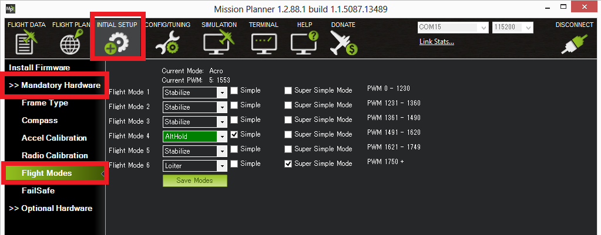
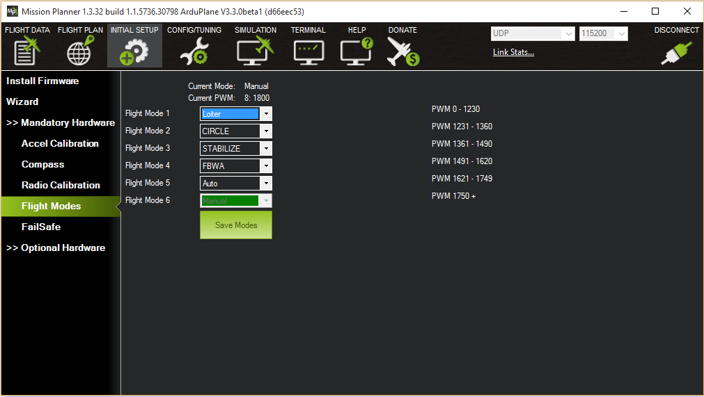
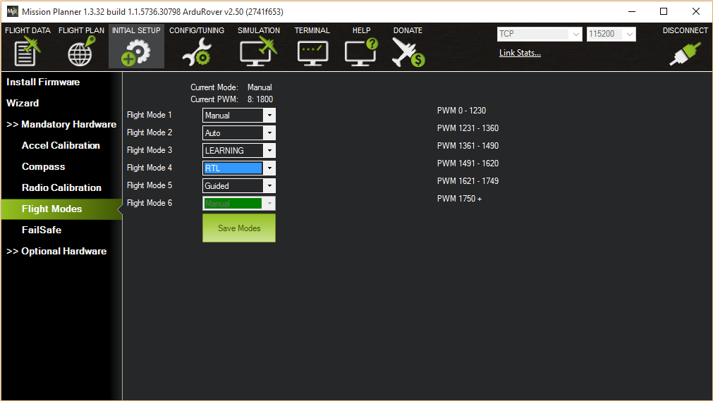
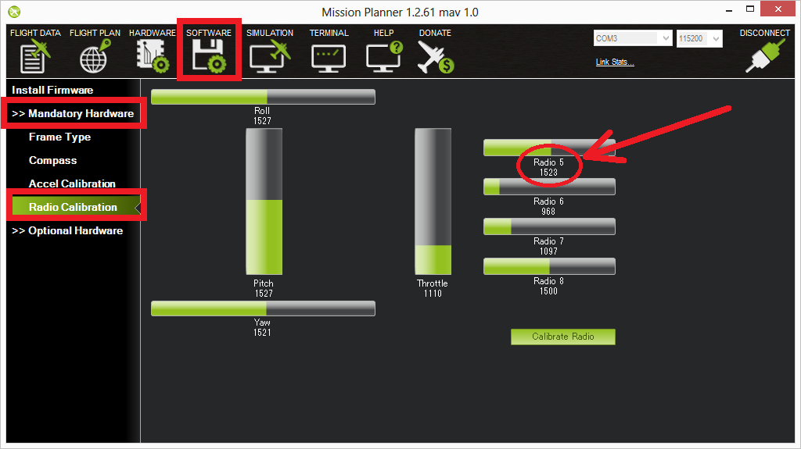

.. _common-rc-transmitter-flight-mode-configuration:

========================================
RC Transmitter Flight Mode Configuration
========================================

This article shows how you can enable up to 6 autopilot control/flight
modes to be set from your RC transmitter.

.. _common-rc-transmitter-flight-mode-configuration_flight_modes_configuration:

Flight modes configuration
==========================

The mapping between switch position and flight mode is set in the
*Mission Planner Flight Mode* screen.

[site wiki="copter"]

   Mission Planner:Flight Mode Screen (Copter).
[/site]

[site wiki="plane"]

   Mission Planner: Flight Mode Screen(Plane)
[/site]

[site wiki="rover"]

   Mission Planner: Flight ModeScreen (Rover).
[/site]

You can set up the flight modes available on the transmitter by doing
the following:

-  Turn on your RC transmitter
-  Connect the Pixhawk (or other flight controller) to the *Mission Planner*
-  Go to the **Initial Setup \| Mandatory Hardware \| Flight Modes** screen

   .. note::

      As you move your transmitter's flight mode switch the green
      highlight bar will move to a different position.

-  Use the drop-down on each line to select the flight mode for that
   switch position.

[site wiki="copter"]
-  (Copter) Ensure that at least one switch position is left assigned to
   STABILISE.
[/site]

[site wiki="copter"]
-  (Copter) Optionally check the :ref:`Simple Mode <copter:simpleandsuper-simple-modes_simple_mode>`
   check-box for that switch position. If using AC3.1 or higher you can
   optionally set :ref:`Super Simple mode <copter:simpleandsuper-simple-modes_super_simple_mode>`.
   If both Simple mode and Super Simple mode checkboxes are checked
   Super Simple will be used.
[/site]

-  When finished press the **Save Modes** button.

[site wiki="copter"]
(Copter) Some modes can also be invoked from the :ref:`auxiliary switches <copter:channel-7-and-8-options>`
(a.k.a. ch7, ch8 option switches). For example, to set a dedicated
switch for RTL.
[/site]

Setting the flight mode channel
===============================

The flight mode channel is the input radio channel that ArduPilot
monitors for mode changes.

[site wiki="copter"]
On Copter this is always channel 5.
[/site]
[site wiki="plane"]
On Plane this is configurable using the :ref:`FLTMODE_CH <plane:FLTMODE_CH>`
parameter. 
[/site]
[site wiki="rover"]
On Rover this is configurable using the :ref:`MODE_CH <rover:MODE_CH>` parameter
[/site]

Transmitter configuration
=========================

The transmitter must emit PWM signals in the correct range to allow us
to map a mode to a switch position.

.. note::

   The correct PWM ranges for selectable modes are shown alongside
   each mode selection dropdown in the *Mission Planner Flight Mode* screen
   (see :ref:`screenshot above <common-rc-transmitter-flight-mode-configuration_flight_modes_configuration>`). 

If you want to just support three modes (using a three position switch)
then you would configure the transmitter to produce PWM pulse widths of
1165, 1425, and 1815 microseconds for the respective switch positions.

If you want to support 6 modes then the transmitter will need to emit
PWM widths of around 1165, 1295, 1425, 1555, 1685, and 1815
milliseconds. Typically this is achieved by configuring the transmitter
to mix a two position switch and a three position switch (giving 6 modes
in total). You can also do this with an analog dial if one is available,
but it’s hard to reliably turn a dial to just the right position for six
distinct settings.

The sections below provide links showing how to configure transmitters
from different manufactures, and how to test (in Mission Planner) that
each switch setting is emitting the appropriate PWM signal.

Test transmitter switch settings
--------------------------------

You can use the *Mission Planner Radio Calibration* screen to test the
PWM pulse widths for each mode setting.

Simply toggle through the modes on your transmitter and confirm that the
PWM for the selected channel matches the required PWM values. The
screenshot below assumes that the flight mode channel is set to Radio 5.

Tutorials for specific RC hardware
----------------------------------

Here are some user-contributed tutorials for doing this (or adding more
modes to RC units with just a two-position toggle) with various RC
systems:

-  `JR XG8 DMSS <http://www.diydrones.com/forum/topics/how-to-set-up-6-apm-flight-modes-on-1-channel-of-jr-xg8-rc>`__
-  `JR9303 <http://diydrones.com/profiles/blogs/how-to-program-6-flight-modes>`__
-  `JR X2720 <http://diydrones.com/forum/topics/six-flight-modes-can-be-done>`__
-  `FlySky FS-I6 <http://diydrones.com/profiles/blogs/flysky-fs-i6-flight-modes>`__
-  `Futaba T8FG <http://diydrones.com/profiles/blogs/acmapm-futaba-t8fg-super-mode>`__
-  `Futaba T8J <http://www.diydrones.com/profiles/blogs/pixhawk-futaba-t8j-6-modes-configuration-with-2-switches-c-d>`__
-  `Futaba T7CP <http://diydrones.com/profiles/blogs/configure-6-flight-modes-for>`__
-  `Futaba T6EX <http://diydrones.com/profiles/blogs/four-modes-switch-for-futaba>`__
-  `Futaba 9ZAP/ZHP <http://diydrones.com/profiles/blogs/flight-mode-switching-on-a>`__
-  `Futaba T10CAG <http://www.diydrones.com/profiles/blogs/getting-six-fly-modes-on-futaba-t10cag-transmitter>`__
-  `Futaba T14 <http://diydrones.com/profiles/blogs/futaba-t14-mz-mode-configuration-for-all-6-modes>`__
-  `Futaba T14SG <http://diydrones.com/forum/topics/set-6-point-switch-for-flight-mode-control-in-futaba-t14sg>`__
-  `Futaba 9C Super <http://diydrones.com/profiles/blogs/6-positions-for-futaba-9c-super>`__
-  `Graupner MX-16 <http://diydrones.com/profiles/blogs/six-modes-with-graupner-mx-16>`__
-  `Turnigy 9x <http://diydrones.com/profiles/blogs/mode-switch-setup-for-turnigy-1>`__\ (or
   an even easier way)
   `(Here!) <http://www.diydrones.com/profiles/blogs/another-way-to-set-modes-on-turnigy-9x>`__ - `Turnigy 9x with ER9x firmware <http://diydrones.com/profiles/blogs/mode-switch-setup-for-turnigy>`__
-  `Turnigy 9XR <http://diydrones.com/profiles/blogs/change-between-6-modes-with-turnigy-9xr-using-mixing>`__
-  `Turnigy TGY-I6 <http://diydrones.com/profiles/blogs/flysky-fs-i6-flight-modes>`__
-  `Hitech Aurora 9 <http://www.diydrones.com/forum/topics/quad-goes-to-full-throttle?commentId>`__
-  `Spektrum DX8 <http://diydrones.com/profiles/blogs/spectrum-dx8-2-switches-1-tx-channel-6-flight-modes?>`__ 
   (alternate method below)
-  `Spektrum DX7s <http://diydrones.com/profiles/blogs/getting-6-modes-out-of-channel-5-on-a-spektrum-dx7s>`__
-  `Spektrum DX7 Version 6 <http://diydrones.com/profiles/blogs/dx7-new-version-6-flight-mode-setup-with-pixhawk>`__

Or `build your own six-position switch! <http://diydrones.com/profiles/blogs/6-position-mode-switch-for-apm>`__

Spektrum DX8 (alternate method)
-------------------------------

This section describes an alternative way to set 6 modes with the
Spektrum DX8. This method uses the Gear switch and the Flight mode
switch. All the other switches can be assigned as preferred. This method
also allows each mode to be set in the middle of each mode's pulse width
range so small changes will not change modes. Use Mission Planner Flight
Modes setup to monitor the Current PWM for these adjustments.

#. Setup the switches (required for the 6 modes)

   -  Hold roller bar down, turn on DX8, scroll down to Switch Select,
      Click roller bar.  Set switches as follows:
      
      -  Gear = Gear (Channel 5)
      -  FMode = Inh  Not assigned to a channel – Used to mix with Gear Sw (Channel 5) for 6 modes
      
   -  Others anyway you want. One method is as follows:

      -  Knob to aux1 = channel 6 for camera tilt / tuning
      -  Mix = aux2 = channel 7 to save Way Point or RTL, auto trim or
         other settings in APM configuration.
      -  Flap to aux3 = channel 8 for other uses

   -  Click BACK until the normal screen appears, or turn off power,
      then turn power back on.

#. Set up the non-mixed servo setting for channel 5 (Gear channel
   controlled by the Gear Switch)

   This will be the values with no mixing - F Mode switch in the 0
   position and sets the lowest pulse width to 1165 ms (mode 1) and
   highest to 1815 ms (mode 6)

-  Click the roller bar, scroll down to Servo Setup, Select the Gear
   channel, Select Sub Trim.
-  Set sub trim to 0
-  Select Travel.
-  Set travel (left, position 0) for 1165 ms pulse  (~90%).
-  Set travel (right, position 1 for 1815 ms pulse (~74%).
-  Set up Mix 1 to change the Gear Pulse width when F Mode is in
   position 1

   -  Click roller, scroll down to Mixing, click roller, scroll to first
      line under Mix (has xxx > xxx, AIL > RUD, or some other mix
      set),click roller, Select Mix 1, Click roller.
   -  Set Mix: Gear > Gear. Gear changes Gear depending on Switch F Mode
      setting
   -  Set Offset = 0, Trim = Inh.
   -  Set SW = FM 1
   -  Set the F Mode switch on the transmitter to position 1.
   -  Set the Gear switch on the transmitter to position 0.
   -  Set top Rate for pulse width of 1290 ms for mode 2  (~-35%)

      (change = 400 ms \* -90% \* -35% = 126 ms. Result = 1165 ms + 126
      ms = 1251 ms = mode 2)
   -  Set the Gear switch on the transmitter to position 1.
   -  Set bottom Rate for pulse width of 1685 ms for mode 5  (~– 45%)

      (change = 400 ms \* +73% \*- 45% = -131 ms. Result = 1815 ms - 131
      ms = 1684 ms = mode 5)

-  Set up a mix 2 to change the Gear Pulse width when F Mode is in
   position 2

   -  Mix: Gear > Gear.  Gear changes Gear depending on Switch F Mode
      setting.
   -  Set Offset = 0, Trim = Inh
   -  Set SW = FM2
   -  Set the F Mode switch on the transmitter to position 2
   -  Set the Gear switch on the transmitter to position 0.
   -  Rate top Rate for pulse width of 1425 ms for mode 3  (~–72%)
      (change = 400 ms \* –90% \* – 72% = 259 ms.  Result = 1165 ms +
      259 ms = 1424 ms = mode 3)
   -  Set the Gear switch on the transmitter to position 1.
   -  Set bottom Rate for pulse width of 1550 ms for mode 4  (~–89%)
      (change = 400 ms \* +73% \* – 89% = -262 ms.  Result = 1815 ms -
      262 ms = 1553 ms = mode 4)

      
[copywiki destination="copter,plane,rover,planner"]
