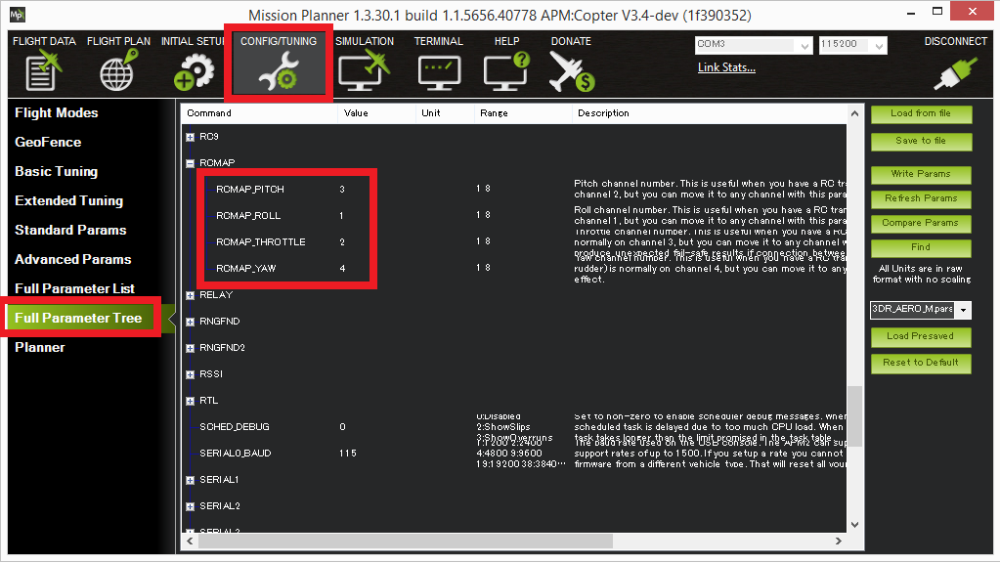

.. _common-rcmap:

================================
RC Input Channel Mapping (RCMAP)
================================

This article shows how to set up a non-standard RC input channel mapping
using the RCMAP feature.

Configuration
=============

By default the RC input channels are:

-  Channel 1: Roll input
-  Channel 2: Pitch input
-  Channel 3: Throttle input
-  Channel 4: Yaw input

These can be changed by setting the :ref:`RCMAP_ROLL <RCMAP_ROLL>`, :ref:`RCMAP_PITCH <RCMAP_PITCH>`, :ref:`RCMAP_THROTTLE <RCMAP_THROTTLE>` and :ref:`RCMAP_YAW <RCMAP_YAW>` parameters using the *Mission Planner*'s **Config/Tuning \| Full Parameter Tree** (or Full Parameter List) as shown below.

After changing any of these parameters the autopilot should be
rebooted.

[site wiki="copter"]
For multicopters, the :ref:`RC calibration <common-radio-control-calibration>` and 
:ref:`ESC calibration <copter:esc-calibration>` should be re-done.
[/site]

Additional information about the ``RCMAP`` parameters can be found for the respective platforms in: 
:ref:`Copter Parameters <copter:RCMAP_ROLL>`, :ref:`Plane Parameters <copter:RCMAP_ROLL>`
and :ref:`Rover Parameters <rover:RCMAP_ROLL>`.

[site wiki="rover"]
Rover notes
===========

As a real example, if your aileron (steering) is on channel 1 and your
elevator (throttle) is on channel 2, then the settings should be:

-  ``RCMAP_ROLL=1``
-  ``RCMAP_THROTTLE=2``

``RCMAP_PITCH`` and ``RCMAP_YAW`` can be whatever channels you want to
make them as long as they are not channels 1 and 2.

For Rover you should also select the receiver channel that will be used
to control the Mode select (:ref:`MODE_CH <rover:MODE_CH>`).

[/site]
