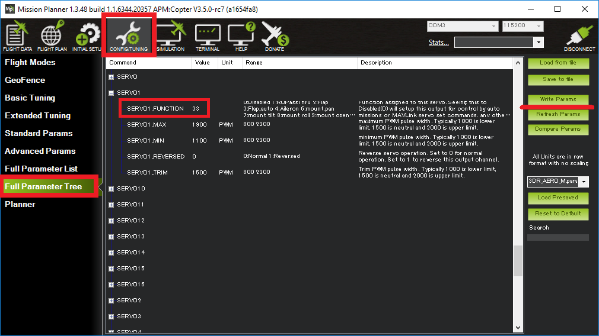

.. _common-rcoutput-mapping:

==========================
Autopilot Output Functions
==========================

All autopilot servo/motor outputs may be mapped to any output function supported by
ArduPilot. This page describes how to configure these output channels and what each
of the available functions is.

The SERVOn_FUNCTION parameters
------------------------------

In the advanced parameter view of your GCS you will find that each
SERVO output channel has a ``SERVOn_FUNCTION`` parameter. For example, :ref:`SERVO5_FUNCTION<SERVO5_FUNCTION>`  controls the output function of channel 5, :ref:`SERVO6_FUNCTION<SERVO6_FUNCTION>` controls the output function of channel 6 and so on.

Not all the functions are available in each vehicle. Defaults are set to 0 when firmware for a vehicle type is first loaded. Choosing a frame
configuration in Mission Planner during initial setup will set the outputs to the basic typical functions for that frame type. For example,
fixed wing plane will set the first four outputs, SERVO1-SERVO4 to Aileron, Elevator, Throttle, and Rudder functions, respectively.

All of these functions may be used on multiple channels. So if you
want 3 elevator channels for some reason you can set ``SERVOn_FUNCTION``
to 19 on 3 of your output channels.

Configuration
-------------

Configuration can be done using the SERVO tab of Mission Planner or by directly setting the ``SERVOx_FUNCTION`` parameter for an output.

For example, if you wished to re-order a Copter quad-x frame's motors from the :ref:`kitty-corner default <connect-escs-and-motors>` to a more logical clockwise method, make these changes:

- :ref:`SERVO1_FUNCTION <SERVO1_FUNCTION>` leave as 33 (aka "motor1", front-right)
- :ref:`SERVO2_FUNCTION <SERVO2_FUNCTION>` change from 34 (aka "motor2", back-left) to 36 (motor #4, back-right)
- :ref:`SERVO3_FUNCTION <SERVO3_FUNCTION>` change from 35 (aka "motor3", front-left) to 34 (motor #2, back-left)
- :ref:`SERVO4_FUNCTION <SERVO4_FUNCTION>` change from 36 (aka "motor4", back-right) to 35 (motor #3, front-left)

GENERIC FUNCTIONS
-----------------

+--------------------------------+----+---------------------------------------+
|       Function                 | ID |        Available in:                  |
+--------------------------------+----+---------------------------------------+
|      Disabled                  | 0  |    Plane, Copter, Rover               |
+--------------------------------+----+---------------------------------------+
|      RCPassThru                | 1  |    Plane, Copter, Rover               |
+--------------------------------+----+---------------------------------------+
|      RCPassThru1               | 51 |    Plane, Copter, Rover               |
+--------------------------------+----+---------------------------------------+
|      RCPassThru2               | 52 |    Plane, Copter, Rover               |
+--------------------------------+----+---------------------------------------+
|      RCPassThru3               | 53 |    Plane, Copter, Rover               |
+--------------------------------+----+---------------------------------------+
|      RCPassThru4               | 54 |    Plane, Copter, Rover               |
+--------------------------------+----+---------------------------------------+
|      RCPassThru5               | 55 |    Plane, Copter, Rover               |
+--------------------------------+----+---------------------------------------+
|      RCPassThru6               | 56 |    Plane, Copter, Rover               |
+--------------------------------+----+---------------------------------------+
|      RCPassThru7               | 57 |    Plane, Copter, Rover               |
+--------------------------------+----+---------------------------------------+
|      RCPassThru8               | 58 |    Plane, Copter, Rover               |
+--------------------------------+----+---------------------------------------+
|      RCPassThru9               | 59 |    Plane, Copter, Rover               |
+--------------------------------+----+---------------------------------------+
|      RCPassThru10              | 60 |    Plane, Copter, Rover               |
+--------------------------------+----+---------------------------------------+
|      RCPassThru11              | 61 |    Plane, Copter, Rover               |
+--------------------------------+----+---------------------------------------+
|      RCPassThru12              | 62 |    Plane, Copter, Rover               |
+--------------------------------+----+---------------------------------------+
|      RCPassThru13              | 63 |    Plane, Copter, Rover               |
+--------------------------------+----+---------------------------------------+
|      RCPassThru14              | 64 |    Plane, Copter, Rover               |
+--------------------------------+----+---------------------------------------+
|      RCPassThru15              | 65 |    Plane, Copter, Rover               |
+--------------------------------+----+---------------------------------------+
|      RCPassThru16              | 66 |    Plane, Copter, Rover               |
+--------------------------------+----+---------------------------------------+

Disabled
++++++++

For normal operation, the Disabled output function sets the output value
of the channel to 0, ie no PWM pulses being sent. The exception to this is when a
MAVLink override of the channel or a mission servo set is used. So in
some ways "disabled" could be called "mission-controlled".

When you perform an auto mission you can ask for a servo to be set to a
value as part of that mission. In that case you should set the
SERVOn_FUNCTION for that channel to Disabled, so that the value doesn't
get changed by another output function immediately after the mission
sets the value.

RCPassThru
++++++++++

Setting a channel to RCPassThru means it will output the value that is
coming into the board from the corresponding input channel. For example,
if :ref:`SERVO5_FUNCTION<SERVO5_FUNCTION>` is 1 (meaning RCPassThru) then channel 5 output will
always be equal to channel 5 input.

.. note:: The servo output will exactly match the RC input source's PWM value. RCx_TRIM/_MIN/_MAX and SERVOx_TRIM/_MIN/_MAX has no affect in this mode.

RCPassThru1 to RCPassThru16
+++++++++++++++++++++++++++

This operates the same as RCPassThru explained above. However, instead of the ``SERVOx`` output being controlled by the ``RCx`` input, any RC input can be assigned to control this output. For example RCPassThru 1 (51) would assign RC Channel 1 input to control the output. So, for output 1, assigning 51 to the :ref:`SERVO1_FUNCTION<SERVO1_FUNCTION>` is identical to assigning  the value of 1 passing RC Channel 1 to the output.

PLANE FUNCTIONS (Also applies to QuadPlanes)
--------------------------------------------

+--------------------------------+----+---------------------------------------+
|       Function                 | ID |        Available in:                  |
+--------------------------------+----+---------------------------------------+
|      Aileron                   | 4  |    Plane                              |
+--------------------------------+----+---------------------------------------+
|      Elevator                  | 19 |    Plane                              |
+--------------------------------+----+---------------------------------------+
|      Throttle                  | 70 |    Plane, Copter, Rover               |
+--------------------------------+----+---------------------------------------+
|      Throttle Left             | 73 |    Plane, Copter, Rover               |
+--------------------------------+----+---------------------------------------+
|      Throttle Right            | 74 |    Plane, Copter, Rover               |
+--------------------------------+----+---------------------------------------+
|      Rudder                    | 21 |    Plane                              |
+--------------------------------+----+---------------------------------------+
|      Flap                      | 2  |    Plane                              |
+--------------------------------+----+---------------------------------------+
|      Automatic Flaps           | 3  |    Plane                              |
+--------------------------------+----+---------------------------------------+
|      Flaperon Left             | 24 |    Plane                              |
+--------------------------------+----+---------------------------------------+
|      Flaperon Right            | 25 |    Plane                              |
+--------------------------------+----+---------------------------------------+
|      Elevon Left               | 77 |    Plane                              |
+--------------------------------+----+---------------------------------------+
|      Elevon Right              | 78 |    Plane                              |
+--------------------------------+----+---------------------------------------+
|      V-Tail Left               | 79 |    Plane                              |
+--------------------------------+----+---------------------------------------+
|      V-Tail Right              | 80 |    Plane                              |
+--------------------------------+----+---------------------------------------+
|     Differential Spoiler Left1 | 16 |    Plane                              |
+--------------------------------+----+---------------------------------------+
|     Differential Spoiler Right1| 17 |    Plane                              |
+--------------------------------+----+---------------------------------------+
|     Differential Spoiler Left2 | 86 |    Plane                              |
+--------------------------------+----+---------------------------------------+
|     Differential Spoiler Right2| 87 |    Plane                              |
+--------------------------------+----+---------------------------------------+
|      Ground Steering           | 26 |    Plane, Rover                       |
+--------------------------------+----+---------------------------------------+
|      Boost Engine Throttle     | 81 |    Copter, QuadPlane                  |
+--------------------------------+----+---------------------------------------+
|      Motor Enable Switch       | 30 |    Copter, QuadPlane                  |
+--------------------------------+----+---------------------------------------+
|      Landing Gear              | 29 |    Copter, Plane                      |
+--------------------------------+----+---------------------------------------+

Aileron
+++++++

The Aileron output function provides an aileron output, with
its own per-channel trim and range. This is useful when you want to
trim each aileron separately, or if your main roll control is setup as
:ref:`ELEVONS<guide-elevon-plane>`, and you also want some
normal ailerons.

Elevator
++++++++

The elevator output function provides an elevator output. Multiple outputs are possible, each with
separate per-channel trim and range. This is useful when you want to
trim each elevator separately, or if your main pitch control is setup as
:ref:`ELEVONS<guide-elevon-plane>`, and you also want some
normal elevator.

Throttle
++++++++

Typical servo output for motor power control for vehicles. Multiple outputs can be used for multi-engine vehicles. Primary power control output for normal fixed-wing planes, single rotor helicopter, and rovers.

Throttle Left/ Right
++++++++++++++++++++

In Plane, these outputs are for differential thrust in twin engine aircraft and the amount of yaw affecting the base throttle value is determined by :ref:`RUDD_DT_GAIN<RUDD_DT_GAIN>`. Also, in Plane's vectored Tailsitters, these are the motor outputs. In Rover, these outputs are for control of the steering motors in :ref:`Skid-Steering Rovers <rover-motor-and-servo-configuration-skid>`. In Copter, theses outputs are used for the Bicopter motors.

Rudder
++++++

The rudder output function provides a rudder outputs with its own
per-channel trim and range. Separate rudder channels are particularly
useful for nose wheel steering where the nose wheel may need to be
reversed as compared to the normal rudder channel or for multi-wheel
planes.

Flap
++++

When a channel is set as a flap its value comes from the ``FLAP_IN_CHANNEL`` . The reason you
may want to use this instead of a RCPassThru is that you can setup
multiple flap channels with different trims and ranges, and you may want
to take advantage of the :ref:`FLAP_SLEWRATE<FLAP_SLEWRATE>` to limit the speed of flap
movement.

Automatic Flaps
+++++++++++++++

The Automatic Flaps output function behaves like the Flap output, except it
can also accept automatic flap output control from the :ref:`TKOFF_FLAP_PCNT<TKOFF_FLAP_PCNT>` and
:ref:`LAND_FLAP_PERCNT<LAND_FLAP_PERCNT>` parameters, as well as the :ref:`FLAP_1_SPEED <FLAP_1_SPEED>`,
:ref:`FLAP_1_PERCNT<FLAP_1_PERCNT>`, :ref:`FLAP_2_SPEED<FLAP_2_SPEED>` and :ref:`FLAP_2_PERCNT<FLAP_2_PERCNT>` parameters. in addition to manual control.

If you have both a ``FLAP_IN_CHANNEL`` set and the Automatic Flaps
function set then the amount of flap applied is the higher of the two.

Flaperons
+++++++++

Using SERVOn_FUNCTION 24 and 25 (FlaperonLeft / FlaperonRight) you can setup
flaperons, which are ailerons that double as flaps. They are very useful
for aircraft which have ailerons but no flaps.

See the :ref:`Flaperon guide <flaperons-on-plane>` section for more details.

Note that flaperons act like Automatic or normal flaps, described above for the flap
component of the output.

Elevon Left/ Right
++++++++++++++++++

Provides outputs for :ref:`Elevons <guide-elevon-plane>` .

V-tail Left/ Right
++++++++++++++++++

Provides outputs for :ref:`guide-vtail-plane` .

Differential Spoilers Left/Right
++++++++++++++++++++++++++++++++

See :ref:`Differential Spoilers <differential-spoilers>` section.

Ground Steering
+++++++++++++++

The GroundSteering output function acts much like the rudder output
function except that it only acts when the aircraft is below
:ref:`GROUND_STEER_ALT<GROUND_STEER_ALT>` altitude. At altitudes above :ref:`GROUND_STEER_ALT<GROUND_STEER_ALT>` the
output will be the trim value for the channel.

See the separate page on :ref:`setting up ground steering <tuning-ground-steering-for-a-plane>`

Boost Engine Throttle
+++++++++++++++++++++

This output is for throttle control of an auxiliary :ref:`booster-motor` to add an additional vertical thrust source in Multi-Copter and Quadplane applications.

Motor Enable Switch
+++++++++++++++++++

This provides an output that reflects the ARM/DISARM state of the vehicle to control a motor enable/kill switch. When ARMED, it is at SERVOx_MAX pwm, and at SERVOx_MIN pwm when disarmed.

Landing Gear
++++++++++++

This output controls the landing gear servo(s) in Copter and Plane. See :ref:`landing-gear` for more information.

COPTER / QUADPLANE FUNCTIONS
----------------------------

+--------------------------------+----+-----------------------------------------------------------------+
|       Function                 | ID |                  Available in:                                  |
+--------------------------------+----+-----------------------------------------------------------------+
|      Motor 1                   | 33 |    Copter, QuadPlane, HeliQuad, Traditional & Dual helicopters  |
+--------------------------------+----+-----------------------------------------------------------------+
|      Motor 2                   | 34 |    Copter, QuadPlane, HeliQuad, Traditional & Dual helicopters  |
+--------------------------------+----+-----------------------------------------------------------------+
|      Motor 3                   | 35 |    Copter, QuadPlane, HeliQuad, Traditional & Dual helicopters  |
+--------------------------------+----+-----------------------------------------------------------------+
|      Motor 4                   | 36 |    Copter, QuadPlane, HeliQuad, Traditional & Dual helicopters  |
+--------------------------------+----+-----------------------------------------------------------------+
|      Motor 5                   | 37 |    Copter, QuadPlane, Dual Helicopter                           |
+--------------------------------+----+-----------------------------------------------------------------+
|      Motor 6                   | 38 |    Copter, QuadPlane, Dual Helicopter                           |
+--------------------------------+----+-----------------------------------------------------------------+
|      Motor 7                   | 39 |    Copter, QuadPlane                                            |
+--------------------------------+----+-----------------------------------------------------------------+
|      Motor 8                   | 40 |    Copter, QuadPlane                                            |
+--------------------------------+----+-----------------------------------------------------------------+
|      Motor 9                   | 82 |    Copter                                                       |
+--------------------------------+----+-----------------------------------------------------------------+
|      Motor 10                  | 83 |    Copter                                                       |
+--------------------------------+----+-----------------------------------------------------------------+
|      Motor 11                  | 84 |    Copter                                                       |
+--------------------------------+----+-----------------------------------------------------------------+
|      Motor 12                  | 85 |    Copter                                                       |
+--------------------------------+----+-----------------------------------------------------------------+
|      Motor Tilt                | 41 |    QuadPlane                                                    |
+--------------------------------+----+-----------------------------------------------------------------+
|      Throttle Left             | 73 |    Plane, Copter, Rover                                         |
+--------------------------------+----+-----------------------------------------------------------------+
|      Throttle Right            | 74 |    Plane, Copter, Rover                                         |
+--------------------------------+----+-----------------------------------------------------------------+
|      Tilt Motor Left           | 75 |    Copter, QuadPlane                                            |
+--------------------------------+----+-----------------------------------------------------------------+
|      Tilt Motor Right          | 76 |    Copter, QuadPlane                                            |
+--------------------------------+----+-----------------------------------------------------------------+
|      Boost Engine Throttle     | 81 |    Copter, QuadPlane                                            |
+--------------------------------+----+-----------------------------------------------------------------+
|      Motor Enable Switch       | 30 |    Copter, QuadPlane                                            |
+--------------------------------+----+-----------------------------------------------------------------+
|      Parachute Release         | 27 |    Copter                                                       |
+--------------------------------+----+-----------------------------------------------------------------+
|      Landing Gear              | 29 |    Copter, Plane                                                |
+--------------------------------+----+-----------------------------------------------------------------+
|      Winch                     | 88 |    Copter                                                       |
+--------------------------------+----+-----------------------------------------------------------------+
|      Rotor Head Speed          | 31 |    Traditional & Dual Helicopter, HeliQuad                      |
+--------------------------------+----+-----------------------------------------------------------------+
|      Tail Rotor Speed          | 32 |    Traditional Helicopter                                       |
+--------------------------------+----+-----------------------------------------------------------------+

Motors 1 - 12
+++++++++++++

These are the Copter and Quadplane VTOL motor outputs. For Multi-Copters, see :ref:`Motor Order Diagrams<connect-escs-and-motors>` . Or see :ref:`Tradtional Helicopter <traditional-helicopter-connecting-apm>`, or :ref:`singlecopter-and-coaxcopter`, or :ref:`heliquads`.

[site wiki="copter"]
.. note::

   It is only possible to modify the output channel used, it is not possible to redefine the direction the motor spins with these parameters.
   Copter-3.5 (and earlier) do not support assigning the same function to multiple output channels but this feature will be present in Copter-3.6 (and higher).
[/site]

For Quadplanes, see :ref:`quadplane-frame-setup` for motor output configuration.

Throttle Left/ Right
++++++++++++++++++++

In Plane, these outputs are for differential thrust in twin engine aircraft and the amount of yaw affecting the base throttle value is determined by :ref:`RUDD_DT_GAIN<RUDD_DT_GAIN>`. Also, in Plane's vectored Tailsitters, these are the motor outputs. In Rover, these outputs are for control of the steering motors in :ref:`Skid-Steering Rovers <rover-motor-and-servo-configuration-skid>`. In Copter, theses outputs are used for the Bicopter motors.

Motor Tilt/ Tilt Motor Left/ Tilt Motor Right
+++++++++++++++++++++++++++++++++++++++++++++

These outputs control the tilt servos for :ref:`guide-tilt-rotor` in Plane and Bicopters in Copter.

Boost Engine Throttle
+++++++++++++++++++++

This output is for throttle control of an auxiliary :ref:`booster-motor` to add an additional vertical thrust source in Multi-Copter and Quadplane applications.

Motor Enable Switch
+++++++++++++++++++

This provides an output that reflects the ARM/DISARM state of the vehicle to control a motor enable/kill switch. When ARMED, it is at SERVOx_MAX pwm, and at SERVOx_MIN pwm when disarmed.

Parachute Release
+++++++++++++++++

See :ref:`Parachute<copter:parachute>` section.

Landing Gear
++++++++++++

This output controls the landing gear servo(s) in Copter and Plane. See :ref:`landing-gear` for more information.

Winch
+++++

This output controls a winch for object delivery in Copter.

Rotor Head Speed
++++++++++++++++

Motor control output for :ref:`Traditional Helicopter<traditional-helicopters>`.

Tail Rotor Speed
++++++++++++++++

Output to :ref:`Traditional Helicopter<traditional-helicopters>` tail rotor ESC/Governor (future enhancement).

ROVER FUNCTIONS
---------------

+--------------------------------+----+---------------------------------------+
|       Function                 | ID |        Available in:                  |
+--------------------------------+----+---------------------------------------+
|      Ground Steering           | 26 |    Plane, Rover                       |
+--------------------------------+----+---------------------------------------+
|      Throttle                  | 70 |    Plane, QuadPlane, Copter, Rover    |
+--------------------------------+----+---------------------------------------+
|      Throttle Left             | 73 |    Plane, Copter, Rover               |
+--------------------------------+----+---------------------------------------+
|      Throttle Right            | 74 |    Plane, Copter, Rover               |
+--------------------------------+----+---------------------------------------+
|      Main Sail Sheet           | 89 |    Rover                              |
+--------------------------------+----+---------------------------------------+

Throttle
++++++++

Typical servo output for motor power control for vehicles. Multiple outputs can be used for multi-engine vehicles. Primary power control output for normal fixed-wing planes, single rotor helicopter, and rovers.

Throttle Left/ Right
++++++++++++++++++++

In Plane, these outputs are for differential thrust in twin engine aircraft and the amount of yaw affecting the base throttle value is determined by :ref:`RUDD_DT_GAIN<RUDD_DT_GAIN>`. Also, in Plane's vectored Tailsitters, these are the motor outputs. In Rover, these outputs are for control of the steering motors in :ref:`Skid-Steering Rovers <rover-motor-and-servo-configuration-skid>`. In Copter, theses outputs are used for the Bicopter motors.

Main Sail Sheet
++++++++++++++++++++++

This output is used to control the Main Sail in Rover based Sailboats. See :ref:`Sailing Vehicle Setup<sailboat-hardware>` setup for more information.

ANTENNA TRACKER FUNCTIONS
-------------------------

+--------------------------------+----+---------------------------------------+
|       Function                 | ID |        Available in:                  |
+--------------------------------+----+---------------------------------------+
|      Tracker Yaw               | 71 |    Antenna Tracker                    |
+--------------------------------+----+---------------------------------------+
|      Tracker Pitch             | 72 |    Antenna Tracker                    |
+--------------------------------+----+---------------------------------------+

Tracker Yaw/Pitch
+++++++++++++++++

These outputs control the pitch and yaw servos for an `Antenna Tracker <https://ardupilot.org/antennatracker/index.html>`__.

CAMERA/GIMBAL FUNCTIONS
-----------------------

+--------------------------------+----+---------------------------------------+
|       Function                 | ID |        Available in:                  |
+--------------------------------+----+---------------------------------------+
|      Mount Pan                 | 6  |    Plane, Copter, Rover               |
+--------------------------------+----+---------------------------------------+
|      Mount Tilt                | 7  |    Plane, Copter, Rover               |
+--------------------------------+----+---------------------------------------+
|      Mount Roll                | 8  |    Plane, Copter, Rover               |
+--------------------------------+----+---------------------------------------+
|      Mount Deploy/Retract      | 9  |    Plane, Copter, Rover               |
+--------------------------------+----+---------------------------------------+
|      Camera Trigger            | 10 |    Plane, Copter, Rover               |
+--------------------------------+----+---------------------------------------+
|      Mount2 Pan                | 12 |    Plane, Copter, Rover               |
+--------------------------------+----+---------------------------------------+
|      Mount2 Tilt               | 13 |    Plane, Copter, Rover               |
+--------------------------------+----+---------------------------------------+
|      Mount2 Roll               | 14 |    Plane, Copter, Rover               |
+--------------------------------+----+---------------------------------------+
|      Mount2 Deploy/Retract     | 15 |    Plane, Copter, Rover               |
+--------------------------------+----+---------------------------------------+
|      Camera ISO                | 90 |    Plane, Copter, Rover               |
+--------------------------------+----+---------------------------------------+
|      Camera Aperture           | 91 |    Plane, Copter, Rover               |
+--------------------------------+----+---------------------------------------+
|      Camera Focus              | 92 |    Plane, Copter, Rover               |
+--------------------------------+----+---------------------------------------+
|      Camera Shutter Speed      | 93 |    Plane, Copter, Rover               |
+--------------------------------+----+---------------------------------------+

Mount Pan/Tilt/Roll/Deploy
++++++++++++++++++++++++++

These control the output channels for controlling a servo gimbal. Please
see the :ref:`camera gimbal configuration documentation <common-camera-gimbal>` for details.

The Mount2 options are the same, but control a second camera gimbal.

Camera_trigger
++++++++++++++

The Camera_trigger output function is used to trigger a camera with a
servo. See the :ref:`camera gimbal documentation <common-camera-gimbal>` for details.

Camera ISO/Aperture/Focus/Shutter Speed
+++++++++++++++++++++++++++++++++++++++

These outputs are used to remotely control the above values for BMMC (Blackmagic Micro Cinema Camera) compatible devices.

INTERNAL COMBUSTION ENGINE FUNCTIONS
------------------------------------

+--------------------------------+----+---------------------------------------+
|       Function                 | ID |        Available in:                  |
+--------------------------------+----+---------------------------------------+
|      Ignition                  | 67 |    Plane, Copter, Rover               |
+--------------------------------+----+---------------------------------------+
|      Choke                     | 68 |    *reserved for future use*          |
+--------------------------------+----+---------------------------------------+
|      Starter                   | 69 |    Plane, Copter, Rover               |
+--------------------------------+----+---------------------------------------+

Ignition/Starter/Choke
++++++++++++++++++++++

For control of an internal combustion engine's spark plug/igniter, starter motor, and choke. See :ref:`common-ice` .

NEOPIXEL LED STRINGS
--------------------

:ref:`Neopixel LEDs/Strings<common-serial-led-neopixel>` can be controlled using ``Function IDs 120-124``, thereby supporting up to four strings independently controlled. These may be used for ArduPilot notifications and warnings (See :ref:`common-ntf-devices` ) or controlled via LUA scripting (See :ref:`common-lua-scripts`.
This is available in all vehicles.

ProfiLEDs
---------

:ref:`ProfiLEDs<common-serial-led-ProfiLED>` can be controlled using ``Function IDs 129-132``, thereby supporting up to three strings independently controlled with a common clock. These may be used for ArduPilot notifications and warnings (See :ref:`common-ntf-devices` ) or controlled via LUA scripting (See :ref:`common-lua-scripts`. This is available in all vehicles. See :ref:

MISCELLANEOUS FUNCTIONS
-----------------------

+--------------------------------+----+---------------------------------------+
|       Function                 | ID |        Available in:                  |
+--------------------------------+----+---------------------------------------+
|      Gripper                   | 28 |     Plane, Copter, Rover              |
+--------------------------------+----+---------------------------------------+
|      EggDrop                   | 11 |     Deprecated                        |
+--------------------------------+----+---------------------------------------+
|      Sprayer Pump              | 22 |     Copter                            |
+--------------------------------+----+---------------------------------------+
|      Sprayer Mixer             | 23 |     Copter                            |
+--------------------------------+----+---------------------------------------+

Gripper
+++++++

This is an output for controlling a servo or electormagnetic gripper for holding items for delivery applications. See :ref:`common-gripper-landingpage` for more information.

Sprayer Pump/Mixer
++++++++++++++++++

These outputs are controlling a :ref:`sprayer` .

GENERAL PURPOSE LUA SCRIPTING OUTPUTS
-------------------------------------

:ref:`Lua Scripts <common-lua-scripts>` can also directly control autopilot outputs. Using ``Function IDs 94-106`` provides the ability to configure up to 16 of these outputs, if the autopilot is capable. This is available in all vehicles.

INTERNAL CONTROLLER ACCESS
--------------------------

+--------------------------------+-----+---------------------------------------+
|       Function                 | ID  |        Available in:                  |
+--------------------------------+-----+---------------------------------------+
|      RateRoll                  | 124 |     Copter                            |
+--------------------------------+-----+---------------------------------------+
|      RatePitch                 | 125 |     Copter                            |
+--------------------------------+-----+---------------------------------------+
|      RateThrust                | 126 |     Copter                            |
+--------------------------------+-----+---------------------------------------+
|      RateYaw                   | 127 |     Copter                            |
+--------------------------------+-----+---------------------------------------+

These outputs provide the FeedForward terms from the attitude control loops, scaled by the ATC_RAT_x_FF PID parameter values for roll/pitch/yaw for use with external vehicle controllers.

DEFAULT VALUES
--------------

Either upon loading the firmware or selecting the frame type, certain default values will be set for the output functions. The user may move these to alternate servo/motor outputs if they desire. The default values are shown below:

+------------------------------------+---+---+---+---+---+---+---+---+---+----+----+----+
| VEHICLE TYPE                 SERVO | 1 | 2 | 3 | 4 | 5 | 6 | 7 | 8 | 9 | 10 | 11 | 12 |
+------------------------------------+---+---+---+---+---+---+---+---+---+----+----+----+
| MultiCopter                        |33 |34 |35 |36 |37 |38 |39 |40 |82 |83  |84  |85  |
+------------------------------------+---+---+---+---+---+---+---+---+---+----+----+----+
| Tricopter                          |33 |34 |0  |36 |0  |0  |39 |0  |0  |0   |0   |0   |
+------------------------------------+---+---+---+---+---+---+---+---+---+----+----+----+
| SingleCopter / CoAxialCopter       |33 |34 |35 |36 |37 |38 |0  |0  |0  |0   |0   |0   |
+------------------------------------+---+---+---+---+---+---+---+---+---+----+----+----+
| Traditional Helicopter             |33 |34 |35 |36 |0  |0  |0  |31 |0  |0   |0   |0   |
+------------------------------------+---+---+---+---+---+---+---+---+---+----+----+----+
| Dual Helicopter                    |33 |34 |35 |36 |37 |38 |0  |31 |0  |0   |0   |0   |
+------------------------------------+---+---+---+---+---+---+---+---+---+----+----+----+
| HeliQuad                           |33 |34 |35 |36 |0  |0  |0  |31 |0  |0   |0   |0   |
+------------------------------------+---+---+---+---+---+---+---+---+---+----+----+----+
| Fixed Wing Plane / Tailsitter      |4  |19 |21 |70 |0  |0  |0  |0  |0  |0   |0   |0   |
+------------------------------------+---+---+---+---+---+---+---+---+---+----+----+----+
| Quadplane                          |4  |19 |21 |70 |33 |34 |35 |36 |0  |0   |0   |0   |
+------------------------------------+---+---+---+---+---+---+---+---+---+----+----+----+
| Quadplane Tricopter                |4  |19 |21 |70 |33 |34 |0  |36 |0  |0   |39  |0   |
+------------------------------------+---+---+---+---+---+---+---+---+---+----+----+----+
| Rover                              |26 |0  |70 |0  |0  |0  |0  |0  |0  |0   |0   |0   |
+------------------------------------+---+---+---+---+---+---+---+---+---+----+----+----+

 .. note:: Rover Skid Steered vehicles will need to manually change SERVO1 and SERVO3 to Throttle Left and Throttle Right to enable skid steering.
 
