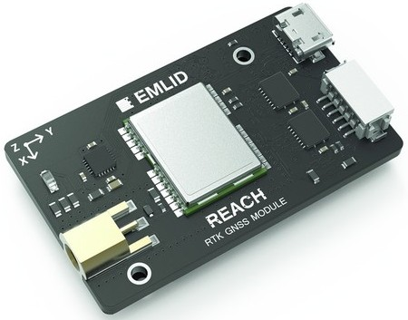

.. _common-reach-rtk-receiver:

========================
Emlid Reach RTK Receiver
========================

This article provides a brief overview of Reach RTK receiver. 

What is Reach and what is it for?
=================================

Reach is an RTK GNSS receiver for applications when your standard GPS with several meters accuracy just won't cut it. It relies on RTK (real-time kinematics) technology to deliver centimeter level accuracy.

RTK has historically been used primarily by surveyors and others who required centimeter precise positioning, and were able to spend thousands of dollars on an RTK system. Reach makes this same functionality affordable to hobbyists and makers. 

Reach runs open-source RTK processing software called RTKLIB written by Tomoji Takasu. Previously a computer was required to run RTKLIB, but now all RTKLIB features are available directly on Reach.

For further information see `Reach documentation <http://docs.emlid.com/reach/introduction/>`__.

ArduPilot integration
=====================

Reach supports RTK-enhanced coordinates output to ArduPilot based autopilots. To make this possible, it uses a custom GPS protocol called ERB (Emlid Reach Binary protocol).

Here is a demo video of Pixhawk and Reach working together:
 
..  youtube:: oq9H19ikAdM
    :width: 100%

**Pixhawk binaries**

Although ERB support has already been added to ArduPilot master, there was no release yet to include it. You can get stable binaries with ERB support for all the ArduPilot supported vehicles.

* `Pixhawk firmware compatible with ERB <http://files.emlid.com/apm/px4-reach.zip>`__

Connecting Reach to Pixhawk
===========================

A drone-mounted Reach unit can receive base corrections over telemetry radio, thus not requiring a separate correction link to the drone. Coordinate output is implemented via a serial port.

For more information on Reach and Pixhawk integration, visit `Reach Ardupilot integration docs <http://docs.emlid.com/reach/apm-integration/>`__.

Read about Reach and its other applications:

- `Reach overview <http://www.emlid.com/reach/>`__  
- `Introduction to using Reach <http://docs.emlid.com/reach/introduction/>`__

