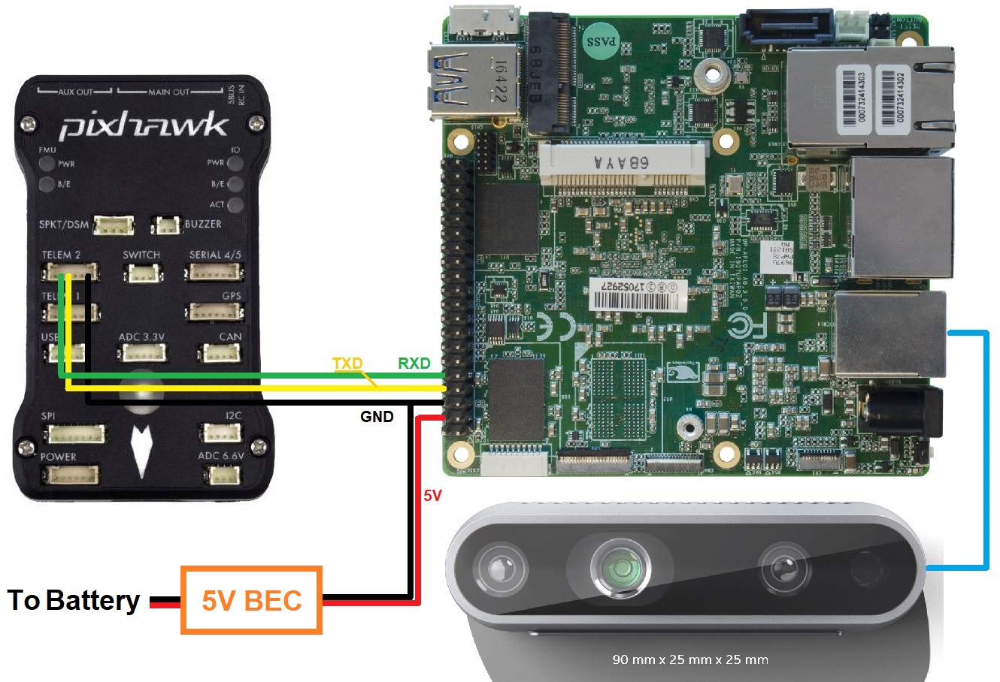

.. _common-realsense-depth-camera:

============================
Intel RealSense Depth Camera
============================

[copywiki destination="copter,rover"]

..  youtube:: fLzxyPWQHuA
    :width: 100%

This article explains how to setup an `Intel Realsense Depth Camera <https://www.intelrealsense.com/stereo-depth/>`__ to be used with ArduPilot for :ref:`obstacle avoidance <common-object-avoidance-landing-page>`. This method uses a Python script (non `ROS <https://www.ros.org/>`__) running on a companion computer to send distance information to ArduPilot.

What to Buy
-----------

- `Intel RealSense 435 <https://www.intelrealsense.com/depth-camera-d435/>`__ or `D435i <https://www.intelrealsense.com/depth-camera-d435i/>`__ depth camera.  Other `Intel depth cameras <https://www.intelrealsense.com/stereo-depth/>`__ may also work
- `UP Squared companion computer <https://up-shop.org/up-squared-series.html>`__ (Celeron 2GB and ATOM are known to work). Other companion computers including the `RPi4 <https://www.raspberrypi.org/products/raspberry-pi-4-model-b/>`__ are not supported although it may be possible to manually set them up (see Configure Companion Computer section below)
- Two USB flash drives (8GB or more)

Hardware Connections
--------------------

- Mount the camera on the vehicle facing **forward** (other orientation are not yet supported) and provide isolation from vibrations if possible. Connect the camera USB cable to one of the UP2 board's blue USB3 ports
- Connect the UP Squared's serial port to one of the autopilot's telemetry ports (i.e. Telem1, Telem2) as shown below

Setup the UP Squared
--------------------

Install APSync to the UP Squared:

- Download the latest APSync image (`look for apsync-up2-d435i-yyyymmdd.tar.xz here <https://firmware.ardupilot.org/Companion/apsync/beta/>`__) and copy to one of the USB flash drives
- `Download Tuxboot <https://tuxboot.org/download/>`__
- Format a second USB flash drive and use Tuxboot to install `Clonezilla <https://clonezilla.org/>`__ onto it
- Insert this second USB flash drive into the UP Squared's USB port and then power up the UP Squared board
- The CloneZilla boot menu should appear, Press enter to select the first option
- In CloneZilla:

  - Press enter to accept default keyboard layout
  - Press enter to start clonezilla
  - Press enter to select device-image
  - Press enter for local_dev
  - Insert the second USB stick which has the APSync image copied onto it
  - Press enter to continue and detect USB devices
  - When device is detected, use ctrl-c to exit detection screen
  - Use the cursor keys to select the device that contains the APSync image
  - Select the apsync directory which contains the image
  - Use tab to move the “cursor” over “Done” and press enter
  - Press enter to acknowledge disk space usage
  - Press enter to select Beginner mode
  - Use the cursor keys to select "restoredisk" and press enter
  - Select the image file to restore and again press enter
  - Choose the target disk to be overwritten. Any data on that disk will be overwritten with the APSync image. Press enter
  - Select "Yes check the image before restoring" and press enter. This will ensure the image you copied onto USB is healthy.
  - Select "-p choose" . Press enter to any prompt till restoration begins
  - Installation progress should be visible now, wait a few minutes
  - Enter "Y" when prompted for overwriting all data to selected disk
  - After the cloning process is finished, there will be a prompt declaring success, press enter to continue.
  - Press enter on "power off"
  - Remove all USB sticks from the board. You can also remove your monitor input. 
  - Reboot 

Upgrade the Camera's Firmware
-----------------------------

Check the camera's firmware is version 5.12.8.200 or later.  This can be done using the `Firmware Update Tool (Windows only) <https://dev.intelrealsense.com/docs/firmware-update-tool>`__ or the `Intel Realsense Viewer <https://www.intelrealsense.com/sdk-2/>`__

- If using the `Firmware Update Tool <https://dev.intelrealsense.com/docs/firmware-update-tool>`__ the `latest camera firmware can be found here <https://downloadcenter.intel.com/product/128255/Intel-RealSense-Depth-Camera-D435>`__
- If using the `Intel RealSense Viewer <https://www.intelrealsense.com/sdk-2/>`__ after downloading and installing, connect the camera to your PC with a USB3 cable.  The firmware upgrade can be triggered via a pop-up on the top right of the application or from the "More" menu as shown below

Configure ArduPilot
-------------------

Connect to the autopilot with a ground station (i.e. Mission Planner) and check that the following parameters are set:

- :ref:`SERIAL2_PROTOCOL <SERIAL2_PROTOCOL>` = 2 (MAVLink2).  Note this assumes the companion computer is connected to AutoPilot "Telem2" port.
- :ref:`SERIAL2_BAUD <SERIAL2_BAUD>` = 921 (921600 baud)

Enable any of the :ref:`obstacle avoidance <common-object-avoidance-landing-page>` of your own choosing. :ref:`Simple avoidance behavior <common-simple-object-avoidance>` (Stop/Slide) will be used as the example for this wiki:

- :ref:`PRX_TYPE <PRX_TYPE>` = 2: for MAVLink
- :ref:`AVOID_ENABLE <AVOID_ENABLE>` = 7: “All” to use all sources of barrier information including “Proximity” sensors

Example of specifics for ``Loiter`` and ``AltHold`` mode:

- :ref:`AVOID_MARGIN <AVOID_MARGIN>` = 1.5: How many meters from the barrier the vehicle will attempt to stop or try to slide along it
- :ref:`AVOID_BEHAVE <AVOID_BEHAVE>` = 1: Whether the vehicle should simply Stop (1) in front of the barrier or Slide (0) around it
- :ref:`AVOID_DIST_MAX <AVOID_DIST_MAX>` = 1.5: How far from a barrier the vehicle starts leaning away from the barrier in AltHold
- :ref:`AVOID_ANGLE_MAX <AVOID_DIST_MAX>` = 3000: How far the vehicle will try to lean away from the barrier

**Optional**: You can assign an RC switch to enable Avoidance instead of always on by default. Example of setting RC7 to switch Avoidance on in Mission Planner:

After the parameters are modified, reboot the autopilot.

Ground Test: Pre-Flight Verification
------------------------------------

To verify that the APSync image is working and everything has been correctly configured ensure ArduPilot is receiving ``OBSTACLE_DISTANCE`` messages, on Mission Planner: press ``Ctrl+F`` and click on “Mavlink Inspector”, you should be able to see data coming in:

.. image:: ../../../images/copter-object-avoidance-show-radar-view.png
    :target: ../_images/copter-object-avoidance-show-radar-view.png
    :width: 500px

- If you have a stable telemetry connection, the data frequency for ``OBSTACLE_DISTANCE`` message should be close to ``15 hz``. If not, use a USB cable to connect AP and GCS to make sure that the obstacle avoidance data is being received as intended by AP before moving on.

Within Mission Planner, open the ``Proximity view`` (``Ctrl-F`` > ``Proximity``):

- Put the vehicle/depth camera in front of some obstacles, check that the distance to the nearest obstacle is accurate is shown in the Proximity view.

- The proximity view will group every distances within 45-degrees arc together (in total 8 quadrants around the vehicle), so at most only 3 **nearest** obstacles will be shown at any one time on the Proximity window (since the camera's FOV is less then 90 degrees).

Flight Test
-----------

For your first flight:

- Test process: Take-off -> AltHold / Loiter -> Move toward the obstacle.

- Only push the vehicle gently and observe the reactions.

- Expected behavior: The vehicle should stop/slide (set by ``AVOID_BEHAVE``) at a certain distance away from the obstacle (set by ``AVOID_MARGIN/AVOID_DIST_MAX`` depending on the flight mode).

If everything works as expected, the next step is to test out the safety margins for your specific sensor/vehicle/environment:

- Since the camera has limited FOV and min/max depth range, it is important to test the limits to ensure safety for your vehicle in the actual environment.

- The pilot should have a rough guess of these margins and put some overheads into the planning of mission.

Experiments
-----------

- First manual tests: confirm the expected behavior when obstacle is present, as well as the FOV and safety margins for my vehicle + camera. The flights were conducted in Loiter:

..  youtube:: WGOKat8tkVg
    :width: 100%

- Autonomous flight tests: Here is a short video summarizes the main steps during actual experiments and how a working system should behave. In this example, the vehicle will attempt to follow a square pattern but will stop before any obstacle.

..  youtube:: fLzxyPWQHuA
    :width: 100%

DataFlash logging
-----------------

- The relevant messages for the depth camera are ``PRX.CAn`` and ``PRX.CDist``, which stand for angle and distance of the closest object, respectively.

- You can also view the distance data in each quadrant (D0, D45, and D315 - or 0 degree, 45 degree and 315 degree). Note that the range of value for CAn is 360 degrees while for CDist and the other Dangle only a few meters, so you might need to view them separately.

System Overview
---------------

In a nutshell, the script will convert the depth image provided by the Realsense depth camera into distances to obstacles in front. AP supports `DISTANCE_SENSOR <https://mavlink.io/en/messages/common.html#DISTANCE_SENSOR>`__ and `OBSTACLE_DISTANCE <https://mavlink.io/en/messages/common.html#OBSTACLE_DISTANCE>`__ MAVLink messages, with the former carries a single distance and the latter carries an array of distances. ``OBSTACLE_DISTANCE`` allows us to send up to 72 distances at once, so it will be used.

- Firstly, it is important to apply some form of filters on the **raw** depth image to avoid black holes, noises and generally improve the data to obtain more stable results. Here is full `list of filters <https://github.com/IntelRealSense/librealsense/blob/master/doc/post-processing-filters.md>`__ that are included in the script, which you can enable individually. To test the settings for different filters, you can use the `rs-depth-quality <https://github.com/IntelRealSense/librealsense/tree/master/tools/depth-quality>`__ example provided by ``librealsense`` or run the example ``opencv_depth_filtering.py`` script. The following picture demonstrates the raw (left) and filtered (right) depth image, with the horizontal line as the position where we compute the distances to the obstacles.

- Next, from the input/processed depth image, the distances need to be on the same **horizontal** line (depicted in the right image) since the message contains no field to distinguish different pitch angles. We devide the horizontal field of view of the camera into 72 evenly spaced rays. Along each ray, we select the pixel corresponding to the end of the ray and pick out the depth value.

- Subsequently, the obstacle line will be kept "fixed" when the vehicle pitches up and down by compensating for the current pitch of the vehicle which is provided by the `ATTITUDE <https://mavlink.io/en/messages/common.html#ATTITUDE>`__  MAVLink message.

- Finally, the message should be sent at 10Hz or higher, depends on how fast the vehicle is moving.

Manually Setup the Companion Computer
-------------------------------------

These steps are only required if you have not already installed APSync to the companion computer.

For the companion computer:

- **OS**: **Ubuntu 18.04** (highly recommended as this release is the most up-to-date with the required libraries).
- **Python 3.6** and above, which is also the standard for Ubuntu 18.04. Check ther version with ``$ python3 -V``, you should see ``Python 3.6.9`` or higher.
- `librealsense <https://github.com/IntelRealSense/librealsense>`__: download or install from the `official source <https://github.com/IntelRealSense/librealsense/blob/master/doc/distribution_linux.md>`__.
- ``pyrealsense2`` is also required

The installation process varies widely for different systems, hence refer to `the official github page <https://github.com/IntelRealSense/librealsense>`__ for instructions for your specific system:

- `Ubuntu <https://github.com/IntelRealSense/librealsense/blob/master/doc/installation.md>`__
- `Jetson <https://github.com/IntelRealSense/librealsense/blob/master/doc/installation_jetson.md>`__
- `Odroid <https://github.com/IntelRealSense/librealsense/blob/master/doc/installation_odroid.md>`__
- `Windows <https://github.com/IntelRealSense/librealsense/blob/master/doc/installation_windows.md>`__
- `Raspbian <https://github.com/IntelRealSense/librealsense/blob/master/doc/installation_raspbian.md>`__

Install supporting packages
===========================

First install `Python3 for Ubuntu <https://realpython.com/installing-python/#ubuntu>`__ (not necessary for Ubuntu 18.04 and above). You should be able to then run the examples provided by Intel can be found in the folder ``~/librealsense/wrappers/python/examples`` with Python3 command.

.. code-block:: bash

    # Update the PYTHONPATH environment variable to add the path to the pyrealsense2 library
    export PYTHONPATH=$PYTHONPATH:/usr/local/lib

    cd ~/librealsense/wrappers/python/examples

    # You should see a stream of depth data coming from the D4xx camera.
    python3 python-tutorial-1-depth.py

Install pip for Python3 `(pip3) <https://linuxize.com/post/how-to-install-pip-on-ubuntu-18.04/#installing-pip-for-python-3>`__ and other supporting packages:

.. code-block:: bash

    sudo apt-get install python3-pip
    pip3 install pyrealsense2
    pip3 install transformations
    pip3 install dronekit
    pip3 install apscheduler
    pip3 install pyserial # For serial connection
    pip3 install opencv-python
    sudo apt -y install python3-gst-1.0 gir1.2-gst-rtsp-server-1.0 gstreamer1.0-plugins-base gstreamer1.0-plugins-ugly libx264-dev

    # Only necessary if you installed the minimal version of Ubuntu
    sudo apt install python3-opencv

Download the main script `d4xx_to_mavlink.py <https://github.com/thien94/vision_to_mavros/blob/master/scripts/d4xx_to_mavlink.py>`__ or clone the `vision_to_mavros <https://github.com/thien94/vision_to_mavros>`__ repository and find the script folder.

.. code-block:: bash

    cd /path/to/download # Or ROS workspace ~/catkin_ws/src
    git clone https://github.com/thien94/vision_to_mavros.git
    cd vision_to_mavros/script
    chmod +x d4xx_to_mavlink.py
    chmod +x opencv_depth_filtering.py  # Useful to test the filtering options

- The main script to be used with AP is ``d4xx_to_mavlink.py``. The second script ``opencv_depth_filtering.py`` can be used to test out different filtering options at your own leisure.

Making Changes to the Script
============================

If you don't have a monitor plugged in, disable the debug option in the script ``d4xx_to_mavlink.py`` by setting ``debug_enable_default = False`` or add the argument ``--debug_enable 0`` when running the script:

- Run the script with:

.. code-block:: bash

  cd /path/to/script
  python3 d4xx_to_mavlink.py

- If the debugging option is enabled, wait until the input and processed depth images are shown. The processing speed (fps) can be seen in the top right corner. The horizontal line on the output image (right) indicates the line on which we find the distances to the obstacles in front of the camera.

Setup video feed of the RGB image from the camera:

- The script ``d4xx_to_mavlink.py`` has an option ``RTSP_STREAMING_ENABLE``. If enabled (``True``), a video stream of the RGB image from the Realsense camera will be available at ``rtsp://<ip-address>:8554/d4xx`` with ``<ip-address>`` of the UP2 / companion computer.

- In Mission Planner: right-click the HUD > Video > Set GStreamer Source, which will open the Gstreamer url window. Pass the following example pipeline into the Gstreamer url window. Change the ``<ip-address>`` accordingly:

.. code-block:: bash

    rtspsrc location=rtsp://<ip-address>:8554/d4xx caps=“application/x-rtp, media=(string)video, clock-rate=(int)90000, encoding-name=(string)H264” latency=100 ! queue ! rtph264depay ! avdec_h264 ! videoconvert ! video/x-raw,format=BGRA ! appsink name=outsink

- The latency of the video feed depends on the network as well as pipeline configuration, so feel free to tune/modify the parameters.

As the performance of the depth camera varies in different setting/environment, it is recommended to further tune the settings of the script before actual flight. Below are some improvements based on real experiments with the system:

- When the vehicle is on the ground, it is possible that a large portion of the depth image will see the ground. In such cases, within the ``d4xx_to_mavlink.py`` script, reduce the ``obstacle_line_height_ratio`` parameter (closer to zero) to move the obstacle detection line up.

- If the depth data is noisy, increase the thickness of the obstacle line by modify the ``obstacle_line_thickness_pixel`` param in the script. At the time of this writing, the idea is to process a group of pixels within a certain boundary (defined by this parameter) and find the lowest value to use as indicator to the object. This can change in the future if a better scheme is developed.

.. tip::
    
    The depth camera can be used together with the :ref:`Realsense T265 Tracking camera for non-GPS navigation <common-vio-tracking-camera>`. There are supporting `scripts <https://github.com/thien94/vision_to_mavros/tree/master/scripts>`__ available to simplify the usage of multiple cameras simultaneously.