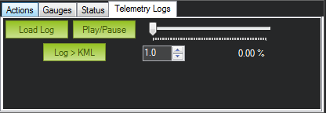
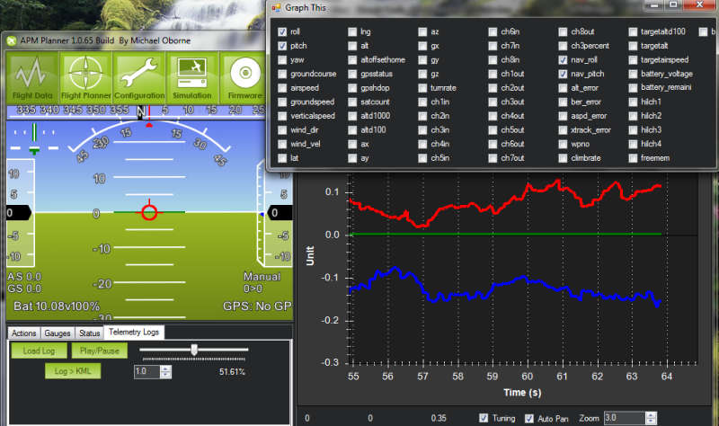

.. _common-recording-and-playing-back-missions:

=============================================
Archived: Recording and Playing Back Missions
=============================================

[copywiki destination="copter,plane,rover,planner"]

If you are using wireless telemetry and have connected to APM via the
Mission Planner, your flight data will automatically recorded as a
"tlog" file in the Mission Planner's logs folder.

You can load and replay any one and convert any log to a KMZ file that
can be displayed in Google Earth by clicking on the KMZ button. That
file can also be found in the logs folder.

While the log is replaying, you can analyze the data by clicking on the
"Tuning" checkbox under the map display in the Flight Data tab. It will
show the recorded data changing as the flight progresses. You can double
click on the data legend to bring up a box that will let you choose
which data fields are graphed, as shown here:

Below is a video overview of how to use tlogs.

..  youtube:: 4IRRN5YMHJA
    :width: 100%
